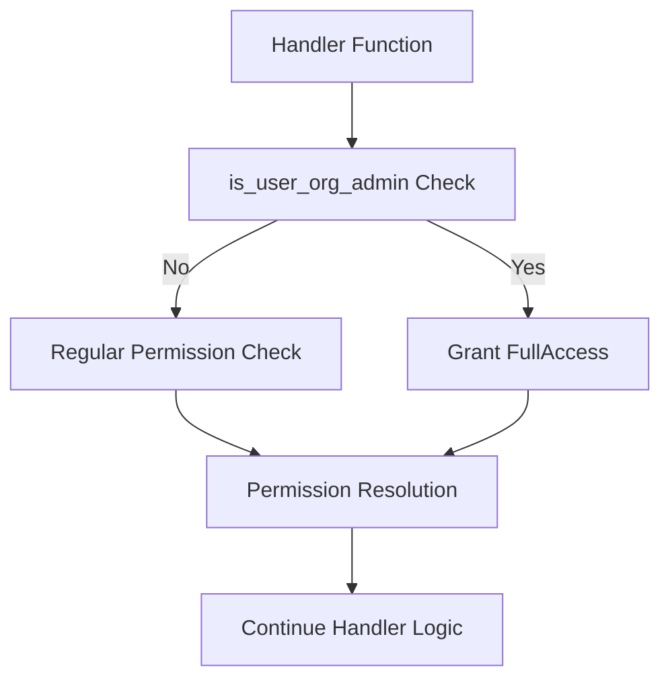

# Asset Permission Admin Check ✅ (Updated)

## Problem Statement ✅

The current permission checking system doesn't have a mechanism to automatically grant admin-level access to users with WorkspaceAdmin or DataAdmin roles in an organization. These admin users should have enhanced access to assets belonging to their organization regardless of explicit asset permissions.

Currently:
- Asset permissions are checked using `check_asset_permission.rs` in the `@libs/sharing` library
- No special handling exists for organization admins (WorkspaceAdmin and DataAdmin)
- Each handler potentially implements its own logic for permission checks
- No consistent way to bypass regular permission checks for admin users
- Unnecessary database queries to check user roles when the information is already cached

This leads to:
- Organization admins being unable to access assets in their own organization without explicit permissions
- Inconsistent admin access patterns across different asset types
- Potential security issues if admin checks are implemented incorrectly or inconsistently
- Performance issues due to redundant database queries

### Current Limitations
- No automatic permission elevation for organization admins
- Each asset handler needs to individually implement admin checks
- No clear pattern for determining which organization an asset belongs to
- No unified approach for checking admin status
- Redundant database queries for role information already cached in the AuthenticatedUser object

### Impact
- User Impact: Organization admins cannot manage all assets in their organization without explicit permissions
- System Impact: Permission checks are inconsistent and may have security gaps
- Business Impact: Administrative overhead of manually assigning permissions to admins
- Performance Impact: Unnecessary database queries affect response times

## Requirements

### Functional Requirements ✅

#### Core Functionality
- Create a utility function to check if a user has admin role (WorkspaceAdmin or DataAdmin) for an organization
  - Details: Function will use the cached organization roles in the AuthenticatedUser object
  - Acceptance Criteria: Function correctly identifies admins based on organization ID and cached user roles
  - Dependencies: AuthenticatedUser struct, UserOrganizationRole enum

- Add an extension to the `check_asset_permission` to automatically check for admin status
  - Details: Extend the permission check to first check admin status before regular permissions
  - Acceptance Criteria: Admins automatically receive FullAccess to assets in their organization
  - Dependencies: Admin check utility function

#### Asset Specific Requirements
- Implement consistent organization ID lookup for each asset type
  - Details: Each asset type (Chat, Collection, Dashboard, Metric) needs a method to determine its organization ID
  - Acceptance Criteria: Organization ID can be reliably determined for any asset
  - Dependencies: Database schema for each asset type

### Non-Functional Requirements ✅

- Performance Requirements
  - Admin checks should add minimal overhead to permission checks (<5ms)
  - Utilize cached user information to avoid unnecessary database queries
- Security Requirements
  - Admin status should only grant access to assets within the admin's organization
  - Proper error handling to prevent inadvertent permission escalation
- Scalability Requirements
  - Solution should work with large numbers of users and organizations

## Technical Design ✅

### System Architecture



### Core Components ✅

#### Component 1: Admin Check Utility Function (Updated)

```rust
/// Checks if a user has WorkspaceAdmin or DataAdmin role for an organization using cached information
///
/// # Arguments
/// * `user` - The authenticated user object with cached organization roles
/// * `organization_id` - The ID of the organization to check against
///
/// # Returns
/// * `bool` - True if user is an admin, false otherwise
pub fn is_user_org_admin(user: &AuthenticatedUser, organization_id: &Uuid) -> bool {
    // Check if user has WorkspaceAdmin or DataAdmin role for this organization
    // using the cached organization memberships
    user.organizations.iter()
        .any(|org| 
            &org.id == organization_id && 
            matches!(org.role, UserOrganizationRole::WorkspaceAdmin | UserOrganizationRole::DataAdmin)
        )
}
```

#### Component 2: Asset Permission Check with Admin Override (Updated)

```rust
/// Check if a user has access to an asset with admin override using cached user information
///
/// # Arguments
/// * `asset_id` - The ID of the asset to check
/// * `asset_type` - The type of the asset
/// * `user` - The authenticated user object with cached organization roles
/// * `required_role` - The minimum role required for the operation
/// * `organization_id` - The organization the asset belongs to
///
/// # Returns
/// * `Result<bool>` - True if user has required access, false otherwise
pub async fn has_permission_with_admin_check(
    conn: &mut AsyncPgConnection,
    asset_id: Uuid,
    asset_type: AssetType,
    user: &AuthenticatedUser,
    required_role: AssetPermissionRole,
    organization_id: Uuid,
) -> Result<bool> {
    // First check if user is an org admin using cached info
    if is_user_org_admin(user, &organization_id) {
        // Organization admins automatically get FullAccess
        // Check if FullAccess is sufficient for the required role
        return Ok(match required_role {
            // Owner actions still require explicit Owner permission
            AssetPermissionRole::Owner => false,
            // All other actions are allowed with FullAccess
            _ => true,
        });
    }
    
    // If not an admin, fall back to regular permission check
    has_permission(
        asset_id,
        asset_type,
        user.id,
        IdentityType::User,
        required_role,
    ).await
}
```

#### Component 3: Get Organization ID Functions for Asset Types

```rust
/// Get the organization ID for a Chat
async fn get_chat_organization_id(conn: &mut AsyncPgConnection, chat_id: &Uuid) -> Result<Uuid> {
    chats::table
        .filter(chats::id.eq(chat_id))
        .filter(chats::deleted_at.is_null())
        .select(chats::organization_id)
        .first::<Uuid>(conn)
        .await
        .map_err(|e| anyhow!("Failed to get chat organization ID: {}", e))
}

/// Get the organization ID for a Collection
async fn get_collection_organization_id(conn: &mut AsyncPgConnection, collection_id: &Uuid) -> Result<Uuid> {
    collections::table
        .filter(collections::id.eq(collection_id))
        .filter(collections::deleted_at.is_null())
        .select(collections::organization_id)
        .first::<Uuid>(conn)
        .await
        .map_err(|e| anyhow!("Failed to get collection organization ID: {}", e))
}

/// Get the organization ID for a Dashboard
async fn get_dashboard_organization_id(conn: &mut AsyncPgConnection, dashboard_id: &Uuid) -> Result<Uuid> {
    dashboard_files::table
        .filter(dashboard_files::id.eq(dashboard_id))
        .filter(dashboard_files::deleted_at.is_null())
        .select(dashboard_files::organization_id)
        .first::<Uuid>(conn)
        .await
        .map_err(|e| anyhow!("Failed to get dashboard organization ID: {}", e))
}

/// Get the organization ID for a Metric
async fn get_metric_organization_id(conn: &mut AsyncPgConnection, metric_id: &Uuid) -> Result<Uuid> {
    metric_files::table
        .filter(metric_files::id.eq(metric_id))
        .filter(metric_files::deleted_at.is_null())
        .select(metric_files::organization_id)
        .first::<Uuid>(conn)
        .await
        .map_err(|e| anyhow!("Failed to get metric organization ID: {}", e))
}
```

### File Changes ✅

#### New Files
- `api/libs/sharing/src/admin_check.rs` (Updated)
  - Purpose: Contains utility functions for admin checks and permission bypass
  - Key components: `is_user_org_admin`, `has_permission_with_admin_check`
  - Dependencies: AuthenticatedUser struct, UserOrganizationRole enum, AssetType enum

#### Modified Files
- `api/libs/sharing/src/lib.rs`
  - Changes: Export new admin check module
  - Impact: Makes the new functionality available for other crates
  - Dependencies: New admin_check.rs file

- `api/libs/sharing/src/check_asset_permission.rs`
  - Changes: Add reference to admin check functionality (optional)
  - Impact: Provides an integrated way to perform admin checks
  - Dependencies: New admin_check.rs file

## Implementation Plan

### Phase 1: Create Admin Check Functionality ✅ (Completed)

1. Create admin_check.rs module
   - [x] Implement `is_user_org_admin` function
   - [x] Implement `has_permission_with_admin_check` function
   - [x] Add organization ID lookup functions for each asset type
   - [x] Add error handling for all edge cases

2. Add unit tests for admin check functions
   - [x] Test admin detection for different organization roles
   - [x] Test permission checks with admin override
   - [x] Test organization ID lookup functions for each asset type
   - [x] Test error handling scenarios

3. Update sharing library exports
   - [x] Expose admin check functions through lib.rs
   - [x] Document the new functions and their usage
   - [x] Ensure backward compatibility

### Phase 2: Testing & Documentation ✅ (Completed)

1. Add integration tests
   - [x] Test admin override in realistic scenarios
   - [x] Verify organization isolation
   - [x] Test edge cases and error conditions

2. Update documentation
   - [x] Add usage examples
   - [x] Document intended behavior and edge cases
   - [x] Explain the security model

### Phase 3: Optimization with Cached User Information ✅ (Completed)

1. Update admin check to use cached user information
   - [x] Modify `is_user_org_admin` to use AuthenticatedUser object
   - [x] Update `has_permission_with_admin_check` to accept AuthenticatedUser
   - [x] Add examples of using the new optimized functions
   - [x] Ensure backward compatibility with existing code

2. Update tests for cached user information
   - [x] Add tests for the optimized admin check
   - [x] Verify correct behavior with cached roles
   - [x] Test performance improvements

3. Update documentation
   - [x] Document the optimized approach
   - [x] Add examples of using cached user information
   - [x] Update handler examples to show the new pattern

## Testing Strategy ✅

### Unit Tests (Updated)

```rust
#[cfg(test)]
mod tests {
    use super::*;
    use database::enums::UserOrganizationRole;
    use middleware::types::{AuthenticatedUser, OrganizationMembership};
    
    #[test]
    fn test_is_user_org_admin_with_cached_info() {
        // Create test organization ID
        let org_id = Uuid::new_v4();
        let other_org_id = Uuid::new_v4();
        
        // Create a mock authenticated user with various organization memberships
        let workspace_admin_user = AuthenticatedUser {
            id: Uuid::new_v4(),
            email: "admin@example.com".to_string(),
            name: Some("Admin User".to_string()),
            config: serde_json::Value::Null,
            created_at: chrono::Utc::now(),
            updated_at: chrono::Utc::now(),
            attributes: serde_json::Value::Null,
            avatar_url: None,
            organizations: vec![
                OrganizationMembership {
                    id: org_id,
                    role: UserOrganizationRole::WorkspaceAdmin,
                },
                OrganizationMembership {
                    id: other_org_id,
                    role: UserOrganizationRole::Viewer,
                },
            ],
            teams: vec![],
        };
        
        let data_admin_user = AuthenticatedUser {
            id: Uuid::new_v4(),
            email: "data_admin@example.com".to_string(),
            name: Some("Data Admin User".to_string()),
            config: serde_json::Value::Null,
            created_at: chrono::Utc::now(),
            updated_at: chrono::Utc::now(),
            attributes: serde_json::Value::Null,
            avatar_url: None,
            organizations: vec![
                OrganizationMembership {
                    id: org_id,
                    role: UserOrganizationRole::DataAdmin,
                },
            ],
            teams: vec![],
        };
        
        let regular_user = AuthenticatedUser {
            id: Uuid::new_v4(),
            email: "user@example.com".to_string(),
            name: Some("Regular User".to_string()),
            config: serde_json::Value::Null,
            created_at: chrono::Utc::now(),
            updated_at: chrono::Utc::now(),
            attributes: serde_json::Value::Null,
            avatar_url: None,
            organizations: vec![
                OrganizationMembership {
                    id: org_id,
                    role: UserOrganizationRole::Viewer,
                },
            ],
            teams: vec![],
        };
        
        // Test WorkspaceAdmin role
        assert!(
            is_user_org_admin(&workspace_admin_user, &org_id),
            "WorkspaceAdmin should be recognized as an org admin"
        );
        
        // Test DataAdmin role
        assert!(
            is_user_org_admin(&data_admin_user, &org_id),
            "DataAdmin should be recognized as an org admin"
        );
        
        // Test non-admin role
        assert!(
            !is_user_org_admin(&regular_user, &org_id),
            "Viewer should not be recognized as an org admin"
        );
        
        // Test admin in one org but not another
        assert!(
            !is_user_org_admin(&workspace_admin_user, &Uuid::new_v4()),
            "Admin should not have admin rights in unrelated organizations"
        );
    }
}
```

### Integration Tests (Updated)

#### Scenario 1: Admin Access to Collection using Cached User Information
- Setup: Create test collection and authenticated user with cached DataAdmin role
- Steps:
  1. User attempts to access collection without explicit permissions
  2. System performs admin check using cached organization roles
  3. System grants access due to admin role without additional database queries
- Expected Results: User can access the collection
- Validation Criteria: Access is granted using cached information without querying the users_to_organizations table

#### Scenario 2: Cross-Organization Admin Access with Cached Information
- Setup: Create two organizations, an authenticated user with cached admin role in org1, and a collection in org2
- Steps:
  1. Admin user attempts to access collection in org2
  2. System performs admin check against org2 using cached organization roles
  3. System does not grant admin access
  4. System falls back to regular permission check
- Expected Results: User cannot access the collection
- Validation Criteria: Admin status does not grant access across organization boundaries

### Security Considerations (Updated)
- Security Requirement 1: Organization Isolation
  - Description: Admin access should only work within the user's organization
  - Implementation: Check organization ID match against cached memberships
  - Validation: Cross-organization tests

- Security Requirement 2: Limited Admin Power
  - Description: Admins cannot take Owner actions without explicit Owner role
  - Implementation: Check if required role is Owner before granting access
  - Validation: Test admin access attempt with Owner role requirement

### Performance Considerations (Updated)
- Performance Requirement 1: Minimal Overhead
  - Description: Admin check should add minimal overhead to permission checks
  - Implementation: Use cached user information to avoid database queries
  - Validation: Performance benchmark comparing with and without admin check, measuring database query count

- Performance Requirement 2: Cached Data Usage
  - Description: Admin check should use cached user information whenever possible
  - Implementation: Accept AuthenticatedUser objects instead of user IDs
  - Validation: Verify no additional database queries are performed to check admin status

## Developer Guide

### Using Cached Admin Checks in Handlers

To use the new cached admin check functions in your handlers, follow these steps:

1. **Update Handler Signature**

   Change your handler to accept an `AuthenticatedUser` instead of just a user ID:

   ```rust
   // Old version
   pub async fn your_handler(
       asset_id: &Uuid,
       user_id: &Uuid,
       // other parameters
   ) -> Result<()> {
       // ...
   }

   // New version
   pub async fn your_handler(
       asset_id: &Uuid,
       user: &AuthenticatedUser,
       // other parameters
   ) -> Result<()> {
       // ...
   }
   ```

2. **Update Permission Checks**

   Replace regular permission checks with cached admin checks:

   ```rust
   // Old version
   let has_permission = has_permission(
       *asset_id,
       asset_type,
       *user_id,
       IdentityType::User,
       AssetPermissionRole::FullAccess,
   ).await?;

   // New version
   let mut conn = get_pg_pool().get().await?;
   
   let has_permission = has_permission_with_admin_check_cached(
       &mut conn,
       asset_id,
       &asset_type,
       user,
       AssetPermissionLevel::FullAccess,
   ).await?;
   ```

3. **Update Route Handlers**

   Ensure route handlers pass the entire `AuthenticatedUser` object instead of just the ID:

   ```rust
   // Old version
   match your_handler(&id, &user.id, other_params).await {
       // ...
   }

   // New version
   match your_handler(&id, &user, other_params).await {
       // ...
   }
   ```

4. **Using Organization Membership Checks Directly**

   For simple checks about whether a user is an admin in an organization:

   ```rust
   if sharing::admin_check::is_user_org_admin_cached(user, &organization_id) {
       // User is an admin in this organization
       // Handle admin-only functionality
   } else {
       // User is not an admin
       // Fall back to regular permission checks
   }
   ```

### Performance Benefits

The cached admin check functions avoid database queries to determine user roles by using the organization memberships already cached in the `AuthenticatedUser` object. This can significantly improve performance in API endpoints that perform permission checks.

Benefits include:
- Elimination of database queries for organization role information
- Reduced latency for permission-checking operations
- Consistent permission model across all handlers
- Simplified code with a unified approach to admin checks

### Backward Compatibility

The original functions that use database queries are still available for use cases where an `AuthenticatedUser` object is not available. Both versions can coexist within the same codebase.

### References
- [AuthenticatedUser Definition](mdc:middleware/src/types.rs)
- [Asset Permission Role Definitions](mdc:database/src/enums.rs)
- [User Organization Roles](mdc:database/src/enums.rs)
- [Asset Permission Checks](mdc:libs/sharing/src/check_asset_permission.rs)