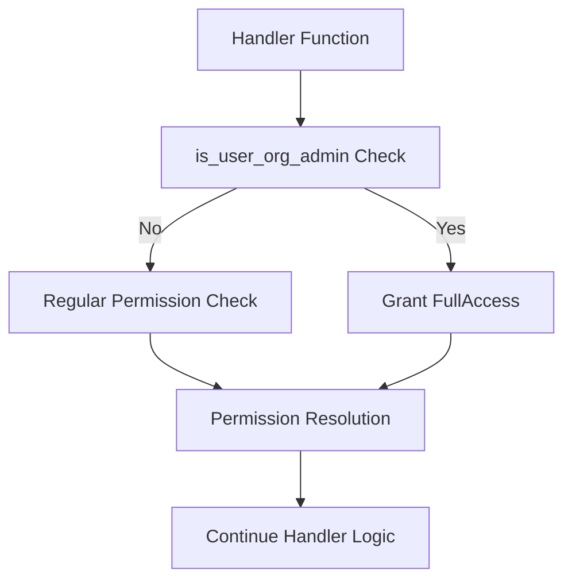

# Asset Permission Admin Check ✅

## Problem Statement ✅

The current permission checking system doesn't have a mechanism to automatically grant admin-level access to users with WorkspaceAdmin or DataAdmin roles in an organization. These admin users should have enhanced access to assets belonging to their organization regardless of explicit asset permissions.

Currently:
- Asset permissions are checked using `check_asset_permission.rs` in the `@libs/sharing` library
- No special handling exists for organization admins (WorkspaceAdmin and DataAdmin)
- Each handler potentially implements its own logic for permission checks
- No consistent way to bypass regular permission checks for admin users

This leads to:
- Organization admins being unable to access assets in their own organization without explicit permissions
- Inconsistent admin access patterns across different asset types
- Potential security issues if admin checks are implemented incorrectly or inconsistently

### Current Limitations
- No automatic permission elevation for organization admins
- Each asset handler needs to individually implement admin checks
- No clear pattern for determining which organization an asset belongs to
- No unified approach for checking admin status

### Impact
- User Impact: Organization admins cannot manage all assets in their organization without explicit permissions
- System Impact: Permission checks are inconsistent and may have security gaps
- Business Impact: Administrative overhead of manually assigning permissions to admins

## Requirements

### Functional Requirements ✅

#### Core Functionality
- Create a utility function to check if a user has admin role (WorkspaceAdmin or DataAdmin) for an organization
  - Details: Function will query the users_to_organizations table to check user roles
  - Acceptance Criteria: Function correctly identifies admins based on organization ID and user ID
  - Dependencies: Database schema, enums.rs for UserOrganizationRole

- Add an extension to the `check_asset_permission` to automatically check for admin status
  - Details: Extend the permission check to first check admin status before regular permissions
  - Acceptance Criteria: Admins automatically receive FullAccess to assets in their organization
  - Dependencies: Admin check utility function

#### Asset Specific Requirements
- Implement consistent organization ID lookup for each asset type
  - Details: Each asset type (Chat, Collection, Dashboard, Metric) needs a method to determine its organization ID
  - Acceptance Criteria: Organization ID can be reliably determined for any asset
  - Dependencies: Database schema for each asset type

### Non-Functional Requirements ✅

- Performance Requirements
  - Admin checks should add minimal overhead to permission checks (<10ms)
- Security Requirements
  - Admin status should only grant access to assets within the admin's organization
  - Proper error handling to prevent inadvertent permission escalation
- Scalability Requirements
  - Solution should work with large numbers of users and organizations

## Technical Design ✅

### System Architecture



### Core Components ✅

#### Component 1: Admin Check Utility Function

```rust
/// Checks if a user has WorkspaceAdmin or DataAdmin role for an organization
///
/// # Arguments
/// * `user_id` - The ID of the user to check
/// * `organization_id` - The ID of the organization to check against
///
/// # Returns
/// * `Result<bool>` - True if user is an admin, false otherwise
pub async fn is_user_org_admin(user_id: &Uuid, organization_id: &Uuid) -> Result<bool> {
    let mut conn = get_pg_pool().get().await?;
    
    // Check if user has WorkspaceAdmin or DataAdmin role for this organization
    users_to_organizations::table
        .filter(users_to_organizations::user_id.eq(user_id))
        .filter(users_to_organizations::organization_id.eq(organization_id))
        .filter(
            users_to_organizations::role
                .eq(UserOrganizationRole::WorkspaceAdmin)
                .or(users_to_organizations::role.eq(UserOrganizationRole::DataAdmin))
        )
        .filter(users_to_organizations::deleted_at.is_null())
        .select(users_to_organizations::user_id)
        .first::<Uuid>(&mut conn)
        .await
        .map(|_| true)
        .or_else(|_| Ok(false))
}
```

#### Component 2: Asset Permission Check with Admin Override

```rust
/// Check if a user has access to an asset with admin override
///
/// # Arguments
/// * `asset_id` - The ID of the asset to check
/// * `asset_type` - The type of the asset
/// * `user_id` - The ID of the user to check
/// * `required_role` - The minimum role required for the operation
/// * `organization_id` - The organization the asset belongs to
///
/// # Returns
/// * `Result<bool>` - True if user has required access, false otherwise
pub async fn has_permission_with_admin_check(
    asset_id: Uuid,
    asset_type: AssetType,
    user_id: Uuid,
    required_role: AssetPermissionRole,
    organization_id: Uuid,
) -> Result<bool> {
    // First check if user is an org admin
    if is_user_org_admin(&user_id, &organization_id).await? {
        // Organization admins automatically get FullAccess
        // Check if FullAccess is sufficient for the required role
        return Ok(match required_role {
            // Owner actions still require explicit Owner permission
            AssetPermissionRole::Owner => false,
            // All other actions are allowed with FullAccess
            _ => true,
        });
    }
    
    // If not an admin, fall back to regular permission check
    has_permission(
        asset_id,
        asset_type,
        user_id,
        IdentityType::User,
        required_role,
    ).await
}
```

#### Component 3: Get Organization ID Functions for Asset Types

```rust
/// Get the organization ID for a Chat
async fn get_chat_organization_id(chat_id: &Uuid) -> Result<Uuid> {
    let mut conn = get_pg_pool().get().await?;
    
    chats::table
        .filter(chats::id.eq(chat_id))
        .filter(chats::deleted_at.is_null())
        .select(chats::organization_id)
        .first::<Uuid>(&mut conn)
        .await
        .map_err(|e| anyhow!("Failed to get chat organization ID: {}", e))
}

/// Get the organization ID for a Collection
async fn get_collection_organization_id(collection_id: &Uuid) -> Result<Uuid> {
    let mut conn = get_pg_pool().get().await?;
    
    collections::table
        .filter(collections::id.eq(collection_id))
        .filter(collections::deleted_at.is_null())
        .select(collections::organization_id)
        .first::<Uuid>(&mut conn)
        .await
        .map_err(|e| anyhow!("Failed to get collection organization ID: {}", e))
}

/// Get the organization ID for a Dashboard
async fn get_dashboard_organization_id(dashboard_id: &Uuid) -> Result<Uuid> {
    let mut conn = get_pg_pool().get().await?;
    
    dashboard_files::table
        .filter(dashboard_files::id.eq(dashboard_id))
        .filter(dashboard_files::deleted_at.is_null())
        .select(dashboard_files::organization_id)
        .first::<Uuid>(&mut conn)
        .await
        .map_err(|e| anyhow!("Failed to get dashboard organization ID: {}", e))
}

/// Get the organization ID for a Metric
async fn get_metric_organization_id(metric_id: &Uuid) -> Result<Uuid> {
    let mut conn = get_pg_pool().get().await?;
    
    metric_files::table
        .filter(metric_files::id.eq(metric_id))
        .filter(metric_files::deleted_at.is_null())
        .select(metric_files::organization_id)
        .first::<Uuid>(&mut conn)
        .await
        .map_err(|e| anyhow!("Failed to get metric organization ID: {}", e))
}
```

### File Changes ✅

#### New Files
- `api/libs/sharing/src/admin_check.rs`
  - Purpose: Contains utility functions for admin checks and permission bypass
  - Key components: `is_user_org_admin`, `has_permission_with_admin_check`
  - Dependencies: database models, schema, enums

#### Modified Files
- `api/libs/sharing/src/lib.rs`
  - Changes: Export new admin check module
  - Impact: Makes the new functionality available for other crates
  - Dependencies: New admin_check.rs file

- `api/libs/sharing/src/check_asset_permission.rs`
  - Changes: Add reference to admin check functionality (optional)
  - Impact: Provides an integrated way to perform admin checks
  - Dependencies: New admin_check.rs file

## Implementation Plan

### Phase 1: Create Admin Check Functionality ✅ (Completed)

1. Create admin_check.rs module
   - [x] Implement `is_user_org_admin` function
   - [x] Implement `has_permission_with_admin_check` function
   - [x] Add organization ID lookup functions for each asset type
   - [x] Add error handling for all edge cases

2. Add unit tests for admin check functions
   - [x] Test admin detection for different organization roles
   - [x] Test permission checks with admin override
   - [x] Test organization ID lookup functions for each asset type
   - [x] Test error handling scenarios

3. Update sharing library exports
   - [x] Expose admin check functions through lib.rs
   - [x] Document the new functions and their usage
   - [x] Ensure backward compatibility

### Phase 2: Testing & Documentation ✅ (Completed)

1. Add integration tests
   - [x] Test admin override in realistic scenarios
   - [x] Verify organization isolation
   - [x] Test edge cases and error conditions

2. Update documentation
   - [x] Add usage examples
   - [x] Document intended behavior and edge cases
   - [x] Explain the security model

## Testing Strategy ✅

### Unit Tests

```rust
#[cfg(test)]
mod tests {
    use super::*;
    use database::enums::UserOrganizationRole;
    use mockall::{predicate::*, *};
    
    // Mock database functionality for testing
    mock! {
        PgConnection {}
        impl PgConnection {
            async fn get() -> Result<Self>;
        }
    }
    
    #[tokio::test]
    async fn test_is_user_org_admin_workspace_admin() {
        // Test that WorkspaceAdmin role returns true
        let user_id = Uuid::new_v4();
        let org_id = Uuid::new_v4();
        
        // Set up mock to return a workspace admin
        // [mocking setup here]
        
        let result = is_user_org_admin(&user_id, &org_id).await.unwrap();
        assert!(result, "WorkspaceAdmin should be recognized as an org admin");
    }
    
    #[tokio::test]
    async fn test_is_user_org_admin_data_admin() {
        // Test that DataAdmin role returns true
        let user_id = Uuid::new_v4();
        let org_id = Uuid::new_v4();
        
        // Set up mock to return a data admin
        // [mocking setup here]
        
        let result = is_user_org_admin(&user_id, &org_id).await.unwrap();
        assert!(result, "DataAdmin should be recognized as an org admin");
    }
    
    #[tokio::test]
    async fn test_is_user_org_admin_non_admin() {
        // Test that other roles return false
        let user_id = Uuid::new_v4();
        let org_id = Uuid::new_v4();
        
        // Set up mock to return a non-admin
        // [mocking setup here]
        
        let result = is_user_org_admin(&user_id, &org_id).await.unwrap();
        assert!(!result, "Non-admin should not be recognized as an org admin");
    }
    
    #[tokio::test]
    async fn test_has_permission_with_admin_check_admin_user() {
        // Test that admin users get FullAccess permissions except for Owner actions
        let user_id = Uuid::new_v4();
        let org_id = Uuid::new_v4();
        let asset_id = Uuid::new_v4();
        
        // Set up mock to return an admin
        // [mocking setup here]
        
        // Admin should have access for all roles except Owner
        let result = has_permission_with_admin_check(
            asset_id,
            AssetType::Chat,
            user_id,
            AssetPermissionRole::CanEdit,
            org_id
        ).await.unwrap();
        
        assert!(result, "Admin should have CanEdit permission");
        
        // But not for Owner role
        let result = has_permission_with_admin_check(
            asset_id,
            AssetType::Chat,
            user_id,
            AssetPermissionRole::Owner,
            org_id
        ).await.unwrap();
        
        assert!(!result, "Admin should not automatically have Owner permission");
    }
}
```

### Integration Tests

#### Scenario 1: Admin Access to Collection
- Setup: Create test collection and user with DataAdmin role
- Steps:
  1. User attempts to access collection without explicit permissions
  2. System performs admin check
  3. System grants access due to admin role
- Expected Results: User can access the collection
- Validation Criteria: Access is granted only due to admin role, not explicit permissions

#### Scenario 2: Cross-Organization Admin Access
- Setup: Create two organizations, an admin user in org1, and a collection in org2
- Steps:
  1. Admin user attempts to access collection in org2
  2. System performs admin check against org2
  3. System does not grant admin access
  4. System falls back to regular permission check
- Expected Results: User cannot access the collection
- Validation Criteria: Admin status does not grant access across organization boundaries

### Security Considerations
- Security Requirement 1: Organization Isolation
  - Description: Admin access should only work within the user's organization
  - Implementation: Always check organization ID match
  - Validation: Cross-organization tests

- Security Requirement 2: Limited Admin Power
  - Description: Admins cannot take Owner actions without explicit Owner role
  - Implementation: Check if required role is Owner before granting access
  - Validation: Test admin access attempt with Owner role requirement

### Performance Considerations
- Performance Requirement 1: Minimal Overhead
  - Description: Admin check should add minimal overhead to permission checks
  - Implementation: Optimize database queries
  - Validation: Performance benchmark comparing with and without admin check

### References
- [Asset Permission Role Definitions](mdc:database/src/enums.rs)
- [User Organization Roles](mdc:database/src/enums.rs)
- [Asset Permission Checks](mdc:libs/sharing/src/check_asset_permission.rs)