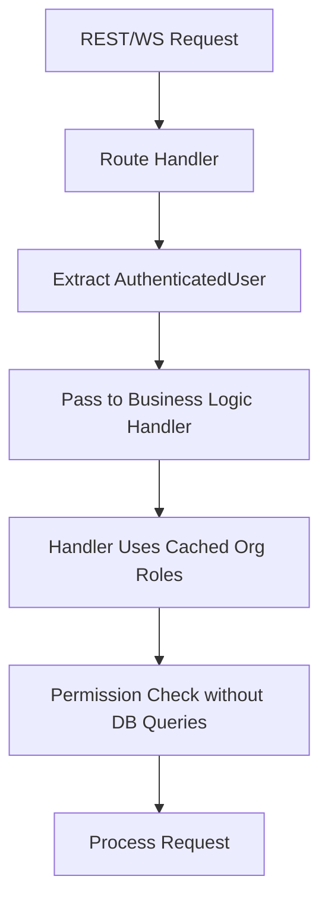

# Authenticated User Object Enhancement

## Problem Statement
Currently, not all handlers in the Buster application consistently receive the `AuthenticatedUser` object, which contains cached organization role information needed for efficient permission checks. Some handlers only receive a user ID (`&Uuid`), requiring additional database queries to retrieve organization role data for permission checks.

This inconsistency leads to several issues:
- Redundant database queries for user role information
- Inability to use the optimized cached permission check functions
- Inconsistent handler signatures across the codebase
- Greater difficulty implementing standardized permission checks

To enable efficient permission checks, all handlers must receive the full `AuthenticatedUser` object from their calling routes, leveraging the cached organization roles to avoid unnecessary database queries.

## Requirements

### Functional Requirements

#### Core Functionality
- Update REST route handlers to extract and pass the `AuthenticatedUser` object
  - Details: Modify all REST handlers to use `AuthenticatedUser` instead of just user ID
  - Acceptance Criteria: All REST handlers receive and use `AuthenticatedUser` object
  - Dependencies: None

- Update WebSocket message handlers to pass the `AuthenticatedUser` object
  - Details: Modify all WebSocket handlers to use `AuthenticatedUser` instead of just user ID
  - Acceptance Criteria: All WebSocket handlers receive and use `AuthenticatedUser` object
  - Dependencies: None

- Create standardized error responses for permission denied scenarios
  - Details: Implement consistent error handling for permission failures
  - Acceptance Criteria: All permission failures return standardized error responses
  - Dependencies: None

### Non-Functional Requirements
- Performance Requirements
  - Handler changes should not introduce additional overhead
- Maintainability Requirements
  - Handler signature changes should follow consistent patterns
  - Document new handler signature standard

## Technical Design

### System Architecture



### Core Components

#### Component 1: REST Route Handler Update Pattern

```rust
// Before:
pub async fn get_asset_route(
    Path(asset_id): Path<Uuid>,
    user_id: Uuid, // Only user ID
    // ...
) -> Result<Json<AssetResponse>, ApiError> {
    let result = get_asset_handler(&asset_id, &user_id).await?;
    Ok(Json(result))
}

// After:
pub async fn get_asset_route(
    Path(asset_id): Path<Uuid>,
    user: AuthenticatedUser, // Complete authenticated user
    // ...
) -> Result<Json<AssetResponse>, ApiError> {
    let result = get_asset_handler(&asset_id, &user).await?;
    Ok(Json(result))
}
```

#### Component 2: WebSocket Handler Update Pattern

```rust
// Before:
pub async fn ws_get_asset(
    message: WsMessage,
    user_id: &Uuid, // Only user ID
) -> Result<WsResponse> {
    let payload: GetAssetRequest = serde_json::from_str(&message.payload)?;
    let result = get_asset_handler(&payload.id, user_id).await?;
    // ...
}

// After:
pub async fn ws_get_asset(
    message: WsMessage,
    user: &AuthenticatedUser, // Complete authenticated user
) -> Result<WsResponse> {
    let payload: GetAssetRequest = serde_json::from_str(&message.payload)?;
    let result = get_asset_handler(&payload.id, user).await?;
    // ...
}
```

#### Component 3: Handler Signature Update Pattern

```rust
// Before:
pub async fn get_asset_handler(
    asset_id: &Uuid,
    user_id: &Uuid, // Only user ID
) -> Result<AssetResponse> {
    // Need to query database for user's organization roles
    // ...
}

// After:
pub async fn get_asset_handler(
    asset_id: &Uuid,
    user: &AuthenticatedUser, // Complete authenticated user with cached organization roles
) -> Result<AssetResponse> {
    // Can use cached organization roles directly
    // ...
}
```

#### Component 4: Standardized Permission Error Response

```rust
// For REST APIs
pub fn permission_denied_error() -> ApiError {
    ApiError::Forbidden(ErrorResponse {
        code: "PERMISSION_DENIED",
        message: "You do not have permission to perform this action",
        details: None,
    })
}

// For WebSocket APIs
pub async fn send_permission_denied_error(
    user: &AuthenticatedUser,
    route: WsRoutes,
    event: WsEvent,
) -> Result<()> {
    send_error_message(
        &user.id.to_string(),
        route,
        event,
        WsErrorCode::PermissionDenied,
        "You do not have permission to perform this action".to_string(),
        user,
    ).await
}
```

### File Changes

#### Modified Files
- All REST route handler files
  - Changes: Update handler signatures to use `AuthenticatedUser`
  - Impact: Enables cached permission checks

- All WebSocket handler files
  - Changes: Update handler signatures to use `AuthenticatedUser`
  - Impact: Enables cached permission checks

- All business logic handler files
  - Changes: Update handler signatures to use `AuthenticatedUser`
  - Impact: Enables cached permission checks

#### New Files
- `api/src/utils/security/errors.rs`
  - Purpose: Define standardized permission error responses
  - Impact: Ensures consistent error handling

## Implementation Plan

### Phase 1: Documentation and Standards

1. Create documentation for handler signature changes
   - [ ] Define standard handler signature pattern
   - [ ] Create examples for REST and WebSocket handlers
   - [ ] Define standard error response pattern

2. Implement standardized error responses
   - [ ] Create permission denied error helper for REST
   - [ ] Create permission denied error helper for WebSocket
   - [ ] Add unit tests for error helpers

### Phase 2: REST Handler Updates

1. Update REST route handlers
   - [ ] Update chat REST handlers
   - [ ] Update collection REST handlers
   - [ ] Update dashboard REST handlers
   - [ ] Update metric REST handlers
   - [ ] Update unit tests

### Phase 3: WebSocket Handler Updates

1. Update WebSocket message handlers
   - [ ] Update chat WebSocket handlers
   - [ ] Update collection WebSocket handlers
   - [ ] Update dashboard WebSocket handlers
   - [ ] Update metric WebSocket handlers
   - [ ] Update unit tests

### Phase 4: Business Logic Handler Updates

1. Update business logic handlers
   - [ ] Update chat handlers
   - [ ] Update collection handlers
   - [ ] Update dashboard handlers
   - [ ] Update metric handlers
   - [ ] Update unit tests

## Testing Strategy

### Unit Tests

```rust
#[tokio::test]
async fn test_handler_with_authenticated_user() {
    // Create mock authenticated user with cached organization roles
    let user = mock_authenticated_user(
        vec![(Uuid::new_v4(), UserOrganizationRole::WorkspaceAdmin)]
    );
    
    // Call handler with authenticated user
    let result = handler_function(asset_id, &user).await;
    
    // Assert handler properly used the authenticated user's cached information
    assert!(result.is_ok());
}
```

### Integration Tests

#### Scenario 1: REST Handler with AuthenticatedUser
- Setup: Create test authenticated user with known organization roles
- Steps:
  1. Make REST request with authentication
  2. Route handler extracts authenticated user
  3. Handler uses cached organization roles for permission check
- Expected Results: Permission check happens without database queries
- Validation Criteria: Log shows no user role database queries

#### Scenario 2: WebSocket Handler with AuthenticatedUser
- Setup: Create test authenticated user with known organization roles
- Steps:
  1. Establish WebSocket connection with authentication
  2. Send WebSocket message
  3. Handler uses cached organization roles for permission check
- Expected Results: Permission check happens without database queries
- Validation Criteria: Log shows no user role database queries

### Security Considerations
- The AuthenticatedUser object must be properly validated
- Permission error messages should not reveal sensitive information
- Permission checks must still happen despite cached information

### Performance Considerations
- Measure and compare database query count with and without cached roles
- Ensure memory usage remains reasonable with cached information

## References
- [Middleware AuthenticatedUser Definition](mdc:middleware/src/types.rs)
- [Admin Check with Cached Info](mdc:libs/sharing/src/admin_check.rs)