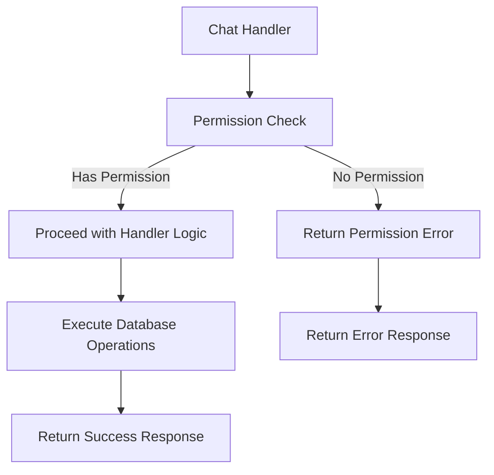

# Chat Permission Checks

## Problem Statement ✅

The chat-related handlers in `@libs/handlers/src/chats` currently lack standardized permission checks using the `@libs/sharing` library. While some permission logic may exist, it doesn't consistently use the `check_asset_permission.rs` functions and doesn't properly handle organization admin access to chat resources.

Specific issues include:
- Inconsistent permission checks across chat handlers
- No checks for appropriate `AssetPermissionRole` levels
- No automatic elevated access for workspace and data admins
- Risk of unauthorized access to chat resources
- No clear error handling for permission denied cases

These issues affect the security and consistency of the application and need to be addressed to ensure proper access control across all chat resources.

### Current Limitations
- Chat handlers may use ad-hoc permission checks instead of the sharing library
- No organization admin check for automatic access elevation
- Inconsistent error handling for permission failures
- No clear distinction between view and edit permissions

### Impact
- User Impact: Users may have incorrect access to chats (too much or too little)
- System Impact: Security vulnerabilities and inconsistent behavior
- Business Impact: Potential data exposure and inability to properly administer chats

## Requirements

### Functional Requirements ✅

#### Core Functionality
- Implement permission checks in all chat handlers
  - Details: Add permission checks at the beginning of each handler function
  - Acceptance Criteria: All chat handlers properly check permissions before performing operations
  - Dependencies: Sharing library, admin check utility

- Enforce correct permission levels
  - Details: Map operations to appropriate permission levels (view, edit, etc.)
  - Acceptance Criteria: Each operation requires the correct minimum permission level
  - Dependencies: `AssetPermissionRole` enum

- Implement proper error handling
  - Details: Return appropriate error messages for permission denied cases
  - Acceptance Criteria: Consistent, secure error handling across all chat handlers
  - Dependencies: None

#### Handler-Specific Requirements

- get_chat_handler
  - Details: Require at least CanView permission
  - Acceptance Criteria: Users with at least CanView permission can access chat details
  - Dependencies: None

- delete_chats_handler
  - Details: Require FullAccess or Owner permission
  - Acceptance Criteria: Only users with FullAccess or Owner permission can delete chats
  - Dependencies: None

- update_chats_handler
  - Details: Require at least CanEdit permission
  - Acceptance Criteria: Users with at least CanEdit permission can update chat details
  - Dependencies: None

- list_chats_handler
  - Details: Filter results based on user's permissions
  - Acceptance Criteria: Only chats the user has at least CanView permission for are returned
  - Dependencies: None

### Non-Functional Requirements ✅

- Performance Requirements
  - Permission checks should add minimal overhead to handlers (<10ms)
- Security Requirements
  - Permission checks must happen before any data access
  - Error messages must not reveal sensitive information
- Maintainability Requirements
  - All handlers should use consistent permission checking patterns
  - Code should be well-documented for future maintenance

## Technical Design ✅

### System Architecture



### Core Components ✅

#### Component 1: Permission Check Utility for Chat Handlers

```rust
/// Verifies a user has sufficient permissions for a chat operation
///
/// # Arguments
/// * `chat_id` - The ID of the chat to check
/// * `user_id` - The ID of the user requesting access
/// * `required_role` - The minimum role required for the operation
///
/// # Returns
/// * `Result<()>` - Ok if user has permission, Error otherwise
async fn verify_chat_permission(
    chat_id: &Uuid,
    user_id: &Uuid,
    required_role: AssetPermissionRole,
) -> Result<()> {
    // Get the organization ID for this chat
    let org_id = chats::table
        .filter(chats::id.eq(chat_id))
        .filter(chats::deleted_at.is_null())
        .select(chats::organization_id)
        .first::<Uuid>(&mut get_pg_pool().get().await?)
        .await
        .map_err(|e| anyhow!("Failed to find chat: {}", e))?;
    
    // Check if user is an org admin
    if is_user_org_admin(user_id, &org_id).await? {
        // Admins get everything except Owner permissions
        if required_role != AssetPermissionRole::Owner {
            return Ok(());
        }
    }
    
    // Check regular permissions
    let has_access = has_permission(
        *chat_id,
        AssetType::Chat,
        *user_id,
        IdentityType::User,
        required_role,
    )
    .await?;
    
    if has_access {
        Ok(())
    } else {
        Err(anyhow!("Insufficient permissions for chat operation"))
    }
}
```

#### Component 2: Modified get_chat_handler

```rust
pub async fn get_chat_handler(chat_id: &Uuid, user_id: &Uuid) -> Result<ChatWithMessages> {
    // Verify user has at least CanView permission
    verify_chat_permission(chat_id, user_id, AssetPermissionRole::CanView).await?;
    
    // Existing handler logic continues below...
    // ...
}
```

#### Component 3: Modified delete_chats_handler

```rust
pub async fn delete_chats_handler(chat_id: &Uuid, user_id: &Uuid) -> Result<()> {
    // Verify user has FullAccess permission (required for deletion)
    verify_chat_permission(chat_id, user_id, AssetPermissionRole::FullAccess).await?;
    
    // Existing handler logic continues below...
    // ...
}
```

#### Component 4: Modified update_chats_handler

```rust
pub async fn update_chats_handler(
    chat_id: &Uuid,
    user_id: &Uuid,
    request: UpdateChatsRequest,
) -> Result<ChatWithMessages> {
    // Verify user has at least CanEdit permission
    verify_chat_permission(chat_id, user_id, AssetPermissionRole::CanEdit).await?;
    
    // Existing handler logic continues below...
    // ...
}
```

#### Component 5: Modified list_chats_handler

```rust
pub async fn list_chats_handler(user_id: &Uuid) -> Result<Vec<ChatWithMessages>> {
    // For list operations, we'll filter by permissions rather than block entirely
    let mut conn = get_pg_pool().get().await?;
    
    // Get all chats the user has created (owner by default)
    let mut user_chats = chats::table
        .filter(chats::created_by.eq(user_id))
        .filter(chats::deleted_at.is_null())
        // ... additional query logic ...
        .load::<Chat>(&mut conn)
        .await?;
    
    // Get all chats where the user has been granted permissions
    let shared_chats = asset_permissions::table
        .inner_join(chats::table.on(chats::id.eq(asset_permissions::asset_id)))
        .filter(asset_permissions::identity_id.eq(user_id))
        .filter(asset_permissions::identity_type.eq(IdentityType::User))
        .filter(asset_permissions::asset_type.eq(AssetType::Chat))
        .filter(asset_permissions::deleted_at.is_null())
        .filter(chats::deleted_at.is_null())
        // ... additional query logic ...
        .load::<Chat>(&mut conn)
        .await?;
    
    // Combine and return unique chats
    user_chats.extend(shared_chats);
    // ... process and deduplicate chats ...
    
    // Existing handler logic continues...
    // ...
}
```

### File Changes ✅

#### Modified Files
- `api/libs/handlers/src/chats/get_chat_handler.rs`
  - Changes: Add permission check at start of handler
  - Impact: Ensures user has appropriate view permissions
  - Dependencies: Sharing library, admin check utility

- `api/libs/handlers/src/chats/delete_chats_handler.rs`
  - Changes: Add permission check at start of handler
  - Impact: Ensures user has appropriate delete permissions
  - Dependencies: Sharing library, admin check utility

- `api/libs/handlers/src/chats/update_chats_handler.rs`
  - Changes: Add permission check at start of handler
  - Impact: Ensures user has appropriate edit permissions
  - Dependencies: Sharing library, admin check utility

- `api/libs/handlers/src/chats/list_chats_handler.rs`
  - Changes: Modify query to filter by permissions
  - Impact: Ensures user only sees chats they have permission to view
  - Dependencies: Sharing library

- `api/libs/handlers/src/chats/post_chat_handler.rs`
  - Changes: No permission check needed for creation
  - Impact: None (users can create chats without special permissions)
  - Dependencies: None

## Implementation Plan

### Phase 1: Add Permission Utilities ⏳ (In Progress)

1. Create chat-specific permission utility functions
   - [ ] Implement `verify_chat_permission` helper function
   - [ ] Add error handling for permission failures
   - [ ] Create reusable query for getting chat organization ID

2. Add unit tests for permission utilities
   - [ ] Test permission verification with various roles
   - [ ] Test admin override functionality
   - [ ] Test error handling and edge cases

### Phase 2: Modify Chat Handlers 🔜 (Not Started)

1. Update get_chat_handler
   - [ ] Add permission check for CanView
   - [ ] Ensure proper error handling
   - [ ] Update unit tests

2. Update delete_chats_handler
   - [ ] Add permission check for FullAccess
   - [ ] Ensure proper error handling
   - [ ] Update unit tests

3. Update update_chats_handler
   - [ ] Add permission check for CanEdit
   - [ ] Ensure proper error handling
   - [ ] Update unit tests

4. Update list_chats_handler
   - [ ] Modify queries to filter by permission
   - [ ] Add logic to include admin-accessible chats
   - [ ] Update unit tests

### Phase 3: Testing & Documentation 🔜 (Not Started)

1. Add integration tests
   - [ ] Test end-to-end flows with different permission levels
   - [ ] Verify admin access works correctly
   - [ ] Test permission denial scenarios

2. Update documentation
   - [ ] Document permission requirements for each handler
   - [ ] Add examples of correct usage
   - [ ] Document error handling behavior

## Testing Strategy ✅

### Unit Tests

```rust
#[cfg(test)]
mod tests {
    use super::*;
    use database::enums::{AssetPermissionRole, AssetType, IdentityType};
    use mockall::{predicate::*, *};
    
    // Mock permission checking functions
    mock! {
        PermissionChecker {}
        impl PermissionChecker {
            async fn has_permission(
                asset_id: Uuid,
                asset_type: AssetType,
                identity_id: Uuid,
                identity_type: IdentityType,
                required_role: AssetPermissionRole,
            ) -> Result<bool>;
            
            async fn is_user_org_admin(
                user_id: &Uuid,
                org_id: &Uuid,
            ) -> Result<bool>;
        }
    }
    
    #[tokio::test]
    async fn test_get_chat_handler_with_permission() {
        // Test that handler succeeds when user has permission
        let chat_id = Uuid::new_v4();
        let user_id = Uuid::new_v4();
        
        // Mock permission check to return true
        // [mocking setup here]
        
        let result = get_chat_handler(&chat_id, &user_id).await;
        assert!(result.is_ok());
    }
    
    #[tokio::test]
    async fn test_get_chat_handler_without_permission() {
        // Test that handler fails when user lacks permission
        let chat_id = Uuid::new_v4();
        let user_id = Uuid::new_v4();
        
        // Mock permission check to return false
        // [mocking setup here]
        
        let result = get_chat_handler(&chat_id, &user_id).await;
        assert!(result.is_err());
        assert!(result.unwrap_err().to_string().contains("Insufficient permissions"));
    }
    
    #[tokio::test]
    async fn test_get_chat_handler_admin_override() {
        // Test that admin users can access chats in their org without explicit permissions
        let chat_id = Uuid::new_v4();
        let user_id = Uuid::new_v4();
        let org_id = Uuid::new_v4();
        
        // Mock admin check to return true
        // [mocking setup here]
        
        let result = get_chat_handler(&chat_id, &user_id).await;
        assert!(result.is_ok());
    }
}
```

### Integration Tests

#### Scenario 1: Chat Access with Various Permission Levels
- Setup: Create test chat and users with different permission levels
- Steps:
  1. Attempt to view chat with CanView, CanEdit, and FullAccess permissions
  2. Attempt to edit chat with CanView, CanEdit, and FullAccess permissions
  3. Attempt to delete chat with CanView, CanEdit, and FullAccess permissions
- Expected Results: Operations succeed only with appropriate permission levels
- Validation Criteria: View works with any permission, edit requires CanEdit+, delete requires FullAccess+

#### Scenario 2: Admin Access to Chats
- Setup: Create test chat and admin user in same organization
- Steps:
  1. Admin attempts to view, edit, and delete chat without explicit permissions
  2. System checks admin status and permits operations
- Expected Results: Admin can perform all operations except those requiring Owner permission
- Validation Criteria: Operations succeed due to admin status, not explicit permissions

### Security Considerations
- Security Requirement 1: Permission Check Precedence
  - Description: Permission checks must happen before any data access or modification
  - Implementation: Place permission checks at the beginning of handler functions
  - Validation: Code review and tests that verify permission failures prevent data access

- Security Requirement 2: Principle of Least Privilege
  - Description: Each operation requires only the minimum necessary permission level
  - Implementation: Map operations to appropriate permission roles
  - Validation: Tests that verify operations fail with insufficient permissions

### Performance Considerations
- Performance Requirement 1: Efficient Permission Checking
  - Description: Permission checks should not significantly impact handler performance
  - Implementation: Optimize database queries, consider caching for frequent checks
  - Validation: Performance benchmarks of handlers with and without permission checks

### References
- [Sharing Library Documentation](mdc:libs/sharing/src/lib.rs)
- [Chat Models](mdc:database/src/models.rs)
- [Asset Permission Roles](mdc:database/src/enums.rs)