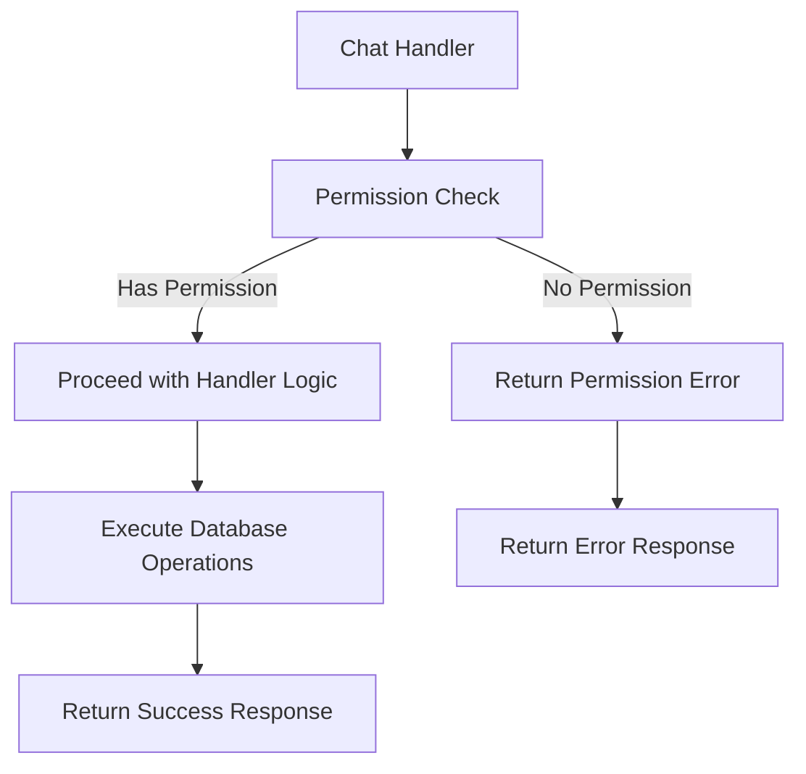

# Chat Permission Checks

## Problem Statement 
The chat-related handlers in `@libs/handlers/src/chats` currently lack standardized permission checks using the `@libs/sharing` library. While some permission logic may exist, it doesn't consistently use the `check_asset_permission.rs` functions and doesn't properly handle organization admin access to chat resources.

Specific issues include:
- Inconsistent permission checks across chat handlers
- No checks for appropriate `AssetPermissionRole` levels
- No automatic elevated access for workspace and data admins
- Risk of unauthorized access to chat resources
- No clear error handling for permission denied cases
- Many handlers only receive a `user_id` (Uuid) instead of the full `AuthenticatedUser` object

These issues affect the security and consistency of the application and need to be addressed to ensure proper access control across all chat resources.

### Current Limitations
- Chat handlers may use ad-hoc permission checks instead of the sharing library
- No organization admin check for automatic access elevation
- Inconsistent error handling for permission failures
- No clear distinction between view and edit permissions
- Unable to use cached organization role information

### Impact
- User Impact: Users may have incorrect access to chats (too much or too little)
- System Impact: Security vulnerabilities and inconsistent behavior
- Business Impact: Potential data exposure and inability to properly administer chats

## Requirements

### Functional Requirements 

#### Core Functionality
- Update chat handler signatures to use `AuthenticatedUser`
  - Details: Modify all chat handlers to accept `AuthenticatedUser` instead of just user ID
  - Acceptance Criteria: All chat handlers use `AuthenticatedUser` object
  - Dependencies: Authenticated User Object Enhancement

- Implement permission checks in all chat handlers
  - Details: Add permission checks at the beginning of each handler function using utility functions
  - Acceptance Criteria: All chat handlers properly check permissions before performing operations
  - Dependencies: Permission Utility Functions

- Enforce correct permission levels
  - Details: Map operations to appropriate permission levels (view, edit, etc.)
  - Acceptance Criteria: Each operation requires the correct minimum permission level
  - Dependencies: Permission level mapping

- Implement proper error handling
  - Details: Return appropriate error messages for permission denied cases
  - Acceptance Criteria: Consistent, secure error handling across all chat handlers
  - Dependencies: Standardized error responses

#### Handler-Specific Requirements

- get_chat_handler
  - Details: Require at least CanView permission
  - Acceptance Criteria: Users with at least CanView permission can access chat details
  - Dependencies: verify_chat_permission utility

- delete_chats_handler
  - Details: Require FullAccess or Owner permission
  - Acceptance Criteria: Only users with FullAccess or Owner permission can delete chats
  - Dependencies: verify_chat_permission utility

- update_chats_handler
  - Details: Require at least CanEdit permission
  - Acceptance Criteria: Users with at least CanEdit permission can update chat details
  - Dependencies: verify_chat_permission utility

- list_chats_handler
  - Details: Filter results based on user's permissions
  - Acceptance Criteria: Only chats the user has at least CanView permission for are returned
  - Dependencies: Permission query utilities

- sharing_endpoint_handlers
  - Details: Require FullAccess or Owner permission
  - Acceptance Criteria: Only users with FullAccess or Owner permission can modify sharing settings
  - Dependencies: verify_chat_permission utility

### Non-Functional Requirements 
- Performance Requirements
  - Permission checks should add minimal overhead to handlers (<10ms)
  - Should use cached organization roles to minimize database queries
- Security Requirements
  - Permission checks must happen before any data access
  - Error messages must not reveal sensitive information
- Maintainability Requirements
  - All handlers should use consistent permission checking patterns
  - Code should be well-documented for future maintenance

## Technical Design 

### System Architecture



### Core Components 

#### Component 1: Updated Chat Handler Signatures

```rust
// Before:
pub async fn get_chat_handler(
    chat_id: &Uuid,
    user_id: &Uuid, // Just user ID
) -> Result<ChatWithMessages> {
    // ...
}

// After:
pub async fn get_chat_handler(
    chat_id: &Uuid,
    user: &AuthenticatedUser, // Complete authenticated user with cached org roles
) -> Result<ChatWithMessages> {
    // ...
}
```

#### Component 2: Permission Check Integration

```rust
pub async fn get_chat_handler(
    chat_id: &Uuid,
    user: &AuthenticatedUser,
) -> Result<ChatWithMessages> {
    // Get database connection
    let mut conn = get_pg_pool().get().await?;
    
    // Use the permission utility to verify access
    verify_chat_permission(
        &mut conn,
        chat_id,
        user,
        AssetPermissionLevel::CanView,
    ).await?;
    
    // Existing handler logic continues below...
    // ...
}
```

#### Component 3: Error Handling

```rust
// In REST route handler
pub async fn get_chat_route(
    Path(chat_id): Path<Uuid>,
    user: AuthenticatedUser,
) -> Result<Json<ChatWithMessages>, ApiError> {
    match get_chat_handler(&chat_id, &user).await {
        Ok(result) => Ok(Json(result)),
        Err(e) => {
            if e.to_string().contains("Insufficient permissions") {
                Err(permission_denied_error())
            } else {
                Err(ApiError::InternalServerError(e.to_string()))
            }
        }
    }
}

// In WebSocket handler
pub async fn ws_get_chat(
    message: WsMessage,
    user: &AuthenticatedUser,
) -> Result<()> {
    let payload: GetChatRequest = serde_json::from_str(&message.payload)?;
    
    match get_chat_handler(&payload.id, user).await {
        Ok(result) => {
            send_ws_message(
                &user.id.to_string(),
                &WsResponseMessage::new(/* ... */),
            ).await?;
        },
        Err(e) => {
            if e.to_string().contains("Insufficient permissions") {
                send_permission_denied_error(
                    user,
                    WsRoutes::Chat(ChatRoute::Get),
                    WsEvent::Chat(ChatEvent::GetChat),
                ).await?;
            } else {
                // Handle other errors
            }
        }
    }
    
    Ok(())
}
```

#### Component 4: List Chats with Permission Filtering

```rust
pub async fn list_chats_handler(
    user: &AuthenticatedUser,
) -> Result<Vec<ChatWithMessages>> {
    let mut conn = get_pg_pool().get().await?;
    
    // Check if user is an org admin for any organization
    let is_admin_in_any_org = user.organizations.iter().any(|org| 
        matches!(org.role, UserOrganizationRole::WorkspaceAdmin | UserOrganizationRole::DataAdmin)
    );
    
    let chats = if is_admin_in_any_org {
        // For admins, get all chats in their organizations
        let org_ids: Vec<Uuid> = user.organizations
            .iter()
            .filter(|org| matches!(org.role, UserOrganizationRole::WorkspaceAdmin | UserOrganizationRole::DataAdmin))
            .map(|org| org.id)
            .collect();
            
        chats::table
            .filter(chats::organization_id.eq_any(org_ids))
            .filter(chats::deleted_at.is_null())
            .load::<Chat>(&mut conn)
            .await?
    } else {
        // For regular users, get chats they have access to
        // Get all chats the user has created (owner by default)
        let mut user_chats = chats::table
            .filter(chats::created_by.eq(user.id))
            .filter(chats::deleted_at.is_null())
            .load::<Chat>(&mut conn)
            .await?;
        
        // Get all chats where the user has been granted permissions
        let shared_chats = asset_permissions::table
            .inner_join(chats::table.on(chats::id.eq(asset_permissions::asset_id)))
            .filter(asset_permissions::identity_id.eq(user.id))
            .filter(asset_permissions::identity_type.eq(IdentityType::User))
            .filter(asset_permissions::asset_type.eq(AssetType::Chat))
            .filter(asset_permissions::deleted_at.is_null())
            .filter(chats::deleted_at.is_null())
            .select(chats::all_columns)
            .load::<Chat>(&mut conn)
            .await?;
        
        // Combine and deduplicate
        user_chats.extend(shared_chats);
        user_chats
    };
    
    // Process chats into ChatWithMessages objects
    // ...
    
    Ok(processed_chats)
}
```

### File Changes 

#### Modified Files
- `api/libs/handlers/src/chats/get_chat_handler.rs`
  - Changes: Update handler signature, add permission check
  - Impact: Ensures user has appropriate view permissions
  - Dependencies: Permission utility functions

- `api/libs/handlers/src/chats/delete_chats_handler.rs`
  - Changes: Update handler signature, add permission check
  - Impact: Ensures user has appropriate delete permissions
  - Dependencies: Permission utility functions

- `api/libs/handlers/src/chats/update_chats_handler.rs`
  - Changes: Update handler signature, add permission check
  - Impact: Ensures user has appropriate edit permissions
  - Dependencies: Permission utility functions

- `api/libs/handlers/src/chats/list_chats_handler.rs`
  - Changes: Update handler signature, modify query to filter by permissions
  - Impact: Ensures user only sees chats they have permission to view
  - Dependencies: Permission utility functions

- `api/libs/handlers/src/chats/post_chat_handler.rs`
  - Changes: Update handler signature, no permission check needed for creation
  - Impact: None (users can create chats without special permissions)
  - Dependencies: None

- `api/libs/handlers/src/chats/sharing/create_sharing_handler.rs`
  - Changes: Update permission check to use verify_chat_permission utility
  - Impact: Consistent permission checking for sharing operations
  - Dependencies: Permission utility functions

- `api/routes/rest/routes/chats/` (all route files)
  - Changes: Update to extract and pass AuthenticatedUser to handlers
  - Impact: Enables cached permission checks
  - Dependencies: None

- `api/routes/ws/chats/` (all handler files)
  - Changes: Update to pass AuthenticatedUser to handlers
  - Impact: Enables cached permission checks
  - Dependencies: None

## Implementation Plan

### Phase 1: Update Handler Signatures

1. Update chat handler signatures
   - [ ] Modify all chat handlers to accept AuthenticatedUser
   - [ ] Update handler documentation to reflect new signatures
   - [ ] Prepare unit tests for updated signatures

2. Update route handlers to pass AuthenticatedUser
   - [ ] Update REST route handlers
   - [ ] Update WebSocket message handlers
   - [ ] Update unit tests for route handlers

### Phase 2: Implement Permission Checks

1. Integrate permission utility functions
   - [ ] Add permission checks to get_chat_handler (CanView)
   - [ ] Add permission checks to delete_chats_handler (FullAccess)
   - [ ] Add permission checks to update_chats_handler (CanEdit)
   - [ ] Update list_chats_handler to filter by permissions
   - [ ] Add permission checks to sharing handlers (FullAccess)

2. Implement error handling
   - [ ] Add consistent error handling for permission failures
   - [ ] Update error responses in REST routes
   - [ ] Update error responses in WebSocket handlers

### Phase 3: Testing and Validation

1. Add unit tests
   - [ ] Test each handler with different permission levels
   - [ ] Test admin bypass functionality
   - [ ] Test error handling for permission failures

2. Update integration tests
   - [ ] Test end-to-end flows with different permission levels
   - [ ] Verify admin access works correctly
   - [ ] Test permission denied scenarios

## Testing Strategy 

### Unit Tests

```rust
#[cfg(test)]
mod tests {
    use super::*;
    use database::enums::{AssetPermissionRole, AssetType, IdentityType, UserOrganizationRole};
    use middleware::types::{AuthenticatedUser, OrganizationMembership};
    
    // Helper to create test authenticated user
    fn create_test_user(org_id: Option<Uuid>, role: Option<UserOrganizationRole>) -> AuthenticatedUser {
        let orgs = match (org_id, role) {
            (Some(id), Some(r)) => vec![OrganizationMembership { id, role: r }],
            _ => vec![],
        };
        
        AuthenticatedUser {
            id: Uuid::new_v4(),
            email: "test@example.com".to_string(),
            name: Some("Test User".to_string()),
            organizations: orgs,
            // Other fields...
        }
    }
    
    #[tokio::test]
    async fn test_get_chat_handler_admin_bypass() {
        // Create test data
        let org_id = Uuid::new_v4();
        let chat_id = Uuid::new_v4();
        
        // Create admin user
        let admin_user = create_test_user(
            Some(org_id),
            Some(UserOrganizationRole::WorkspaceAdmin),
        );
        
        // Mock database connection
        let mut mock_conn = MockDbConnection::new();
        mock_conn.expect_get_chat_org_id()
            .with(eq(chat_id))
            .returning(move |_| Ok(org_id));
        
        // Mock chat query to return a chat
        mock_conn.expect_get_chat()
            .with(eq(chat_id))
            .returning(|_| Ok(Chat { id: chat_id, organization_id: org_id, /* ... */ }));
        
        // Call handler
        let result = get_chat_handler(&chat_id, &admin_user).await;
        
        // Admin should have access due to admin bypass
        assert!(result.is_ok());
    }
    
    #[tokio::test]
    async fn test_get_chat_handler_no_permission() {
        // Create test data
        let org_id = Uuid::new_v4();
        let chat_id = Uuid::new_v4();
        
        // Create regular user
        let user = create_test_user(
            Some(org_id),
            Some(UserOrganizationRole::Member),
        );
        
        // Mock database connection
        let mut mock_conn = MockDbConnection::new();
        mock_conn.expect_get_chat_org_id()
            .with(eq(chat_id))
            .returning(move |_| Ok(org_id));
        
        // Mock permission check to return false
        mock_conn.expect_has_permission()
            .returning(|_, _, _, _, _| Ok(false));
        
        // Call handler
        let result = get_chat_handler(&chat_id, &user).await;
        
        // User should not have access
        assert!(result.is_err());
        assert!(result.unwrap_err().to_string().contains("Insufficient permissions"));
    }
}
```

### Integration Tests

#### Scenario 1: Chat Access with Various Permission Levels
- Setup: Create test chat and users with different permission levels
- Steps:
  1. Attempt to view chat with CanView, CanEdit, and FullAccess permissions
  2. Attempt to edit chat with CanView, CanEdit, and FullAccess permissions
  3. Attempt to delete chat with CanView, CanEdit, and FullAccess permissions
- Expected Results: Operations succeed only with appropriate permission levels
- Validation Criteria: View works with any permission, edit requires CanEdit+, delete requires FullAccess+

#### Scenario 2: Admin Access to Chats
- Setup: Create test chat and admin user in same organization
- Steps:
  1. Admin attempts to view, edit, and delete chat without explicit permissions
  2. System checks admin status using cached information
  3. Operations are permitted due to admin status
- Expected Results: Admin can perform all operations except those requiring Owner permission
- Validation Criteria: Operations succeed due to admin status, not explicit permissions

### Security Considerations
- Security Requirement 1: Permission Check Precedence
  - Description: Permission checks must happen before any data access or modification
  - Implementation: Place permission checks at the beginning of handler functions
  - Validation: Code review and tests that verify permission failures prevent data access

- Security Requirement 2: Principle of Least Privilege
  - Description: Each operation requires only the minimum necessary permission level
  - Implementation: Map operations to appropriate permission roles
  - Validation: Tests that verify operations fail with insufficient permissions

### Performance Considerations
- Performance Requirement 1: Efficient Permission Checking
  - Description: Permission checks should not significantly impact handler performance
  - Implementation: Use cached user organization roles to avoid database queries
  - Validation: Performance benchmarks of handlers with and without cached information

- Performance Requirement 2: Optimized List Queries
  - Description: List operations should efficiently filter by permissions
  - Implementation: Optimize queries for different user types (admin vs. regular)
  - Validation: Database query analysis for list operations

## References
- [Permission Utility Functions](api_permission_utilities.md)
- [Authenticated User Object Enhancement](api_auth_user_enhancement.md)
- [Sharing Library Documentation](mdc:libs/sharing/src/lib.rs)
- [Chat Models](mdc:database/src/models.rs)
- [Asset Permission Roles](mdc:database/src/enums.rs)