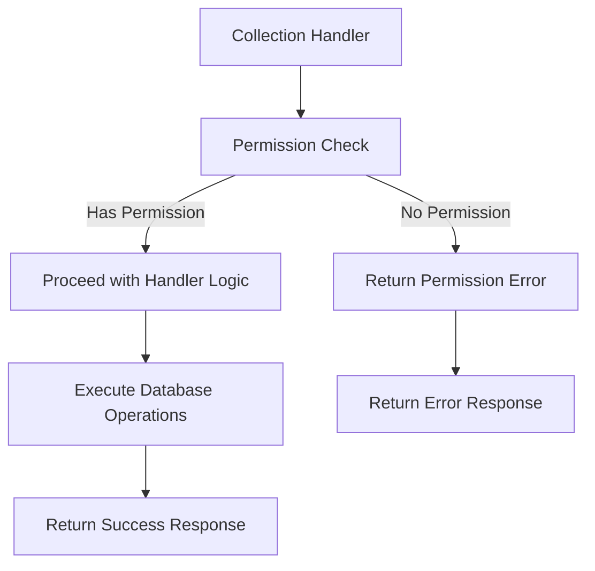

# Collection Permission Checks

## Problem Statement 

The collection-related handlers in `@libs/handlers/src/collections` currently lack standardized permission checks using the `@libs/sharing` library. While some permission logic may exist, it doesn't consistently use the `check_asset_permission.rs` functions and doesn't properly handle organization admin access to collection resources.

Specific issues include:
- Inconsistent permission checks across collection handlers
- Hard-coded permission values without proper checking (e.g., `permission: AssetPermissionRole::Owner` in responses)
- No automatic elevated access for workspace and data admins
- Risk of unauthorized access, modification, or deletion of collections
- No clear error handling for permission denied cases
- Many handlers only receive a `user_id` (Uuid) instead of the full `AuthenticatedUser` object

These issues affect the security and consistency of the application and need to be addressed to ensure proper access control across all collection resources.

### Current Limitations
- Collection handlers may use ad-hoc permission checks or none at all
- No organization admin check for automatic access elevation
- Inconsistent error handling for permission failures
- Lack of proper permission filtering for list operations
- Unable to use cached organization role information

### Impact
- User Impact: Users may have incorrect access to collections (too much or too little)
- System Impact: Security vulnerabilities and inconsistent behavior
- Business Impact: Potential unauthorized access to grouped assets and inability to properly administer collections

## Requirements

### Functional Requirements 

#### Core Functionality
- Update collection handler signatures to use `AuthenticatedUser`
  - Details: Modify all collection handlers to accept `AuthenticatedUser` instead of just user ID
  - Acceptance Criteria: All collection handlers use `AuthenticatedUser` object
  - Dependencies: Authenticated User Object Enhancement

- Implement permission checks in all collection handlers
  - Details: Add permission checks at the beginning of each handler function using utility functions
  - Acceptance Criteria: All collection handlers properly check permissions before performing operations
  - Dependencies: Permission Utility Functions

- Enforce correct permission levels for different operations
  - Details: Map operations to appropriate permission levels (view, edit, delete)
  - Acceptance Criteria: Each operation requires the correct minimum permission level
  - Dependencies: Permission level mapping

- Implement proper error handling
  - Details: Return appropriate error messages for permission denied cases
  - Acceptance Criteria: Consistent, secure error handling across all collection handlers
  - Dependencies: Standardized error responses

#### Handler-Specific Requirements

- get_collection_handler
  - Details: Require at least CanView permission
  - Acceptance Criteria: Users with at least CanView permission can access collection details
  - Dependencies: verify_collection_permission utility

- delete_collection_handler
  - Details: Require FullAccess or Owner permission
  - Acceptance Criteria: Only users with FullAccess or Owner permission can delete collections
  - Dependencies: verify_collection_permission utility

- update_collection_handler
  - Details: Require at least CanEdit permission
  - Acceptance Criteria: Users with at least CanEdit permission can update collection details
  - Dependencies: verify_collection_permission utility

- list_collections_handler
  - Details: Filter results based on user's permissions
  - Acceptance Criteria: Only collections the user has at least CanView permission for are returned
  - Dependencies: Permission query utilities

- add_assets_to_collection_handler
  - Details: Require at least CanEdit permission
  - Acceptance Criteria: Only users with at least CanEdit permission can add assets to collections
  - Dependencies: verify_collection_permission utility

- remove_assets_from_collection_handler
  - Details: Require at least CanEdit permission
  - Acceptance Criteria: Only users with at least CanEdit permission can remove assets from collections
  - Dependencies: verify_collection_permission utility

- sharing_endpoint_handlers
  - Details: Require FullAccess or Owner permission
  - Acceptance Criteria: Only users with FullAccess or Owner permission can modify sharing settings
  - Dependencies: verify_collection_permission utility

### Non-Functional Requirements 

- Performance Requirements
  - Permission checks should add minimal overhead to handlers (<10ms)
  - Should use cached organization roles to minimize database queries
- Security Requirements
  - Permission checks must happen before any data access or modification
  - Error messages must not reveal sensitive information
- Maintainability Requirements
  - All handlers should use consistent permission checking patterns
  - Code should be well-documented for future maintenance

## Technical Design 

### System Architecture



### Core Components 

#### Component 1: Updated Collection Handler Signatures

```rust
// Before:
pub async fn get_collection_handler(
    req: GetCollectionRequest,
    user_id: &Uuid, // Just user ID
) -> Result<CollectionState> {
    // ...
}

// After:
pub async fn get_collection_handler(
    req: GetCollectionRequest,
    user: &AuthenticatedUser, // Complete authenticated user with cached org roles
) -> Result<CollectionState> {
    // ...
}
```

#### Component 2: Permission Check Integration

```rust
pub async fn get_collection_handler(
    req: GetCollectionRequest,
    user: &AuthenticatedUser,
) -> Result<CollectionState> {
    // Get database connection
    let mut conn = get_pg_pool().get().await?;
    
    // Use the permission utility to verify access
    verify_collection_permission(
        &mut conn,
        &req.id,
        user,
        AssetPermissionLevel::CanView,
    ).await?;
    
    // Existing handler logic continues below...
    // ...
    
    // Get the actual permission role for accurate response
    let permission_role = get_collection_permission_role(&mut conn, &req.id, user).await?;
    
    Ok(CollectionState {
        collection,
        assets: formatted_assets,
        permission: permission_role, // Use actual role instead of hardcoded Owner
        organization_permissions: false,
        individual_permissions,
        publicly_accessible,
        public_expiry_date,
        public_enabled_by,
        public_password: None,
    })
}
```

#### Component 3: Add/Remove Assets Permission Check

```rust
pub async fn add_assets_to_collection_handler(
    collection_id: &Uuid,
    user: &AuthenticatedUser,
    assets: Vec<AddAssetRequest>,
) -> Result<()> {
    // Get database connection
    let mut conn = get_pg_pool().get().await?;
    
    // Check if user has edit permission on collection
    verify_collection_permission(
        &mut conn,
        collection_id,
        user,
        AssetPermissionLevel::CanEdit,
    ).await?;
    
    // For each asset, also check if user has view permission
    for asset in &assets {
        match asset.asset_type {
            AssetType::Chat => {
                verify_chat_permission(
                    &mut conn,
                    &asset.asset_id,
                    user,
                    AssetPermissionLevel::CanView,
                ).await?;
            },
            AssetType::DashboardFile => {
                verify_dashboard_permission(
                    &mut conn,
                    &asset.asset_id,
                    user,
                    AssetPermissionLevel::CanView,
                ).await?;
            },
            AssetType::MetricFile => {
                verify_metric_permission(
                    &mut conn,
                    &asset.asset_id,
                    user,
                    AssetPermissionLevel::CanView,
                ).await?;
            },
            _ => return Err(anyhow!("Unsupported asset type for collections")),
        }
    }
    
    // Existing handler logic continues below...
    // ...
}
```

#### Component 4: List Collections with Permission Filtering

```rust
pub async fn list_collections_handler(
    user: &AuthenticatedUser,
) -> Result<Vec<Collection>> {
    let mut conn = get_pg_pool().get().await?;
    
    // Check if user is an org admin for any organization
    let admin_org_ids: Vec<Uuid> = user.organizations
        .iter()
        .filter(|org| matches!(org.role, UserOrganizationRole::WorkspaceAdmin | UserOrganizationRole::DataAdmin))
        .map(|org| org.id)
        .collect();
    
    let collections = if !admin_org_ids.is_empty() {
        // For admins, get all collections in their organizations
        collections::table
            .filter(collections::organization_id.eq_any(&admin_org_ids))
            .filter(collections::deleted_at.is_null())
            .load::<Collection>(&mut conn)
            .await?
    } else {
        // For regular users, get collections they have access to
        // Get all collections the user has created (owner by default)
        let mut user_collections = collections::table
            .filter(collections::created_by.eq(user.id))
            .filter(collections::deleted_at.is_null())
            .load::<Collection>(&mut conn)
            .await?;
        
        // Get all collections where the user has been granted permissions
        let shared_collections = asset_permissions::table
            .inner_join(collections::table.on(collections::id.eq(asset_permissions::asset_id)))
            .filter(asset_permissions::identity_id.eq(user.id))
            .filter(asset_permissions::identity_type.eq(IdentityType::User))
            .filter(asset_permissions::asset_type.eq(AssetType::Collection))
            .filter(asset_permissions::deleted_at.is_null())
            .filter(collections::deleted_at.is_null())
            .select(collections::all_columns)
            .load::<Collection>(&mut conn)
            .await?;
        
        // Combine and deduplicate
        user_collections.extend(shared_collections);
        user_collections
    };
    
    Ok(collections)
}
```

### File Changes 

#### Modified Files
- `api/libs/handlers/src/collections/get_collection_handler.rs`
  - Changes: Update handler signature, add permission check, use accurate permission role in response
  - Impact: Ensures user has appropriate view permissions, returns accurate permission info
  - Dependencies: Permission utility functions

- `api/libs/handlers/src/collections/delete_collection_handler.rs`
  - Changes: Update handler signature, add permission check
  - Impact: Ensures user has appropriate delete permissions
  - Dependencies: Permission utility functions

- `api/libs/handlers/src/collections/update_collection_handler.rs`
  - Changes: Update handler signature, add permission check
  - Impact: Ensures user has appropriate edit permissions
  - Dependencies: Permission utility functions

- `api/libs/handlers/src/collections/list_collections_handler.rs`
  - Changes: Update handler signature, modify query to filter by permissions, add admin special handling
  - Impact: Ensures user only sees collections they have permission to view
  - Dependencies: Permission utility functions

- `api/libs/handlers/src/collections/add_assets_to_collection_handler.rs`
  - Changes: Update handler signature, add permission check for collection and assets
  - Impact: Ensures user has appropriate edit permissions on collection and view permissions on assets
  - Dependencies: Permission utility functions, Cross-asset operations

- `api/libs/handlers/src/collections/remove_assets_from_collection_handler.rs`
  - Changes: Update handler signature, add permission check
  - Impact: Ensures user has appropriate edit permissions
  - Dependencies: Permission utility functions

- `api/libs/handlers/src/collections/create_collection_handler.rs`
  - Changes: Update handler signature, no permission check needed for creation
  - Impact: None (users can create collections without special permissions)
  - Dependencies: None

- `api/libs/handlers/src/collections/sharing/create_sharing_handler.rs`
  - Changes: Update permission check to use verify_collection_permission utility
  - Impact: Consistent permission checking for sharing operations
  - Dependencies: Permission utility functions

- `api/routes/rest/routes/collections/` (all route files)
  - Changes: Update to extract and pass AuthenticatedUser to handlers
  - Impact: Enables cached permission checks
  - Dependencies: None

- `api/routes/ws/collections/` (all handler files)
  - Changes: Update to pass AuthenticatedUser to handlers
  - Impact: Enables cached permission checks
  - Dependencies: None

## Implementation Plan

### Phase 1: Update Handler Signatures

1. Update collection handler signatures
   - [ ] Modify all collection handlers to accept AuthenticatedUser
   - [ ] Update handler documentation to reflect new signatures
   - [ ] Prepare unit tests for updated signatures

2. Update route handlers to pass AuthenticatedUser
   - [ ] Update REST route handlers
   - [ ] Update WebSocket message handlers
   - [ ] Update unit tests for route handlers

### Phase 2: Implement Permission Checks

1. Integrate permission utility functions
   - [ ] Add permission checks to get_collection_handler (CanView)
   - [ ] Add permission checks to delete_collection_handler (FullAccess)
   - [ ] Add permission checks to update_collection_handler (CanEdit)
   - [ ] Update list_collections_handler to filter by permissions
   - [ ] Add permission checks to add/remove assets handlers (CanEdit)
   - [ ] Add permission checks to sharing handlers (FullAccess)

2. Fix hardcoded permission responses
   - [ ] Update get_collection_handler to use actual permission role
   - [ ] Update list_collections_handler to include actual permission roles

3. Implement error handling
   - [ ] Add consistent error handling for permission failures
   - [ ] Update error responses in REST routes
   - [ ] Update error responses in WebSocket handlers

### Phase 3: Cross-Asset Operations

1. Implement cross-asset permission checks
   - [ ] Update add_assets_to_collection_handler to check permissions on both collection and assets
   - [ ] Use cross-asset permission utility functions when available

### Phase 4: Testing and Validation

1. Add unit tests
   - [ ] Test each handler with different permission levels
   - [ ] Test admin bypass functionality
   - [ ] Test error handling for permission failures
   - [ ] Test cross-asset operations

2. Update integration tests
   - [ ] Test end-to-end flows with different permission levels
   - [ ] Verify admin access works correctly
   - [ ] Test permission denied scenarios
   - [ ] Test cross-asset operations

## Testing Strategy 

### Unit Tests

```rust
#[cfg(test)]
mod tests {
    use super::*;
    use database::enums::{AssetPermissionRole, AssetType, IdentityType, UserOrganizationRole};
    use middleware::types::{AuthenticatedUser, OrganizationMembership};
    
    // Helper to create test authenticated user
    fn create_test_user(org_id: Option<Uuid>, role: Option<UserOrganizationRole>) -> AuthenticatedUser {
        let orgs = match (org_id, role) {
            (Some(id), Some(r)) => vec![OrganizationMembership { id, role: r }],
            _ => vec![],
        };
        
        AuthenticatedUser {
            id: Uuid::new_v4(),
            email: "test@example.com".to_string(),
            name: Some("Test User".to_string()),
            organizations: orgs,
            // Other fields...
        }
    }
    
    #[tokio::test]
    async fn test_get_collection_handler_admin_bypass() {
        // Create test data
        let org_id = Uuid::new_v4();
        let collection_id = Uuid::new_v4();
        
        // Create admin user
        let admin_user = create_test_user(
            Some(org_id),
            Some(UserOrganizationRole::WorkspaceAdmin),
        );
        
        // Mock database connection
        let mut mock_conn = MockDbConnection::new();
        mock_conn.expect_get_collection_org_id()
            .with(eq(collection_id))
            .returning(move |_| Ok(org_id));
        
        // Mock collection query to return a collection
        mock_conn.expect_get_collection()
            .with(eq(collection_id))
            .returning(|_| Ok(Collection { id: collection_id, organization_id: org_id, /* ... */ }));
        
        // Create request
        let req = GetCollectionRequest { id: collection_id };
        
        // Call handler
        let result = get_collection_handler(req, &admin_user).await;
        
        // Admin should have access due to admin bypass
        assert!(result.is_ok());
        
        // Check that permission in response is FullAccess (not hardcoded Owner)
        assert_eq!(result.unwrap().permission, AssetPermissionRole::FullAccess);
    }
    
    #[tokio::test]
    async fn test_add_assets_to_collection_insufficient_collection_permission() {
        // Create test data
        let org_id = Uuid::new_v4();
        let collection_id = Uuid::new_v4();
        
        // Create regular user
        let user = create_test_user(
            Some(org_id),
            Some(UserOrganizationRole::Member),
        );
        
        // Mock database connection
        let mut mock_conn = MockDbConnection::new();
        mock_conn.expect_get_collection_org_id()
            .with(eq(collection_id))
            .returning(move |_| Ok(org_id));
        
        // Mock permission check to return false
        mock_conn.expect_has_permission()
            .returning(|_, _, _, _, _| Ok(false));
        
        // Create test assets
        let assets = vec![
            AddAssetRequest {
                asset_id: Uuid::new_v4(),
                asset_type: AssetType::Chat,
            }
        ];
        
        // Call handler
        let result = add_assets_to_collection_handler(&collection_id, &user, assets).await;
        
        // User should not have permission to add assets
        assert!(result.is_err());
        assert!(result.unwrap_err().to_string().contains("Insufficient permissions"));
    }
}
```

### Integration Tests

#### Scenario 1: Collection Access with Various Permission Levels
- Setup: Create test collection and users with different permission levels
- Steps:
  1. Attempt to view collection with CanView, CanEdit, and FullAccess permissions
  2. Attempt to edit collection with CanView, CanEdit, and FullAccess permissions
  3. Attempt to delete collection with CanView, CanEdit, and FullAccess permissions
- Expected Results: Operations succeed only with appropriate permission levels
- Validation Criteria: View works with any permission, edit requires CanEdit+, delete requires FullAccess+

#### Scenario 2: Admin Access to Collections
- Setup: Create test collection and admin user in same organization
- Steps:
  1. Admin attempts to view, edit, and delete collection without explicit permissions
  2. System checks admin status using cached information
  3. Operations are permitted due to admin status
- Expected Results: Admin can perform all operations except those requiring Owner permission
- Validation Criteria: Operations succeed due to admin status, not explicit permissions

#### Scenario 3: Cross-Asset Operations
- Setup: Create test collection, assets, and users with different permission levels
- Steps:
  1. User with CanEdit on collection and CanView on asset attempts to add asset to collection
  2. User with CanEdit on collection but no permission on asset attempts to add asset to collection
  3. User with CanView on collection and CanView on asset attempts to add asset to collection
- Expected Results: Operation succeeds only with appropriate permissions on both collection and asset
- Validation Criteria: Only users with CanEdit on collection and at least CanView on asset can add assets

### Security Considerations
- Security Requirement 1: Permission Check Precedence
  - Description: Permission checks must happen before any data access or modification
  - Implementation: Place permission checks at the beginning of handler functions
  - Validation: Code review and tests that verify permission failures prevent data access

- Security Requirement 2: Principle of Least Privilege
  - Description: Each operation requires only the minimum necessary permission level
  - Implementation: Map operations to appropriate permission roles
  - Validation: Tests that verify operations fail with insufficient permissions

### Performance Considerations
- Performance Requirement 1: Efficient Permission Checking
  - Description: Permission checks should not significantly impact handler performance
  - Implementation: Use cached user organization roles to avoid database queries
  - Validation: Performance benchmarks of handlers with and without cached information

- Performance Requirement 2: Optimized List Queries
  - Description: List operations should efficiently filter by permissions
  - Implementation: Optimize queries for different user types (admin vs. regular)
  - Validation: Database query analysis for list operations

## References
- [Permission Utility Functions](api_permission_utilities.md)
- [Authenticated User Object Enhancement](api_auth_user_enhancement.md)
- [Cross-Asset Operations](api_cross_asset_operations.md)
- [Sharing Library Documentation](mdc:libs/sharing/src/lib.rs)
- [Collection Models](mdc:database/src/models.rs)
- [Asset Permission Roles](mdc:database/src/enums.rs)