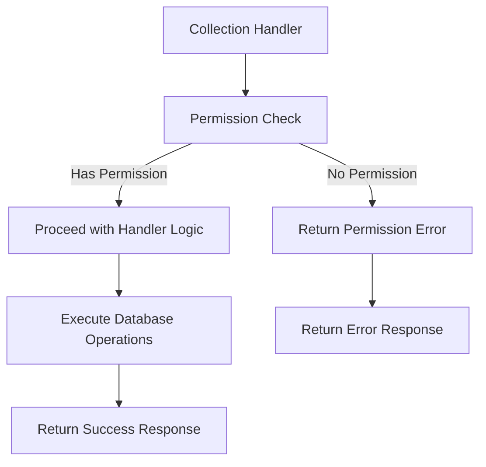

# Collection Permission Checks

## Problem Statement 

The collection-related handlers in `@libs/handlers/src/collections` currently lack standardized permission checks using the `@libs/sharing` library. While some permission logic may exist, it doesn't consistently use the `check_asset_permission.rs` functions and doesn't properly handle organization admin access to collection resources.

Specific issues include:
- Inconsistent permission checks across collection handlers
- Hard-coded permission values without proper checking (e.g., `permission: AssetPermissionRole::Owner` in responses)
- No automatic elevated access for workspace and data admins
- Risk of unauthorized access, modification, or deletion of collections
- No clear error handling for permission denied cases

These issues affect the security and consistency of the application and need to be addressed to ensure proper access control across all collection resources.

### Current Limitations
- Collection handlers may use ad-hoc permission checks or none at all
- No organization admin check for automatic access elevation
- Inconsistent error handling for permission failures
- Lack of proper permission filtering for list operations

### Impact
- User Impact: Users may have incorrect access to collections (too much or too little)
- System Impact: Security vulnerabilities and inconsistent behavior
- Business Impact: Potential unauthorized access to grouped assets and inability to properly administer collections

## Requirements

### Functional Requirements 

#### Core Functionality
- Implement permission checks in all collection handlers
  - Details: Add permission checks at the beginning of each handler function
  - Acceptance Criteria: All collection handlers properly check permissions before performing operations
  - Dependencies: Sharing library, admin check utility

- Enforce correct permission levels for different operations
  - Details: Map operations to appropriate permission levels (view, edit, delete)
  - Acceptance Criteria: Each operation requires the correct minimum permission level
  - Dependencies: `AssetPermissionRole` enum

- Implement proper error handling
  - Details: Return appropriate error messages for permission denied cases
  - Acceptance Criteria: Consistent, secure error handling across all collection handlers
  - Dependencies: None

#### Handler-Specific Requirements

- get_collection_handler
  - Details: Require at least CanView permission
  - Acceptance Criteria: Users with at least CanView permission can access collection details
  - Dependencies: None

- delete_collection_handler
  - Details: Require FullAccess or Owner permission
  - Acceptance Criteria: Only users with FullAccess or Owner permission can delete collections
  - Dependencies: None

- update_collection_handler
  - Details: Require at least CanEdit permission
  - Acceptance Criteria: Users with at least CanEdit permission can update collection details
  - Dependencies: None

- list_collections_handler
  - Details: Filter results based on user's permissions
  - Acceptance Criteria: Only collections the user has at least CanView permission for are returned
  - Dependencies: None

- add_assets_to_collection_handler
  - Details: Require at least CanEdit permission
  - Acceptance Criteria: Only users with at least CanEdit permission can add assets to collections
  - Dependencies: None

- remove_assets_from_collection_handler
  - Details: Require at least CanEdit permission
  - Acceptance Criteria: Only users with at least CanEdit permission can remove assets from collections
  - Dependencies: None

- sharing_endpoint_handlers
  - Details: Require FullAccess or Owner permission
  - Acceptance Criteria: Only users with FullAccess or Owner permission can modify sharing settings
  - Dependencies: None

### Non-Functional Requirements 

- Performance Requirements
  - Permission checks should add minimal overhead to handlers (<10ms)
- Security Requirements
  - Permission checks must happen before any data access or modification
  - Error messages must not reveal sensitive information
- Maintainability Requirements
  - All handlers should use consistent permission checking patterns
  - Code should be well-documented for future maintenance

## Technical Design 

### System Architecture



### Core Components 

#### Component 1: Permission Check Utility for Collection Handlers

```rust
/// Verifies a user has sufficient permissions for a collection operation
///
/// # Arguments
/// * `collection_id` - The ID of the collection to check
/// * `user_id` - The ID of the user requesting access
/// * `required_role` - The minimum role required for the operation
///
/// # Returns
/// * `Result<()>` - Ok if user has permission, Error otherwise
async fn verify_collection_permission(
    collection_id: &Uuid,
    user_id: &Uuid,
    required_role: AssetPermissionRole,
) -> Result<()> {
    // Get the organization ID for this collection
    let org_id = collections::table
        .filter(collections::id.eq(collection_id))
        .filter(collections::deleted_at.is_null())
        .select(collections::organization_id)
        .first::<Uuid>(&mut get_pg_pool().get().await?)
        .await
        .map_err(|e| anyhow!("Failed to find collection: {}", e))?;
    
    // Check if user is an org admin
    if is_user_org_admin(user_id, &org_id).await? {
        // Admins get everything except Owner permissions
        if required_role != AssetPermissionRole::Owner {
            return Ok(());
        }
    }
    
    // Check regular permissions
    let has_access = has_permission(
        *collection_id,
        AssetType::Collection,
        *user_id,
        IdentityType::User,
        required_role,
    )
    .await?;
    
    if has_access {
        Ok(())
    } else {
        Err(anyhow!("Insufficient permissions for collection operation"))
    }
}

/// Get the actual permission role a user has for a collection
///
/// # Arguments
/// * `collection_id` - The ID of the collection to check
/// * `user_id` - The ID of the user to check permissions for
///
/// # Returns
/// * `Result<AssetPermissionRole>` - The highest permission role the user has
async fn get_collection_permission_role(
    collection_id: &Uuid,
    user_id: &Uuid,
) -> Result<AssetPermissionRole> {
    // Get the organization ID for this collection
    let org_id = collections::table
        .filter(collections::id.eq(collection_id))
        .filter(collections::deleted_at.is_null())
        .select(collections::organization_id)
        .first::<Uuid>(&mut get_pg_pool().get().await?)
        .await
        .map_err(|e| anyhow!("Failed to find collection: {}", e))?;
    
    // Check if user is an org admin
    if is_user_org_admin(user_id, &org_id).await? {
        // Admins get FullAccess
        return Ok(AssetPermissionRole::FullAccess);
    }
    
    // Check regular permissions
    let user_role = check_access(
        *collection_id,
        AssetType::Collection,
        *user_id,
        IdentityType::User,
    )
    .await?;
    
    // If collection was created by the user, they're the owner
    let is_owner = collections::table
        .filter(collections::id.eq(collection_id))
        .filter(collections::created_by.eq(user_id))
        .first::<Collection>(&mut get_pg_pool().get().await?)
        .await
        .is_ok();
    
    if is_owner {
        Ok(AssetPermissionRole::Owner)
    } else {
        Ok(user_role.unwrap_or(AssetPermissionRole::CanView))
    }
}
```

#### Component 2: Modified get_collection_handler

```rust
pub async fn get_collection_handler(
    user_id: &Uuid,
    req: GetCollectionRequest,
) -> Result<CollectionState> {
    // Verify user has at least CanView permission
    verify_collection_permission(&req.id, user_id, AssetPermissionRole::CanView).await?;
    
    // Existing handler logic continues below...
    // ...
    
    // Get the actual permission role for accurate response
    let permission_role = get_collection_permission_role(&req.id, user_id).await?;
    
    Ok(CollectionState {
        collection,
        assets: formatted_assets,
        permission: permission_role, // Use actual role instead of hardcoded Owner
        organization_permissions: false,
        individual_permissions,
        publicly_accessible,
        public_expiry_date,
        public_enabled_by,
        public_password: None,
    })
}
```

#### Component 3: Modified delete_collection_handler

```rust
pub async fn delete_collection_handler(
    collection_id: &Uuid,
    user_id: &Uuid,
) -> Result<()> {
    // Verify user has FullAccess permission (required for deletion)
    verify_collection_permission(collection_id, user_id, AssetPermissionRole::FullAccess).await?;
    
    // Existing handler logic continues below...
    // ...
}
```

#### Component 4: Modified update_collection_handler

```rust
pub async fn update_collection_handler(
    collection_id: &Uuid,
    user_id: &Uuid,
    request: UpdateCollectionRequest,
) -> Result<Collection> {
    // Verify user has at least CanEdit permission
    verify_collection_permission(collection_id, user_id, AssetPermissionRole::CanEdit).await?;
    
    // Existing handler logic continues below...
    // ...
}
```

#### Component 5: Modified list_collections_handler

```rust
pub async fn list_collections_handler(user_id: &Uuid) -> Result<Vec<Collection>> {
    // For list operations, we'll filter by permissions rather than block entirely
    let mut conn = get_pg_pool().get().await?;
    
    // Get organization ID for this user
    let org_id = match get_user_organization_id(user_id).await {
        Ok(id) => id,
        Err(_) => return Ok(Vec::new()), // No organization, no collections
    };
    
    // Check if user is an org admin
    let is_admin = is_user_org_admin(user_id, &org_id).await?;
    
    // If admin, return all collections in organization
    if is_admin {
        let org_collections = collections::table
            .filter(collections::organization_id.eq(org_id))
            .filter(collections::deleted_at.is_null())
            .load::<Collection>(&mut conn)
            .await?;
        
        return Ok(org_collections);
    }
    
    // Otherwise, get collections based on explicit permissions
    
    // Get all collections the user has created (owner by default)
    let mut user_collections = collections::table
        .filter(collections::created_by.eq(user_id))
        .filter(collections::deleted_at.is_null())
        // ... additional query logic ...
        .load::<Collection>(&mut conn)
        .await?;
    
    // Get all collections where the user has been granted permissions
    let shared_collections = asset_permissions::table
        .inner_join(collections::table.on(collections::id.eq(asset_permissions::asset_id)))
        .filter(asset_permissions::identity_id.eq(user_id))
        .filter(asset_permissions::identity_type.eq(IdentityType::User))
        .filter(asset_permissions::asset_type.eq(AssetType::Collection))
        .filter(asset_permissions::deleted_at.is_null())
        .filter(collections::deleted_at.is_null())
        // ... additional query logic ...
        .select(collections::all_columns)
        .load::<Collection>(&mut conn)
        .await?;
    
    // Combine and return unique collections
    user_collections.extend(shared_collections);
    // ... process and deduplicate collections ...
    
    Ok(user_collections)
}
```

#### Component 6: Modified add_assets_to_collection_handler

```rust
pub async fn add_assets_to_collection_handler(
    collection_id: &Uuid,
    user_id: &Uuid,
    assets: Vec<AddAssetRequest>,
) -> Result<()> {
    // Verify user has at least CanEdit permission
    verify_collection_permission(collection_id, user_id, AssetPermissionRole::CanEdit).await?;
    
    // Existing handler logic continues below...
    // ...
}
```

### File Changes 

#### Modified Files
- `api/libs/handlers/src/collections/get_collection_handler.rs`
  - Changes: Add permission check at start of handler, use accurate permission role in response
  - Impact: Ensures user has appropriate view permissions, returns accurate permission info
  - Dependencies: Sharing library, admin check utility

- `api/libs/handlers/src/collections/delete_collection_handler.rs`
  - Changes: Add permission check at start of handler
  - Impact: Ensures user has appropriate delete permissions
  - Dependencies: Sharing library, admin check utility

- `api/libs/handlers/src/collections/update_collection_handler.rs`
  - Changes: Add permission check at start of handler
  - Impact: Ensures user has appropriate edit permissions
  - Dependencies: Sharing library, admin check utility

- `api/libs/handlers/src/collections/list_collections_handler.rs`
  - Changes: Modify query to filter by permissions, add admin special handling
  - Impact: Ensures user only sees collections they have permission to view
  - Dependencies: Sharing library, admin check utility

- `api/libs/handlers/src/collections/add_assets_to_collection_handler.rs`
  - Changes: Add permission check at start of handler
  - Impact: Ensures user has appropriate edit permissions
  - Dependencies: Sharing library, admin check utility

- `api/libs/handlers/src/collections/remove_assets_from_collection_handler.rs`
  - Changes: Add permission check at start of handler
  - Impact: Ensures user has appropriate edit permissions
  - Dependencies: Sharing library, admin check utility

- `api/libs/handlers/src/collections/create_collection_handler.rs`
  - Changes: No permission check needed for creation
  - Impact: None (users can create collections without special permissions)
  - Dependencies: None

## Implementation Plan

### Phase 1: Add Permission Utilities  (In Progress)

1. Create collection-specific permission utility functions
   - [ ] Implement `verify_collection_permission` helper function
   - [ ] Implement `get_collection_permission_role` helper function
   - [ ] Add error handling for permission failures
   - [ ] Create reusable query for getting collection organization ID

2. Add unit tests for permission utilities
   - [ ] Test permission verification with various roles
   - [ ] Test admin override functionality
   - [ ] Test error handling and edge cases

### Phase 2: Modify Collection Handlers  (Not Started)

1. Update get_collection_handler
   - [ ] Add permission check for CanView
   - [ ] Replace hardcoded permission with actual user permission
   - [ ] Ensure proper error handling
   - [ ] Update unit tests

2. Update delete_collection_handler
   - [ ] Add permission check for FullAccess
   - [ ] Ensure proper error handling
   - [ ] Update unit tests

3. Update update_collection_handler
   - [ ] Add permission check for CanEdit
   - [ ] Ensure proper error handling
   - [ ] Update unit tests

4. Update list_collections_handler
   - [ ] Modify queries to filter by permission
   - [ ] Add logic to include admin-accessible collections
   - [ ] Update unit tests

5. Update asset modification handlers
   - [ ] Add permission checks to add_assets_to_collection_handler
   - [ ] Add permission checks to remove_assets_from_collection_handler
   - [ ] Update unit tests

### Phase 3: Testing & Documentation  (Not Started)

1. Add integration tests
   - [ ] Test end-to-end flows with different permission levels
   - [ ] Verify admin access works correctly
   - [ ] Test permission denial scenarios

2. Update documentation
   - [ ] Document permission requirements for each handler
   - [ ] Add examples of correct usage
   - [ ] Document error handling behavior

## Testing Strategy 

### Unit Tests

```rust
#[cfg(test)]
mod tests {
    use super::*;
    use database::enums::{AssetPermissionRole, AssetType, IdentityType};
    use mockall::{predicate::*, *};
    
    // Mock permission checking functions
    mock! {
        PermissionChecker {}
        impl PermissionChecker {
            async fn has_permission(
                asset_id: Uuid,
                asset_type: AssetType,
                identity_id: Uuid,
                identity_type: IdentityType,
                required_role: AssetPermissionRole,
            ) -> Result<bool>;
            
            async fn is_user_org_admin(
                user_id: &Uuid,
                org_id: &Uuid,
            ) -> Result<bool>;
        }
    }
    
    #[tokio::test]
    async fn test_get_collection_handler_with_permission() {
        // Test that handler succeeds when user has permission
        let collection_id = Uuid::new_v4();
        let user_id = Uuid::new_v4();
        let req = GetCollectionRequest { id: collection_id };
        
        // Mock permission check to return true
        // [mocking setup here]
        
        let result = get_collection_handler(&user_id, req).await;
        assert!(result.is_ok());
    }
    
    #[tokio::test]
    async fn test_get_collection_handler_without_permission() {
        // Test that handler fails when user lacks permission
        let collection_id = Uuid::new_v4();
        let user_id = Uuid::new_v4();
        let req = GetCollectionRequest { id: collection_id };
        
        // Mock permission check to return false
        // [mocking setup here]
        
        let result = get_collection_handler(&user_id, req).await;
        assert!(result.is_err());
        assert!(result.unwrap_err().to_string().contains("Insufficient permissions"));
    }
    
    #[tokio::test]
    async fn test_get_collection_permission_role_admin() {
        // Test that admin users get FullAccess role
        let collection_id = Uuid::new_v4();
        let user_id = Uuid::new_v4();
        let org_id = Uuid::new_v4();
        
        // Mock admin check to return true
        // [mocking setup here]
        
        let result = get_collection_permission_role(&collection_id, &user_id).await;
        assert!(result.is_ok());
        assert_eq!(result.unwrap(), AssetPermissionRole::FullAccess);
    }
    
    #[tokio::test]
    async fn test_list_collections_handler_admin_user() {
        // Test that admins see all collections in org
        let user_id = Uuid::new_v4();
        let org_id = Uuid::new_v4();
        
        // Mock admin check to return true
        // [mocking setup here]
        
        let result = list_collections_handler(&user_id).await;
        assert!(result.is_ok());
        // Assert that result includes all collections in org
    }
}
```

### Integration Tests

#### Scenario 1: Collection Access with Various Permission Levels
- Setup: Create test collection and users with different permission levels
- Steps:
  1. Attempt to view collection with CanView, CanEdit, and FullAccess permissions
  2. Attempt to edit collection with CanView, CanEdit, and FullAccess permissions
  3. Attempt to delete collection with CanView, CanEdit, and FullAccess permissions
- Expected Results: Operations succeed only with appropriate permission levels
- Validation Criteria: View works with any permission, edit requires CanEdit+, delete requires FullAccess+

#### Scenario 2: Admin Access to Collections
- Setup: Create test collection and admin user in same organization
- Steps:
  1. Admin attempts to view, edit, and delete collection without explicit permissions
  2. System checks admin status and permits operations
- Expected Results: Admin can perform all operations except those requiring Owner permission
- Validation Criteria: Operations succeed due to admin status, not explicit permissions

#### Scenario 3: Collection Asset Modification
- Setup: Create test collection and users with different permission levels
- Steps:
  1. Attempt to add assets to collection with CanView, CanEdit, and FullAccess permissions
  2. Attempt to remove assets from collection with CanView, CanEdit, and FullAccess permissions
- Expected Results: Operations succeed only with appropriate permission levels
- Validation Criteria: Asset modifications require at least CanEdit permission

### Security Considerations
- Security Requirement 1: Permission Check Precedence
  - Description: Permission checks must happen before any data access or modification
  - Implementation: Place permission checks at the beginning of handler functions
  - Validation: Code review and tests that verify permission failures prevent data access

- Security Requirement 2: Principle of Least Privilege
  - Description: Each operation requires only the minimum necessary permission level
  - Implementation: Map operations to appropriate permission roles
  - Validation: Tests that verify operations fail with insufficient permissions

### Performance Considerations
- Performance Requirement 1: Efficient Permission Checking
  - Description: Permission checks should not significantly impact handler performance
  - Implementation: Optimize database queries, consider caching for frequent checks
  - Validation: Performance benchmarks of handlers with and without permission checks

### References
- [Sharing Library Documentation](mdc:libs/sharing/src/lib.rs)
- [Collection Models](mdc:database/src/models.rs)
- [Asset Permission Roles](mdc:database/src/enums.rs)