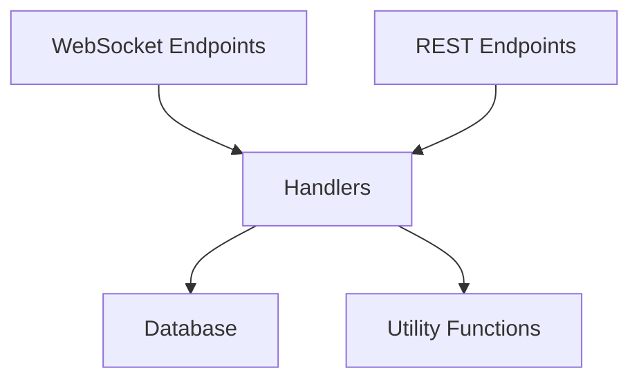

# API Collections REST Endpoints

## Problem Statement ✅

Currently, the collections functionality in our API is only accessible via WebSocket endpoints. This creates several limitations:

1. Clients must maintain WebSocket connections to interact with collections
2. REST API clients cannot access collections functionality
3. Business logic is tightly coupled with WebSocket-specific code
4. Code reuse between different transport mechanisms is limited

These limitations impact our API usability and maintainability:

### Current Limitations
- Collections can only be accessed via WebSocket connections
- Business logic is mixed with transport-specific code
- Duplicate code may be introduced when implementing new transport mechanisms
- Testing is more complex due to WebSocket dependencies

### Impact
- **User Impact**: Clients that prefer or require REST APIs cannot access collections functionality
- **System Impact**: Code maintenance is more difficult due to tight coupling
- **Business Impact**: Limited API access patterns may reduce API adoption and usage

## Requirements

### Functional Requirements ✅

#### Core Functionality
- Migrate WebSocket collections business logic to transport-agnostic handlers
  - Details: Extract business logic from WebSocket handlers to reusable handlers
  - Acceptance Criteria: Handlers can be used by both WebSocket and REST endpoints
  - Dependencies: Existing WebSocket collections implementation

- Implement REST endpoints for collections CRUD operations
  - Details: Create REST endpoints that use the new handlers
  - Acceptance Criteria: All collection operations available via REST API
  - Dependencies: New handler implementations

#### API Endpoints
- GET /users/collections
  - Details: List collections with pagination and filtering
  - Acceptance Criteria: Same functionality as WebSocket list endpoint
  - Dependencies: List collections handler

- GET /users/collections/{id}
  - Details: Get a single collection by ID
  - Acceptance Criteria: Same functionality as WebSocket get endpoint
  - Dependencies: Get collection handler

- POST /users/collections
  - Details: Create a new collection
  - Acceptance Criteria: Same functionality as WebSocket post endpoint
  - Dependencies: Create collection handler

- PUT /users/collections/{id}
  - Details: Update an existing collection
  - Acceptance Criteria: Same functionality as WebSocket update endpoint
  - Dependencies: Update collection handler

- DELETE /users/collections/{id}
  - Details: Delete a collection
  - Acceptance Criteria: Same functionality as WebSocket delete endpoint
  - Dependencies: Delete collection handler

### Non-Functional Requirements ✅

- Performance Requirements
  - REST endpoints should have comparable performance to WebSocket endpoints
  - Handlers should efficiently reuse database connections and queries

- Maintainability Requirements
  - Code should follow the handler guidelines in `.cursor/rules/handlers.mdc`
  - Business logic should be separated from transport-specific code
  - Types should be shared between handlers and endpoints where possible

- Compatibility Requirements
  - Existing WebSocket endpoints must continue to function without changes to client code
  - REST endpoints should use consistent naming and patterns with other REST APIs

## Technical Design ✅

### System Architecture

The new architecture separates business logic from transport-specific code:



### Core Components ✅

#### Component 1: Collection Handlers

The handlers will implement the core business logic for collections operations:

```rust
// libs/handlers/src/collections/list_collections_handler.rs
pub async fn list_collections_handler(
    user_id: &Uuid,
    request: ListCollectionsRequest,
) -> Result<Vec<ListCollectionsCollection>> {
    // Implementation of list collections logic
    // Extracted from existing WebSocket handler
}

// Request and response types
#[derive(Serialize, Deserialize, Debug, Clone)]
pub struct ListCollectionsRequest {
    pub page: Option<i64>,
    pub page_size: Option<i64>,
    #[serde(flatten)]
    pub filters: Option<ListCollectionsFilter>,
}

#[derive(Serialize, Deserialize, Debug, Clone)]
pub struct ListCollectionsCollection {
    pub id: Uuid,
    pub name: String,
    pub last_edited: DateTime<Utc>,
    pub created_at: DateTime<Utc>,
    pub owner: ListCollectionsUser,
    pub is_shared: bool,
}
```

#### Component 2: REST Endpoints

The REST endpoints will use the handlers to implement the API:

```rust
// src/routes/rest/routes/users/collections/list.rs
pub async fn list_collections(
    Query(query): Query<ListCollectionsRequest>,
    user: AuthenticatedUser,
) -> Result<Json<Vec<ListCollectionsCollection>>, AppError> {
    let result = collections::list_collections_handler(&user.id, query).await?;
    Ok(Json(result))
}
```

#### Component 3: Updated WebSocket Handlers

The WebSocket handlers will be updated to use the new handlers:

```rust
// src/routes/ws/collections/list_collections.rs
pub async fn list_collections(user: &AuthenticatedUser, req: ListCollectionsRequest) -> Result<()> {
    let list_collections_res = match collections::list_collections_handler(&user.id, req).await {
        Ok(res) => res,
        Err(e) => {
            // Error handling
            return Err(e);
        }
    };

    // WebSocket-specific response handling
    // ...
}
```

### API Changes

#### New REST Endpoints

```rust
// GET /users/collections
struct ListCollectionsRequest {
    page: Option<i64>,         // Pagination page number
    page_size: Option<i64>,    // Items per page
    shared_with_me: Option<bool>, // Filter for collections shared with user
    owned_by_me: Option<bool>, // Filter for collections owned by user
}

// Response: Vec<ListCollectionsCollection>

// GET /users/collections/{id}
// Path parameter: id: Uuid
// Response: CollectionState

// POST /users/collections
struct CreateCollectionRequest {
    name: String,              // Collection name
    // Other fields as needed
}
// Response: Collection

// PUT /users/collections/{id}
struct UpdateCollectionRequest {
    name: Option<String>,      // Updated collection name
    // Other fields as needed
}
// Response: Collection

// DELETE /users/collections/{id}
// Path parameter: id: Uuid
// Response: ()
```

### File Changes

#### New Files

- `libs/handlers/src/collections/mod.rs`
  - Purpose: Re-export handlers and types
  - Key components: Module exports
  - Dependencies: Handler implementations

- `libs/handlers/src/collections/types.rs`
  - Purpose: Shared types for collections
  - Key components: Request and response types
  - Dependencies: None

- `libs/handlers/src/collections/list_collections_handler.rs`
  - Purpose: Handler for listing collections
  - Key components: `list_collections_handler` function
  - Dependencies: Database, types

- `libs/handlers/src/collections/get_collection_handler.rs`
  - Purpose: Handler for getting a single collection
  - Key components: `get_collection_handler` function
  - Dependencies: Database, types

- `libs/handlers/src/collections/create_collection_handler.rs`
  - Purpose: Handler for creating a collection
  - Key components: `create_collection_handler` function
  - Dependencies: Database, types

- `libs/handlers/src/collections/update_collection_handler.rs`
  - Purpose: Handler for updating a collection
  - Key components: `update_collection_handler` function
  - Dependencies: Database, types

- `libs/handlers/src/collections/delete_collection_handler.rs`
  - Purpose: Handler for deleting a collection
  - Key components: `delete_collection_handler` function
  - Dependencies: Database, types

- `src/routes/rest/routes/users/collections/mod.rs`
  - Purpose: Re-export REST routes
  - Key components: Module exports
  - Dependencies: Route implementations

- `src/routes/rest/routes/users/collections/list.rs`
  - Purpose: REST endpoint for listing collections
  - Key components: `list_collections` function
  - Dependencies: Handlers, authentication

- `src/routes/rest/routes/users/collections/get.rs`
  - Purpose: REST endpoint for getting a collection
  - Key components: `get_collection` function
  - Dependencies: Handlers, authentication

- `src/routes/rest/routes/users/collections/create.rs`
  - Purpose: REST endpoint for creating a collection
  - Key components: `create_collection` function
  - Dependencies: Handlers, authentication

- `src/routes/rest/routes/users/collections/update.rs`
  - Purpose: REST endpoint for updating a collection
  - Key components: `update_collection` function
  - Dependencies: Handlers, authentication

- `src/routes/rest/routes/users/collections/delete.rs`
  - Purpose: REST endpoint for deleting a collection
  - Key components: `delete_collection` function
  - Dependencies: Handlers, authentication

#### Modified Files

- `src/routes/ws/collections/list_collections.rs`
  - Changes: Update to use new handler
  - Purpose: Maintain WebSocket functionality

- `src/routes/ws/collections/get_collection.rs`
  - Changes: Update to use new handler
  - Purpose: Maintain WebSocket functionality

- `src/routes/ws/collections/post_collection.rs`
  - Changes: Update to use new handler
  - Purpose: Maintain WebSocket functionality

- `src/routes/ws/collections/update_collection.rs`
  - Changes: Update to use new handler
  - Purpose: Maintain WebSocket functionality

- `src/routes/ws/collections/delete_collection.rs`
  - Changes: Update to use new handler
  - Purpose: Maintain WebSocket functionality

- `src/routes/rest/routes/mod.rs`
  - Changes: Add collections routes
  - Purpose: Register new REST endpoints

## Implementation Plan

### Phase 1: Create Handler Structure ⏳
1. Create directory structure for handlers
   - [ ] Create `libs/handlers/src/collections/` directory
   - [ ] Create `libs/handlers/src/collections/mod.rs`
   - [ ] Create `libs/handlers/src/collections/types.rs`

2. Define shared types
   - [ ] Extract types from WebSocket handlers
   - [ ] Define request and response types
   - [ ] Ensure compatibility with both WebSocket and REST

### Phase 2: Implement List Collections ⏳
1. Create list collections handler
   - [ ] Create `libs/handlers/src/collections/list_collections_handler.rs`
   - [ ] Extract business logic from WebSocket handler
   - [ ] Implement handler function

2. Update WebSocket handler
   - [ ] Update `src/routes/ws/collections/list_collections.rs` to use new handler
   - [ ] Ensure backward compatibility

3. Create REST endpoint
   - [ ] Create `src/routes/rest/routes/users/collections/list.rs`
   - [ ] Implement REST endpoint using the handler
   - [ ] Add route to router

### Phase 3: Implement Get Collection 🔜
1. Create get collection handler
   - [ ] Create `libs/handlers/src/collections/get_collection_handler.rs`
   - [ ] Extract business logic from WebSocket handler
   - [ ] Implement handler function

2. Update WebSocket handler
   - [ ] Update `src/routes/ws/collections/get_collection.rs` to use new handler
   - [ ] Ensure backward compatibility

3. Create REST endpoint
   - [ ] Create `src/routes/rest/routes/users/collections/get.rs`
   - [ ] Implement REST endpoint using the handler
   - [ ] Add route to router

### Phase 4: Implement Create Collection 🔜
1. Create create collection handler
   - [ ] Create `libs/handlers/src/collections/create_collection_handler.rs`
   - [ ] Extract business logic from WebSocket handler
   - [ ] Implement handler function

2. Update WebSocket handler
   - [ ] Update `src/routes/ws/collections/post_collection.rs` to use new handler
   - [ ] Ensure backward compatibility

3. Create REST endpoint
   - [ ] Create `src/routes/rest/routes/users/collections/create.rs`
   - [ ] Implement REST endpoint using the handler
   - [ ] Add route to router

### Phase 5: Implement Update Collection 🔜
1. Create update collection handler
   - [ ] Create `libs/handlers/src/collections/update_collection_handler.rs`
   - [ ] Extract business logic from WebSocket handler
   - [ ] Implement handler function

2. Update WebSocket handler
   - [ ] Update `src/routes/ws/collections/update_collection.rs` to use new handler
   - [ ] Ensure backward compatibility

3. Create REST endpoint
   - [ ] Create `src/routes/rest/routes/users/collections/update.rs`
   - [ ] Implement REST endpoint using the handler
   - [ ] Add route to router

### Phase 6: Implement Delete Collection 🔜
1. Create delete collection handler
   - [ ] Create `libs/handlers/src/collections/delete_collection_handler.rs`
   - [ ] Extract business logic from WebSocket handler
   - [ ] Implement handler function

2. Update WebSocket handler
   - [ ] Update `src/routes/ws/collections/delete_collection.rs` to use new handler
   - [ ] Ensure backward compatibility

3. Create REST endpoint
   - [ ] Create `src/routes/rest/routes/users/collections/delete.rs`
   - [ ] Implement REST endpoint using the handler
   - [ ] Add route to router

### Phase 7: Testing and Documentation 🔜
1. Write tests
   - [ ] Unit tests for handlers
   - [ ] Integration tests for REST endpoints
   - [ ] Verify WebSocket backward compatibility

2. Update documentation
   - [ ] Add API documentation for new endpoints
   - [ ] Update internal documentation

## Testing Strategy

### Unit Tests
- Test each handler function with various inputs
- Test error handling and edge cases
- Mock database connections and external dependencies

```rust
#[tokio::test]
async fn test_list_collections_handler() {
    // Setup test data
    let user_id = Uuid::new_v4();
    let request = ListCollectionsRequest {
        page: Some(0),
        page_size: Some(10),
        filters: None,
    };
    
    // Call handler
    let result = list_collections_handler(&user_id, request).await;
    
    // Assert expectations
    assert!(result.is_ok());
    let collections = result.unwrap();
    // Additional assertions
}
```

### Integration Tests
- Test REST endpoints with HTTP requests
- Verify response formats and status codes
- Test pagination, filtering, and error handling

```rust
#[tokio::test]
async fn test_list_collections_endpoint() {
    // Setup test app
    let app = test_app().await;
    
    // Make request
    let response = app
        .get("/users/collections")
        .header("Authorization", "Bearer test_token")
        .send()
        .await;
    
    // Assert expectations
    assert_eq!(response.status(), 200);
    // Additional assertions
}
```

### Backward Compatibility Tests
- Verify that WebSocket endpoints continue to work as expected
- Test with existing client code

## Success Criteria
- All REST endpoints are implemented and working correctly
- WebSocket endpoints continue to work as before
- Code follows best practices and guidelines
- All tests pass

## Dependencies
- Existing WebSocket handlers
- Database schema and models
- Authentication middleware

## Checklist Before Submission
- [ ] All template sections completed
- [ ] Technical design is detailed and complete
- [ ] File changes are documented
- [ ] Implementation phases are clear
- [ ] Testing strategy is defined
- [ ] Security considerations addressed
- [ ] Dependencies listed
- [ ] File references included
