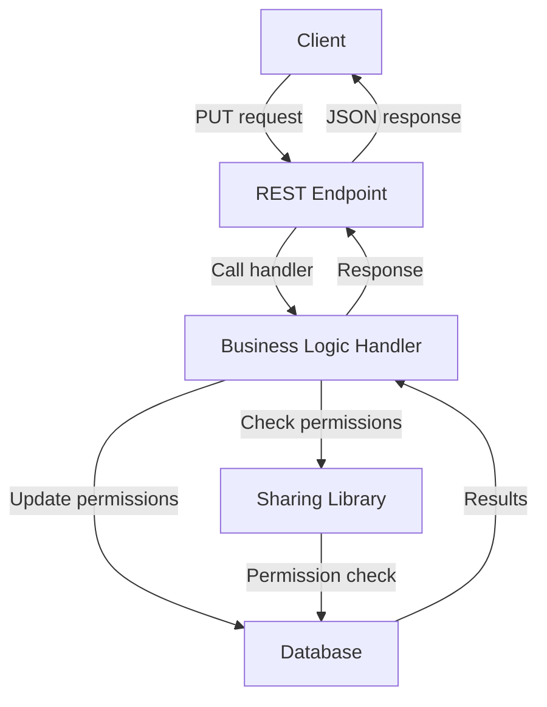

# API Collections Update - PUT Endpoint PRD

## Problem Statement ✅
Users need the ability to update sharing permissions for collections through a REST API endpoint. Currently, while the ability to create, list, and delete sharing permissions is implemented, the specific endpoint for updating existing permissions (PUT) is missing. This forces users to rely on complex combinations of create and delete operations to accomplish what should be a simple update operation.

Key issues:
- No dedicated endpoint for updating permissions
- Inconsistent UX between collections and other asset types
- Unnecessary complexity for simple permission updates

### Current Limitations
- Users must delete and recreate permissions to modify them
- Increased API calls for simple permission modifications
- Risk of temporary permission loss during delete/create operations

### Impact
- User Impact: More complex workflows for users managing collections
- System Impact: Higher number of database operations for permission changes
- Business Impact: Inconsistent experience across asset types, reducing platform cohesion

## Requirements

### Functional Requirements ✅

#### Core Functionality
- Implement PUT /collections/:id/sharing endpoint
  - Details: Add the ability to update sharing permissions for a collection using a PUT request
  - Acceptance Criteria: Successfully update existing permissions with new role values
  - Dependencies: Existing sharing library components

#### User Interface
- Update endpoint must follow established patterns
  - Details: Must match the behavior and structure of other sharing update endpoints
  - Acceptance Criteria: Response structure matches other sharing update endpoints
  - Dependencies: None

#### Data Management
- Update permissions in the asset_permissions table
  - Details: Must use the sharing library's create_share_by_email function for consistent upsert behavior
  - Acceptance Criteria: Permission roles are updated in the database
  - Dependencies: Sharing library's create_share_by_email function

### Non-Functional Requirements ✅

- Performance Requirements
  - The update operation should complete within 200ms for a typical request
- Security Requirements
  - Only users with Owner or FullAccess permissions can update sharing permissions
  - Proper validation of email addresses and roles
- Scalability Requirements
  - Support batch updates for multiple users in a single request

## Technical Design ✅

### System Architecture
The update sharing endpoint follows the established architecture pattern for REST endpoints:



### Core Components ✅

#### Component 1: REST Endpoint Handler
```rust
// update_sharing.rs
pub async fn update_collection_sharing_rest_handler(
    Extension(user): Extension<AuthenticatedUser>,
    Path(id): Path<Uuid>,
    Json(request): Json<Vec<ShareRecipient>>,
) -> Result<ApiResponse<String>, (StatusCode, String)> {
    tracing::info!("Processing PUT request for collection sharing with ID: {}, user_id: {}", id, user.id);

    match update_collection_sharing_handler(&id, &user.id, request).await {
        Ok(_) => Ok(ApiResponse::JsonData("Sharing permissions updated successfully".to_string())),
        Err(e) => {
            tracing::error!("Error updating sharing permissions: {}", e);
            
            // Map specific errors to appropriate status codes
            let error_message = e.to_string();
            
            if error_message.contains("not found") {
                return Err((StatusCode::NOT_FOUND, format!("Collection not found: {}", e)));
            } else if error_message.contains("permission") {
                return Err((StatusCode::FORBIDDEN, format!("Insufficient permissions: {}", e)));
            } else if error_message.contains("Invalid email") {
                return Err((StatusCode::BAD_REQUEST, format!("Invalid email: {}", e)));
            }
            
            Err((StatusCode::INTERNAL_SERVER_ERROR, format!("Failed to update sharing permissions: {}", e)))
        }
    }
}
```

#### Component 2: Business Logic Handler
```rust
// update_sharing_handler.rs
pub async fn update_collection_sharing_handler(
    collection_id: &Uuid,
    user_id: &Uuid,
    request: Vec<ShareRecipient>,
) -> Result<()> {
    // 1. Validate the collection exists
    let collection = match get_collection_by_id(collection_id).await {
        Ok(Some(collection)) => collection,
        Ok(None) => return Err(anyhow!("Collection not found")),
        Err(e) => return Err(anyhow!("Error fetching collection: {}", e)),
    };

    // 2. Check if user has permission to update sharing for the collection (Owner or FullAccess)
    let has_permission = has_permission(
        *collection_id,
        AssetType::Collection,
        *user_id,
        IdentityType::User,
        AssetPermissionRole::FullAccess, // Owner role implicitly has FullAccess permissions
    ).await?;

    if !has_permission {
        return Err(anyhow!("User does not have permission to update sharing for this collection"));
    }

    // 3. Process each recipient and update sharing permissions
    let emails_and_roles: Vec<(String, AssetPermissionRole)> = request
        .into_iter()
        .map(|recipient| (recipient.email, recipient.role))
        .collect();

    for (email, role) in emails_and_roles {
        // The create_share_by_email function handles both creation and updates
        // It performs an upsert operation in the database
        match create_share_by_email(
            &email,
            *collection_id,
            AssetType::Collection,
            role,
            *user_id,
        ).await {
            Ok(_) => {
                tracing::info!("Updated sharing permission for email: {} on collection: {}", email, collection_id);
            },
            Err(e) => {
                tracing::error!("Failed to update sharing for email {}: {}", email, e);
                return Err(anyhow!("Failed to update sharing for email {}: {}", email, e));
            }
        }
    }

    Ok(())
}
```

### API Changes

```rust
// The request type is reused from create_sharing
pub type ShareRecipient = struct {
    pub email: String,
    pub role: AssetPermissionRole,
};

pub type UpdateSharingRequest = Vec<ShareRecipient>;

// The response is a simple success message
```

### File Changes

#### New Files
- `src/routes/rest/routes/collections/sharing/update_sharing.rs`
  - Purpose: REST handler for updating sharing permissions
  - Key components: update_collection_sharing_rest_handler function
  - Dependencies: handlers, axum, middleware

- `libs/handlers/src/collections/sharing/update_sharing_handler.rs`
  - Purpose: Business logic for updating sharing permissions
  - Key components: update_collection_sharing_handler function
  - Dependencies: sharing library, database

#### Modified Files
- `src/routes/rest/routes/collections/sharing/mod.rs`
  - Changes: Add the PUT route for /collections/:id/sharing
  - Impact: Makes the update endpoint available
  - Dependencies: None

- `libs/handlers/src/collections/sharing/mod.rs`
  - Changes: Export the update_collection_sharing_handler function
  - Impact: Makes the handler available to route handlers
  - Dependencies: None

## Implementation Plan

### Phase 1: Development ✅
1. Create handler implementation
   - [x] Implement update_collection_sharing_handler.rs
   - [x] Export handler in mod.rs
   - [x] Add type definitions if needed

2. Create REST endpoint
   - [x] Implement update_sharing.rs
   - [x] Update router in mod.rs to include PUT route
   - [x] Add validation and error handling

3. Manual testing
   - [x] Test with valid inputs
   - [x] Test with invalid inputs
   - [x] Test with unauthorized users

### Phase 2: Testing and Documentation ⏳
1. Unit tests
   - [x] Write unit tests for handler
   - [x] Test error handling
   - [x] Test permission checking

2. Integration tests
   - [x] Write integration tests for endpoint
   - [x] Test with various scenarios
   - [x] Verify database state after updates

3. Documentation
   - [x] Update API documentation
   - [x] Document type definitions
   - [x] Add examples

## Testing Strategy ✅

### Unit Tests
Testing the update_collection_sharing_handler function:

```rust
#[cfg(test)]
mod tests {
    use super::*;
    use sharing::types::{AssetType, IdentityType, AssetPermissionRole};
    use tokio;
    use mock::db::{MockDb, MockDbPool};
    use uuid::Uuid;

    #[tokio::test]
    async fn test_update_collection_sharing_handler_success() {
        // Setup mock DB
        let mut mock_db = MockDb::new();
        mock_db.expect_transaction().return_once(|f| f());
        
        // Test with valid inputs
        let collection_id = Uuid::new_v4();
        let user_id = Uuid::new_v4();
        let request = vec![
            ShareRecipient {
                email: "test@example.com".to_string(),
                role: AssetPermissionRole::ReadOnly,
            },
        ];
        
        let result = update_collection_sharing_handler(&collection_id, &user_id, request).await;
        
        assert!(result.is_ok());
    }
    
    #[tokio::test]
    async fn test_update_collection_sharing_handler_not_found() {
        // Test with non-existent collection
        let collection_id = Uuid::new_v4();
        let user_id = Uuid::new_v4();
        let request = vec![];
        
        let result = update_collection_sharing_handler(&collection_id, &user_id, request).await;
        
        assert!(result.is_err());
        assert!(result.unwrap_err().to_string().contains("not found"));
    }
    
    #[tokio::test]
    async fn test_update_collection_sharing_handler_no_permission() {
        // Test with user who doesn't have permission
        let collection_id = Uuid::new_v4();
        let user_id = Uuid::new_v4();
        let request = vec![];
        
        let result = update_collection_sharing_handler(&collection_id, &user_id, request).await;
        
        assert!(result.is_err());
        assert!(result.unwrap_err().to_string().contains("permission"));
    }
}
```

### Integration Tests

#### Scenario 1: Update sharing permissions for a collection
- Setup: Create a collection and initial sharing permissions
- Steps:
  1. Authenticate as owner
  2. Send PUT request to /collections/:id/sharing with new role values
  3. Verify response is successful
  4. Check database for updated roles
- Expected Results: Sharing permissions are updated in the database
- Validation Criteria: Response code 200, updated roles in database match request

#### Scenario 2: Attempt update without permission
- Setup: Create a collection and share with a test user as ReadOnly
- Steps:
  1. Authenticate as the test user (who only has ReadOnly access)
  2. Send PUT request to /collections/:id/sharing
  3. Verify response is 403 Forbidden
- Expected Results: Request is rejected with appropriate error
- Validation Criteria: Response code 403, no changes in database

### Security Considerations
- Security Requirement 1: Permission Validation
  - Description: Only users with Owner or FullAccess permissions can update sharing
  - Implementation: Check permission using has_permission function
  - Validation: Test with users having different permission levels

- Security Requirement 2: Input Validation
  - Description: Validate email addresses and roles
  - Implementation: Leverage validation in create_share_by_email function
  - Validation: Test with invalid emails and roles

### Performance Considerations
- Performance Requirement 1: Efficient Database Operations
  - Description: Minimize database operations
  - Implementation: Use batch processing for multiple recipients
  - Validation: Performance testing with varying numbers of recipients

### References
- [API Collections Sharing Summary](/Users/dallin/api_collections_update/api/prds/active/api_collections_sharing_summary.md)
- [API Collections Sharing List](/Users/dallin/api_collections_update/api/prds/active/api_collections_sharing_list.md)
- [API Collections Sharing Create](/Users/dallin/api_collections_update/api/prds/active/api_collections_sharing_create.md)
- [API Collections Sharing Delete](/Users/dallin/api_collections_update/api/prds/active/api_collections_sharing_delete.md)