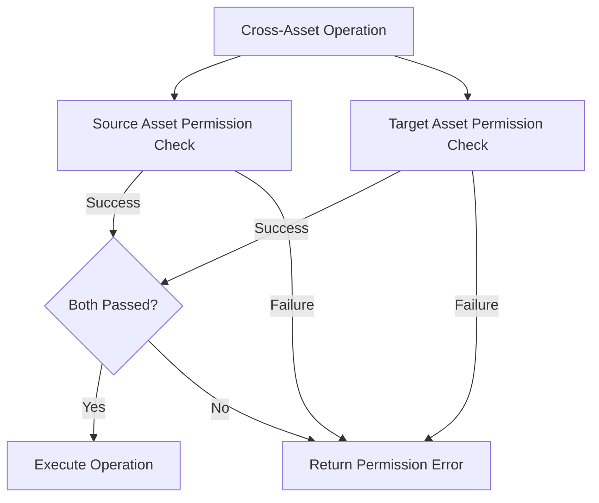

# Cross-Asset Operations Permission Checks

## Problem Statement
The Buster application includes several operations that involve multiple asset types (e.g., adding metrics to dashboards, adding assets to collections). These cross-asset operations require permission checks on both the source and target assets, but currently lack standardized permission checking logic.

Specific issues include:
- Inconsistent permission checks when adding assets to collections
- No clear guidelines for required permission levels when linking assets
- Missing permission checks on some cross-asset operations
- Lack of error handling for permission failures in cross-asset contexts
- No consideration of admin roles for cross-asset operations

These issues could lead to unauthorized access or modification of assets, inconsistent behavior, and security vulnerabilities. A standardized approach to permission checks for cross-asset operations is needed to ensure proper security enforcement.

## Requirements

### Functional Requirements

#### Core Functionality
- Implement permission checks for adding assets to collections
  - Details: Check permissions on both collection and asset being added
  - Acceptance Criteria: User must have CanEdit on collection and at least CanView on asset
  - Dependencies: Collection and asset permission utilities

- Implement permission checks for removing assets from collections
  - Details: Check permissions on collection
  - Acceptance Criteria: User must have CanEdit on collection
  - Dependencies: Collection permission utilities

- Implement permission checks for linking dashboards to assets
  - Details: Check permissions on both dashboard and asset
  - Acceptance Criteria: User must have CanEdit on dashboard and at least CanView on asset
  - Dependencies: Dashboard and asset permission utilities

- Define clear permission matrix for cross-asset operations
  - Details: Document required permission levels for all cross-asset operations
  - Acceptance Criteria: Matrix covers all possible asset-to-asset interactions
  - Dependencies: None

### Non-Functional Requirements
- Performance Requirements
  - Cross-asset checks should minimize the number of database queries
  - Utilize cached user information when possible
- Security Requirements
  - All cross-asset operations must verify permissions on all involved assets
  - Permission failures should be properly logged
- Maintainability Requirements
  - Cross-asset operations should use consistent permission checking patterns
  - Code should be well-documented for future maintenance

## Technical Design

### System Architecture



### Core Components

#### Component 1: Collection-Asset Permission Checker

```rust
/// Checks permissions for adding an asset to a collection
///
/// # Arguments
/// * `conn` - Database connection
/// * `collection_id` - The collection to add to
/// * `asset_id` - The asset to add
/// * `asset_type` - The type of the asset
/// * `user` - The authenticated user
///
/// # Returns
/// * `Result<()>` - Ok if user has permission, Error otherwise
pub async fn check_add_to_collection_permission(
    conn: &mut AsyncPgConnection,
    collection_id: &Uuid,
    asset_id: &Uuid,
    asset_type: &AssetType,
    user: &AuthenticatedUser,
) -> Result<()> {
    // Check if user has edit permission on collection
    verify_collection_permission(
        conn,
        collection_id,
        user,
        AssetPermissionLevel::CanEdit,
    ).await?;
    
    // Check if user has at least view permission on asset
    match asset_type {
        AssetType::Chat => {
            verify_chat_permission(
                conn,
                asset_id,
                user,
                AssetPermissionLevel::CanView,
            ).await?;
        },
        AssetType::DashboardFile => {
            verify_dashboard_permission(
                conn,
                asset_id,
                user,
                AssetPermissionLevel::CanView,
            ).await?;
        },
        AssetType::MetricFile => {
            verify_metric_permission(
                conn,
                asset_id,
                user,
                AssetPermissionLevel::CanView,
            ).await?;
        },
        _ => return Err(anyhow!("Unsupported asset type for collections")),
    }
    
    Ok(())
}
```

#### Component 2: Cross-Asset Permission Matrix

| Operation | Source Asset | Target Asset | Source Permission | Target Permission |
|-----------|--------------|--------------|-------------------|-------------------|
| Add to Collection | Asset | Collection | CanView | CanEdit |
| Remove from Collection | Asset | Collection | None | CanEdit |
| Link Dashboard to Asset | Dashboard | Asset | CanEdit | CanView |
| Link Chat to Dashboard | Chat | Dashboard | CanView | CanEdit |
| Link Metric to Dashboard | Metric | Dashboard | CanView | CanEdit |

#### Component 3: Dashboard-Asset Permission Checker

```rust
/// Checks permissions for linking an asset to a dashboard
///
/// # Arguments
/// * `conn` - Database connection
/// * `dashboard_id` - The dashboard to link to
/// * `asset_id` - The asset to link
/// * `asset_type` - The type of the asset
/// * `user` - The authenticated user
///
/// # Returns
/// * `Result<()>` - Ok if user has permission, Error otherwise
pub async fn check_link_to_dashboard_permission(
    conn: &mut AsyncPgConnection,
    dashboard_id: &Uuid,
    asset_id: &Uuid,
    asset_type: &AssetType,
    user: &AuthenticatedUser,
) -> Result<()> {
    // Check if user has edit permission on dashboard
    verify_dashboard_permission(
        conn,
        dashboard_id,
        user,
        AssetPermissionLevel::CanEdit,
    ).await?;
    
    // Check if user has at least view permission on asset
    match asset_type {
        AssetType::Chat => {
            verify_chat_permission(
                conn,
                asset_id,
                user,
                AssetPermissionLevel::CanView,
            ).await?;
        },
        AssetType::MetricFile => {
            verify_metric_permission(
                conn,
                asset_id,
                user,
                AssetPermissionLevel::CanView,
            ).await?;
        },
        _ => return Err(anyhow!("Unsupported asset type for dashboard linking")),
    }
    
    Ok(())
}
```

### File Changes

#### New Files
- `api/libs/handlers/src/utils/permissions/cross_asset_permissions.rs`
  - Purpose: Implement cross-asset permission utilities
  - Impact: Standardizes permission checks for cross-asset operations

#### Modified Files
- `api/libs/handlers/src/collections/add_assets_to_collection_handler.rs`
  - Changes: Use cross-asset permission utilities
  - Impact: Ensures proper permission checks when adding assets to collections

- `api/libs/handlers/src/collections/remove_assets_from_collection_handler.rs`
  - Changes: Use cross-asset permission utilities
  - Impact: Ensures proper permission checks when removing assets from collections

- `api/libs/handlers/src/dashboards/link_assets_to_dashboard_handler.rs`
  - Changes: Use cross-asset permission utilities
  - Impact: Ensures proper permission checks when linking assets to dashboards

## Implementation Plan

### Phase 1: Design and Documentation

1. Define cross-asset permission matrix
   - [ ] Document all cross-asset operations
   - [ ] Define required permission levels for each operation
   - [ ] Review and validate with stakeholders

2. Create cross-asset permission utility interfaces
   - [ ] Define function signatures
   - [ ] Document parameters and return values
   - [ ] Create error types for permission failures

### Phase 2: Implementation

1. Implement collection-asset permission utilities
   - [ ] Implement `check_add_to_collection_permission` function
   - [ ] Implement `check_remove_from_collection_permission` function
   - [ ] Add unit tests for collection-asset permissions

2. Implement dashboard-asset permission utilities
   - [ ] Implement `check_link_to_dashboard_permission` function
   - [ ] Implement `check_unlink_from_dashboard_permission` function
   - [ ] Add unit tests for dashboard-asset permissions

### Phase 3: Integration

1. Update collection handlers
   - [ ] Modify add_assets_to_collection_handler
   - [ ] Modify remove_assets_from_collection_handler
   - [ ] Update unit tests

2. Update dashboard handlers
   - [ ] Modify link_assets_to_dashboard_handler
   - [ ] Modify remove_assets_from_dashboard_handler
   - [ ] Update unit tests

### Phase 4: Testing

1. Add integration tests
   - [ ] Test collection-asset operations
   - [ ] Test dashboard-asset operations
   - [ ] Test with admin users and regular users

2. Add documentation
   - [ ] Update handler documentation
   - [ ] Create examples of cross-asset operations
   - [ ] Document error cases

## Testing Strategy

### Unit Tests

```rust
#[cfg(test)]
mod tests {
    use super::*;
    
    #[tokio::test]
    async fn test_add_to_collection_permission_success() {
        // Create test authenticated user
        let user = mock_authenticated_user();
        
        // Mock database connection
        let mut conn = mock_connection();
        
        // Mock collection permission check to succeed
        conn.expect_verify_collection_permission()
            .returning(|_, _, _, _| Ok(()));
            
        // Mock asset permission check to succeed
        conn.expect_verify_chat_permission()
            .returning(|_, _, _, _| Ok(()));
        
        // Call check function
        let result = check_add_to_collection_permission(
            &mut conn,
            &Uuid::new_v4(),
            &Uuid::new_v4(),
            &AssetType::Chat,
            &user,
        ).await;
        
        // Both checks pass, so result should be Ok
        assert!(result.is_ok());
    }
    
    #[tokio::test]
    async fn test_add_to_collection_permission_collection_failure() {
        // Create test authenticated user
        let user = mock_authenticated_user();
        
        // Mock database connection
        let mut conn = mock_connection();
        
        // Mock collection permission check to fail
        conn.expect_verify_collection_permission()
            .returning(|_, _, _, _| Err(anyhow!("Insufficient permissions")));
        
        // Call check function
        let result = check_add_to_collection_permission(
            &mut conn,
            &Uuid::new_v4(),
            &Uuid::new_v4(),
            &AssetType::Chat,
            &user,
        ).await;
        
        // Collection check fails, so result should be Err
        assert!(result.is_err());
    }
    
    #[tokio::test]
    async fn test_add_to_collection_permission_asset_failure() {
        // Create test authenticated user
        let user = mock_authenticated_user();
        
        // Mock database connection
        let mut conn = mock_connection();
        
        // Mock collection permission check to succeed
        conn.expect_verify_collection_permission()
            .returning(|_, _, _, _| Ok(()));
            
        // Mock asset permission check to fail
        conn.expect_verify_chat_permission()
            .returning(|_, _, _, _| Err(anyhow!("Insufficient permissions")));
        
        // Call check function
        let result = check_add_to_collection_permission(
            &mut conn,
            &Uuid::new_v4(),
            &Uuid::new_v4(),
            &AssetType::Chat,
            &user,
        ).await;
        
        // Asset check fails, so result should be Err
        assert!(result.is_err());
    }
}
```

### Integration Tests

#### Scenario 1: Add to Collection with Sufficient Permissions
- Setup: Create test collection, asset, and user with appropriate permissions
- Steps:
  1. User attempts to add asset to collection
  2. System checks permissions on both collection and asset
  3. Operation succeeds due to sufficient permissions
- Expected Results: Asset is added to collection
- Validation Criteria: Database shows asset linked to collection

#### Scenario 2: Add to Collection with Insufficient Collection Permission
- Setup: Create test collection, asset, and user with insufficient collection permissions
- Steps:
  1. User attempts to add asset to collection
  2. System checks permissions on collection
  3. Operation fails due to insufficient collection permissions
- Expected Results: Error indicating insufficient permissions
- Validation Criteria: Database shows no changes, error message indicates insufficient permissions

#### Scenario 3: Add to Collection with Insufficient Asset Permission
- Setup: Create test collection, asset, and user with insufficient asset permissions
- Steps:
  1. User attempts to add asset to collection
  2. System checks permissions on collection and asset
  3. Operation fails due to insufficient asset permissions
- Expected Results: Error indicating insufficient permissions
- Validation Criteria: Database shows no changes, error message indicates insufficient permissions

### Security Considerations
- Ensure all cross-asset operations check permissions on all involved assets
- Verify admin privileges only apply within the user's organization
- Log all permission failures for audit purposes
- Ensure error messages don't reveal sensitive information

### Performance Considerations
- Optimize permission checks to minimize database queries
- Use cached user information when possible
- Measure performance impact of cross-asset permission checks

## References
- [Sharing Library](mdc:libs/sharing/src/lib.rs)
- [Asset Permission Roles](mdc:database/src/enums.rs)
- [Collection Models](mdc:database/src/models.rs)
- [Dashboard Models](mdc:database/src/models.rs)