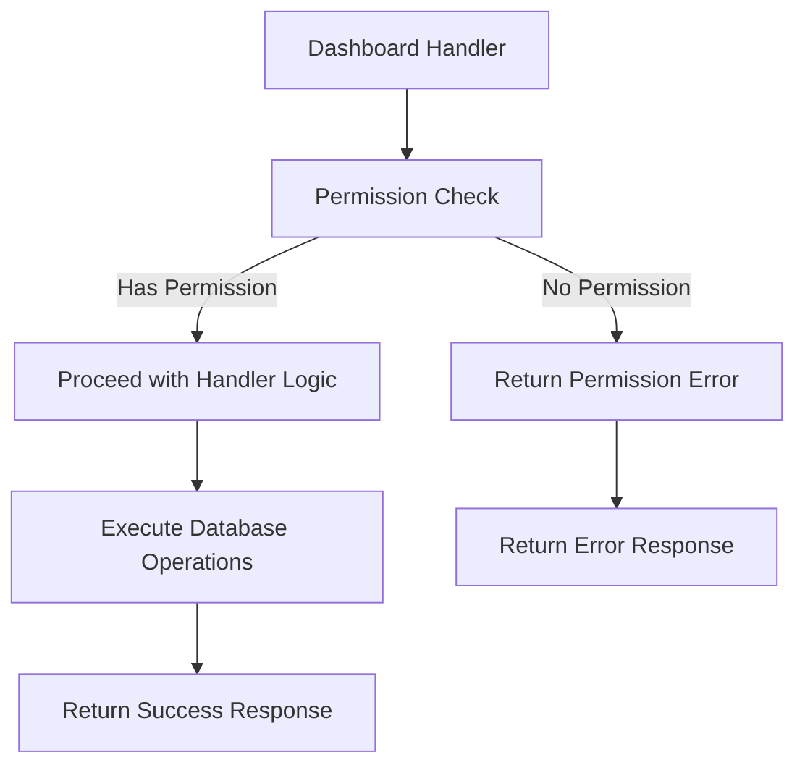

# Dashboard Permission Checks

## Problem Statement 
The dashboard-related handlers in `@libs/handlers/src/dashboards` currently lack standardized permission checks using the `@libs/sharing` library. While some permission logic may exist, it doesn't consistently use the `check_asset_permission.rs` functions and doesn't properly handle organization admin access to dashboard resources.

Specific issues include:
- Inconsistent permission checks across dashboard handlers
- Hardcoded permission values in responses (e.g., `permission: AssetPermissionRole::Owner`)
- No implementation of the CanFilter role which is specifically relevant for dashboards
- No automatic elevated access for workspace and data admins
- Risk of unauthorized access, modification, or deletion of dashboards
- No clear error handling for permission denied cases

These issues affect the security and consistency of the application and need to be addressed to ensure proper access control across all dashboard resources.

### Current Limitations
- Dashboard handlers may use ad-hoc permission checks or none at all
- No organization admin check for automatic access elevation
- No implementation of the CanFilter permission level which is especially important for dashboards
- Inconsistent error handling for permission failures
- Lack of proper permission filtering for list operations

### Impact
- User Impact: Users may have incorrect access to dashboards (too much or too little)
- System Impact: Security vulnerabilities and inconsistent behavior
- Business Impact: Potential unauthorized access to business-critical dashboards and inability to properly administer them

## Requirements

### Functional Requirements 

#### Core Functionality
- Implement permission checks in all dashboard handlers
  - Details: Add permission checks at the beginning of each handler function
  - Acceptance Criteria: All dashboard handlers properly check permissions before performing operations
  - Dependencies: Sharing library, admin check utility

- Enforce correct permission levels for different operations
  - Details: Map operations to appropriate permission levels (view, filter, edit, delete)
  - Acceptance Criteria: Each operation requires the correct minimum permission level
  - Dependencies: `AssetPermissionRole` enum

- Implement proper error handling
  - Details: Return appropriate error messages for permission denied cases
  - Acceptance Criteria: Consistent, secure error handling across all dashboard handlers
  - Dependencies: None

- Support CanFilter permission level
  - Details: Properly handle the CanFilter permission which allows filtering but not editing
  - Acceptance Criteria: Users with CanFilter can view and apply filters but not modify the dashboard
  - Dependencies: None

#### Handler-Specific Requirements

- get_dashboard_handler
  - Details: Require at least CanView permission
  - Acceptance Criteria: Users with at least CanView permission can access dashboard details
  - Dependencies: None

- delete_dashboard_handler
  - Details: Require FullAccess or Owner permission
  - Acceptance Criteria: Only users with FullAccess or Owner permission can delete dashboards
  - Dependencies: None

- update_dashboard_handler
  - Details: Require at least CanEdit permission
  - Acceptance Criteria: Users with at least CanEdit permission can update dashboard structure
  - Dependencies: None

- list_dashboard_handler
  - Details: Filter results based on user's permissions
  - Acceptance Criteria: Only dashboards the user has at least CanView permission for are returned
  - Dependencies: None

- add_asset_to_dashboard_handler
  - Details: Require at least CanEdit permission on the dashboard
  - Acceptance Criteria: Only users with at least CanEdit permission can add assets to dashboards
  - Dependencies: None

- sharing_endpoint_handlers
  - Details: Require FullAccess or Owner permission
  - Acceptance Criteria: Only users with FullAccess or Owner permission can modify sharing settings
  - Dependencies: None

### Non-Functional Requirements 
- Performance Requirements
  - Permission checks should add minimal overhead to handlers (<10ms)
- Security Requirements
  - Permission checks must happen before any data access or modification
  - Error messages must not reveal sensitive information
- Maintainability Requirements
  - All handlers should use consistent permission checking patterns
  - Code should be well-documented for future maintenance

## Technical Design 

### System Architecture



### Core Components 

#### Component 1: Permission Check Utility for Dashboard Handlers

```rust
/// Verifies a user has sufficient permissions for a dashboard operation
///
/// # Arguments
/// * `dashboard_id` - The ID of the dashboard to check
/// * `user_id` - The ID of the user requesting access
/// * `required_role` - The minimum role required for the operation
///
/// # Returns
/// * `Result<()>` - Ok if user has permission, Error otherwise
async fn verify_dashboard_permission(
    dashboard_id: &Uuid,
    user_id: &Uuid,
    required_role: AssetPermissionRole,
) -> Result<()> {
    // Get the organization ID for this dashboard
    let org_id = dashboard_files::table
        .filter(dashboard_files::id.eq(dashboard_id))
        .filter(dashboard_files::deleted_at.is_null())
        .select(dashboard_files::organization_id)
        .first::<Uuid>(&mut get_pg_pool().get().await?)
        .await
        .map_err(|e| anyhow!("Failed to find dashboard: {}", e))?;
    
    // Check if user is an org admin
    if is_user_org_admin(user_id, &org_id).await? {
        // Admins get everything except Owner permissions
        if required_role != AssetPermissionRole::Owner {
            return Ok(());
        }
    }
    
    // Check regular permissions
    let has_access = has_permission(
        *dashboard_id,
        AssetType::DashboardFile,
        *user_id,
        IdentityType::User,
        required_role,
    )
    .await?;
    
    if has_access {
        Ok(())
    } else {
        Err(anyhow!("Insufficient permissions for dashboard operation"))
    }
}

/// Get the actual permission role a user has for a dashboard
///
/// # Arguments
/// * `dashboard_id` - The ID of the dashboard to check
/// * `user_id` - The ID of the user to check permissions for
///
/// # Returns
/// * `Result<AssetPermissionRole>` - The highest permission role the user has
async fn get_dashboard_permission_role(
    dashboard_id: &Uuid,
    user_id: &Uuid,
) -> Result<AssetPermissionRole> {
    // Get the organization ID for this dashboard
    let org_id = dashboard_files::table
        .filter(dashboard_files::id.eq(dashboard_id))
        .filter(dashboard_files::deleted_at.is_null())
        .select(dashboard_files::organization_id)
        .first::<Uuid>(&mut get_pg_pool().get().await?)
        .await
        .map_err(|e| anyhow!("Failed to find dashboard: {}", e))?;
    
    // Check if user is an org admin
    if is_user_org_admin(user_id, &org_id).await? {
        // Admins get FullAccess
        return Ok(AssetPermissionRole::FullAccess);
    }
    
    // Check regular permissions
    let user_role = check_access(
        *dashboard_id,
        AssetType::DashboardFile,
        *user_id,
        IdentityType::User,
    )
    .await?;
    
    // If dashboard was created by the user, they're the owner
    let is_owner = dashboard_files::table
        .filter(dashboard_files::id.eq(dashboard_id))
        .filter(dashboard_files::created_by.eq(user_id))
        .first::<QueryableDashboardFile>(&mut get_pg_pool().get().await?)
        .await
        .is_ok();
    
    if is_owner {
        Ok(AssetPermissionRole::Owner)
    } else {
        Ok(user_role.unwrap_or(AssetPermissionRole::CanView))
    }
}
```

#### Component 2: Modified get_dashboard_handler

```rust
pub async fn get_dashboard_handler(
    dashboard_id: &Uuid,
    user_id: &Uuid,
    version_number: Option<i32>,
) -> Result<BusterDashboardResponse> {
    // Verify user has at least CanView permission
    verify_dashboard_permission(dashboard_id, user_id, AssetPermissionRole::CanView).await?;
    
    // Existing handler logic continues below...
    // ...
    
    // Get the actual permission role for accurate response
    let permission_role = get_dashboard_permission_role(dashboard_id, user_id).await?;
    
    Ok(BusterDashboardResponse {
        access: permission_role, // Use actual role instead of hardcoded Owner
        metrics,
        dashboard,
        permission: permission_role, // Use actual role instead of hardcoded Owner
        public_password: None,
        collections: vec![],
        // Other fields...
        individual_permissions,
        publicly_accessible: dashboard_file.publicly_accessible,
        public_expiry_date: dashboard_file.public_expiry_date,
        public_enabled_by: public_enabled_by_user,
        versions,
    })
}
```

#### Component 3: Modified delete_dashboard_handler

```rust
pub async fn delete_dashboard_handler(
    dashboard_id: &Uuid,
    user_id: &Uuid,
) -> Result<()> {
    // Verify user has FullAccess permission (required for deletion)
    verify_dashboard_permission(dashboard_id, user_id, AssetPermissionRole::FullAccess).await?;
    
    // Existing handler logic continues below...
    // ...
}
```

#### Component 4: Modified update_dashboard_handler

```rust
pub async fn update_dashboard_handler(
    dashboard_id: &Uuid,
    user_id: &Uuid,
    request: UpdateDashboardRequest,
) -> Result<BusterDashboardResponse> {
    // Verify user has at least CanEdit permission
    verify_dashboard_permission(dashboard_id, user_id, AssetPermissionRole::CanEdit).await?;
    
    // Existing handler logic continues below...
    // ...
    
    // Get the actual permission role for accurate response
    let permission_role = get_dashboard_permission_role(dashboard_id, user_id).await?;
    
    // Return with proper permission
    Ok(BusterDashboardResponse {
        // ... other fields ...
        permission: permission_role, // Use actual role instead of hardcoded Owner
        // ... other fields ...
    })
}
```

#### Component 5: Modified list_dashboard_handler

```rust
pub async fn list_dashboard_handler(user_id: &Uuid) -> Result<Vec<DashboardSummary>> {
    // For list operations, we'll filter by permissions rather than block entirely
    let mut conn = get_pg_pool().get().await?;
    
    // Get organization ID for this user
    let org_id = match get_user_organization_id(user_id).await {
        Ok(id) => id,
        Err(_) => return Ok(Vec::new()), // No organization, no dashboards
    };
    
    // Check if user is an org admin
    let is_admin = is_user_org_admin(user_id, &org_id).await?;
    
    // If admin, return all dashboards in organization
    if is_admin {
        let org_dashboards = dashboard_files::table
            .filter(dashboard_files::organization_id.eq(org_id))
            .filter(dashboard_files::deleted_at.is_null())
            // ... additional query logic ...
            .load::<QueryableDashboardFile>(&mut conn)
            .await?;
        
        // Transform to summary format
        let summaries = org_dashboards
            .into_iter()
            .map(|db| DashboardSummary {
                id: db.id,
                name: db.name,
                // ... other fields ...
                permission: AssetPermissionRole::FullAccess, // Admin gets FullAccess
            })
            .collect();
        
        return Ok(summaries);
    }
    
    // Otherwise, get dashboards based on explicit permissions
    
    // Get all dashboards the user has created (owner by default)
    let mut user_dashboards = dashboard_files::table
        .filter(dashboard_files::created_by.eq(user_id))
        .filter(dashboard_files::deleted_at.is_null())
        // ... additional query logic ...
        .load::<QueryableDashboardFile>(&mut conn)
        .await?;
    
    // Get all dashboards where the user has been granted permissions
    let shared_dashboards = asset_permissions::table
        .inner_join(dashboard_files::table.on(dashboard_files::id.eq(asset_permissions::asset_id)))
        .filter(asset_permissions::identity_id.eq(user_id))
        .filter(asset_permissions::identity_type.eq(IdentityType::User))
        .filter(asset_permissions::asset_type.eq(AssetType::DashboardFile))
        .filter(asset_permissions::deleted_at.is_null())
        .filter(dashboard_files::deleted_at.is_null())
        // ... additional query logic ...
        .select((
            dashboard_files::all_columns,
            asset_permissions::role,
        ))
        .load::<(QueryableDashboardFile, AssetPermissionRole)>(&mut conn)
        .await?;
    
    // Transform user dashboards to summary format
    let mut summaries: Vec<DashboardSummary> = user_dashboards
        .into_iter()
        .map(|db| DashboardSummary {
            id: db.id,
            name: db.name,
            // ... other fields ...
            permission: AssetPermissionRole::Owner, // User is owner
        })
        .collect();
    
    // Add shared dashboards to summaries
    let shared_summaries: Vec<DashboardSummary> = shared_dashboards
        .into_iter()
        .map(|(db, role)| DashboardSummary {
            id: db.id,
            name: db.name,
            // ... other fields ...
            permission: role, // Use the actual role
        })
        .collect();
    
    // Combine and deduplicate
    summaries.extend(shared_summaries);
    // ... deduplicate logic ...
    
    Ok(summaries)
}
```

### File Changes 

#### Modified Files
- `api/libs/handlers/src/dashboards/get_dashboard_handler.rs`
  - Changes: Add permission check at start of handler, use accurate permission role in response
  - Impact: Ensures user has appropriate view permissions, returns accurate permission info
  - Dependencies: Sharing library, admin check utility

- `api/libs/handlers/src/dashboards/delete_dashboard_handler.rs`
  - Changes: Add permission check at start of handler
  - Impact: Ensures user has appropriate delete permissions
  - Dependencies: Sharing library, admin check utility

- `api/libs/handlers/src/dashboards/update_dashboard_handler.rs`
  - Changes: Add permission check at start of handler, use accurate permission role in response
  - Impact: Ensures user has appropriate edit permissions, returns accurate permission info
  - Dependencies: Sharing library, admin check utility

- `api/libs/handlers/src/dashboards/list_dashboard_handler.rs`
  - Changes: Modify query to filter by permissions, add admin special handling
  - Impact: Ensures user only sees dashboards they have permission to view
  - Dependencies: Sharing library, admin check utility

- `api/libs/handlers/src/dashboards/create_dashboard_handler.rs`
  - Changes: No permission check needed for creation
  - Impact: None (users can create dashboards without special permissions)
  - Dependencies: None

## Implementation Plan

### Phase 1: Add Permission Utilities  (In Progress)

1. Create dashboard-specific permission utility functions
   - [ ] Implement `verify_dashboard_permission` helper function
   - [ ] Implement `get_dashboard_permission_role` helper function
   - [ ] Add error handling for permission failures
   - [ ] Create reusable query for getting dashboard organization ID

2. Add unit tests for permission utilities
   - [ ] Test permission verification with various roles
   - [ ] Test admin override functionality
   - [ ] Test CanFilter permission level
   - [ ] Test error handling and edge cases

### Phase 2: Modify Dashboard Handlers  (Not Started)

1. Update get_dashboard_handler
   - [ ] Add permission check for CanView
   - [ ] Replace hardcoded permission with actual user permission
   - [ ] Handle CanFilter permission level
   - [ ] Ensure proper error handling
   - [ ] Update unit tests

2. Update delete_dashboard_handler
   - [ ] Add permission check for FullAccess
   - [ ] Ensure proper error handling
   - [ ] Update unit tests

3. Update update_dashboard_handler
   - [ ] Add permission check for CanEdit
   - [ ] Replace hardcoded permission with actual user permission
   - [ ] Ensure proper error handling
   - [ ] Update unit tests

4. Update list_dashboard_handler
   - [ ] Modify queries to filter by permission
   - [ ] Add logic to include admin-accessible dashboards
   - [ ] Include accurate permission levels in responses
   - [ ] Update unit tests

### Phase 3: Testing & Documentation  (Not Started)

1. Add integration tests
   - [ ] Test end-to-end flows with different permission levels
   - [ ] Test CanFilter permission level specifically
   - [ ] Verify admin access works correctly
   - [ ] Test permission denial scenarios

2. Update documentation
   - [ ] Document permission requirements for each handler
   - [ ] Add examples of correct usage
   - [ ] Document error handling behavior
   - [ ] Explain CanFilter permission level

## Testing Strategy 

### Unit Tests

```rust
#[cfg(test)]
mod tests {
    use super::*;
    use database::enums::{AssetPermissionRole, AssetType, IdentityType};
    use mockall::{predicate::*, *};
    
    // Mock permission checking functions
    mock! {
        PermissionChecker {}
        impl PermissionChecker {
            async fn has_permission(
                asset_id: Uuid,
                asset_type: AssetType,
                identity_id: Uuid,
                identity_type: IdentityType,
                required_role: AssetPermissionRole,
            ) -> Result<bool>;
            
            async fn is_user_org_admin(
                user_id: &Uuid,
                org_id: &Uuid,
            ) -> Result<bool>;
        }
    }
    
    #[tokio::test]
    async fn test_get_dashboard_handler_with_permission() {
        // Test that handler succeeds when user has permission
        let dashboard_id = Uuid::new_v4();
        let user_id = Uuid::new_v4();
        
        // Mock permission check to return true
        // [mocking setup here]
        
        let result = get_dashboard_handler(&dashboard_id, &user_id, None).await;
        assert!(result.is_ok());
    }
    
    #[tokio::test]
    async fn test_get_dashboard_handler_without_permission() {
        // Test that handler fails when user lacks permission
        let dashboard_id = Uuid::new_v4();
        let user_id = Uuid::new_v4();
        
        // Mock permission check to return false
        // [mocking setup here]
        
        let result = get_dashboard_handler(&dashboard_id, &user_id, None).await;
        assert!(result.is_err());
        assert!(result.unwrap_err().to_string().contains("Insufficient permissions"));
    }
    
    #[tokio::test]
    async fn test_get_dashboard_permission_role_admin() {
        // Test that admin users get FullAccess role
        let dashboard_id = Uuid::new_v4();
        let user_id = Uuid::new_v4();
        let org_id = Uuid::new_v4();
        
        // Mock admin check to return true
        // [mocking setup here]
        
        let result = get_dashboard_permission_role(&dashboard_id, &user_id).await;
        assert!(result.is_ok());
        assert_eq!(result.unwrap(), AssetPermissionRole::FullAccess);
    }
    
    #[tokio::test]
    async fn test_get_dashboard_with_can_filter_permission() {
        // Test that CanFilter permission allows viewing but has the correct permission level in response
        let dashboard_id = Uuid::new_v4();
        let user_id = Uuid::new_v4();
        
        // Mock permission check to return CanFilter
        // [mocking setup here]
        
        let result = get_dashboard_handler(&dashboard_id, &user_id, None).await;
        assert!(result.is_ok());
        assert_eq!(result.unwrap().permission, AssetPermissionRole::CanFilter);
    }
}
```

### Integration Tests

#### Scenario 1: Dashboard Access with Various Permission Levels
- Setup: Create test dashboard and users with different permission levels
- Steps:
  1. Attempt to view dashboard with CanView, CanFilter, CanEdit, and FullAccess permissions
  2. Attempt to edit dashboard with CanView, CanFilter, CanEdit, and FullAccess permissions
  3. Attempt to delete dashboard with CanView, CanFilter, CanEdit, and FullAccess permissions
- Expected Results: Operations succeed only with appropriate permission levels
- Validation Criteria: View works with any permission, edit requires CanEdit+, delete requires FullAccess+

#### Scenario 2: CanFilter Permission Level
- Setup: Create test dashboard and user with CanFilter permission
- Steps:
  1. User attempts to view dashboard (should succeed)
  2. User applies filters to dashboard (should succeed, specific to dashboards)
  3. User attempts to edit dashboard structure (should fail)
- Expected Results: User can view and filter but not edit
- Validation Criteria: CanFilter works as expected for dashboard-specific operations

#### Scenario 3: Admin Access to Dashboards
- Setup: Create test dashboard and admin user in same organization
- Steps:
  1. Admin attempts to view, edit, and delete dashboard without explicit permissions
  2. System checks admin status and permits operations
- Expected Results: Admin can perform all operations except those requiring Owner permission
- Validation Criteria: Operations succeed due to admin status, not explicit permissions

### Security Considerations
- Security Requirement 1: Permission Check Precedence
  - Description: Permission checks must happen before any data access or modification
  - Implementation: Place permission checks at the beginning of handler functions
  - Validation: Code review and tests that verify permission failures prevent data access

- Security Requirement 2: CanFilter Implementation
  - Description: Users with CanFilter should only be able to view and filter dashboards
  - Implementation: Correctly map dashboard operations to permission levels
  - Validation: Tests that verify filtering works with CanFilter but editing doesn't

### Performance Considerations
- Performance Requirement 1: Efficient Permission Checking
  - Description: Permission checks should not significantly impact handler performance
  - Implementation: Optimize database queries, consider caching for frequent checks
  - Validation: Performance benchmarks of handlers with and without permission checks

### References
- [Sharing Library Documentation](mdc:libs/sharing/src/lib.rs)
- [Dashboard Models](mdc:database/src/models.rs)
- [Asset Permission Roles](mdc:database/src/enums.rs)