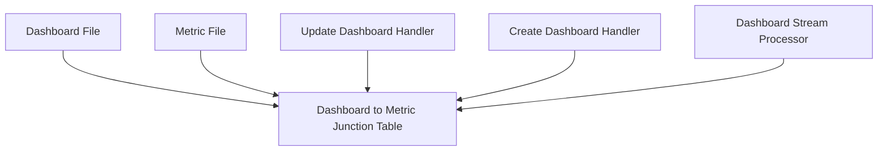

# Metric Dashboard Association PRD

## Problem Statement

Currently, metrics can be added to dashboards through the collections_to_assets junction table which uses generic asset types. However, this approach doesn't capture the specific relationship between dashboard_files and metric_files. When dashboards are created or updated, we need a direct way to track which metrics are used within those dashboards and maintain this association properly.

Key issues:
- No dedicated association table between metric_files and dashboard_files
- Metrics within dashboards are referenced by UUID, but there's no validation of whether these metrics exist
- When modifying dashboards, there's no automatic updating of metric associations
- When creating dashboards through streaming processors, metric associations aren't captured

### Current Limitations
- Dashboard files reference metrics by ID but don't maintain a formal relationship in the database
- No way to efficiently query which metrics are used in a specific dashboard
- No way to efficiently query which dashboards use a specific metric
- When metrics are deleted, dashboards that use them aren't updated

### Impact
- User Impact: Users may encounter broken dashboards if metrics are deleted or modified
- System Impact: Inefficient queries needed to find metric-dashboard relationships
- Business Impact: Poor data integrity and potential orphaned references

## Requirements

### Functional Requirements

#### Core Functionality
- Requirement 1: Create a dedicated junction table to associate metric_files with dashboard_files
  - Details: The table will track which metrics are used in which dashboards
  - Acceptance Criteria: Junction table allows querying of dashboard→metric and metric→dashboard relationships
  - Dependencies: Existing metric_files and dashboard_files tables

- Requirement 2: Update dashboard creation and modification process to maintain associations
  - Details: When dashboards are created or updated, update the junction table with metric associations
  - Acceptance Criteria: Junction table is kept in sync with dashboard content
  - Dependencies: Dashboard creation and update handlers

- Requirement 3: Support streaming dashboard creation with metric associations
  - Details: When dashboards are created through streaming processors, update metric associations
  - Acceptance Criteria: Streaming-created dashboards have proper metric associations
  - Dependencies: Streaming processors for dashboard creation

### Non-Functional Requirements
- Performance Requirements
  - Association operations should not significantly impact dashboard save/update performance
  - Junction table should have appropriate indexes for fast querying in both directions
- Security Requirements
  - Association table should respect existing permissions model
- Maintainability Requirements
  - Code changes should be properly tested and documented

## Technical Design

### System Architecture



### Core Components

#### Component 1: Junction Table
```sql
CREATE TABLE metric_files_to_dashboard_files (
    metric_file_id UUID NOT NULL REFERENCES metric_files(id),
    dashboard_file_id UUID NOT NULL REFERENCES dashboard_files(id),
    created_at TIMESTAMP WITH TIME ZONE NOT NULL DEFAULT NOW(),
    updated_at TIMESTAMP WITH TIME ZONE NOT NULL DEFAULT NOW(),
    deleted_at TIMESTAMP WITH TIME ZONE,
    created_by UUID NOT NULL,
    PRIMARY KEY (metric_file_id, dashboard_file_id)
);
```

#### Component 2: Database Model
```rust
#[derive(Queryable, Insertable, Associations, Debug)]
#[diesel(belongs_to(MetricFile, foreign_key = metric_file_id))]
#[diesel(belongs_to(DashboardFile, foreign_key = dashboard_file_id))]
#[diesel(table_name = metric_files_to_dashboard_files)]
pub struct MetricFileToDashboardFile {
    pub metric_file_id: Uuid,
    pub dashboard_file_id: Uuid,
    pub created_at: DateTime<Utc>,
    pub updated_at: DateTime<Utc>,
    pub deleted_at: Option<DateTime<Utc>>,
    pub created_by: Uuid,
}
```

#### Component 3: Dashboard Update Handler
```rust
// Update dashboard handler function to extract metric IDs from dashboard content
// and maintain association table entries
pub async fn update_dashboard_handler(
    dashboard_id: Uuid,
    request: DashboardUpdateRequest,
    user_id: &Uuid,
) -> Result<BusterDashboardResponse> {
    // Existing handler code...
    
    // Extract metric IDs from dashboard content
    let metric_ids = extract_metric_ids_from_dashboard(&dashboard_content);
    
    // Update associations
    update_dashboard_metric_associations(
        dashboard_id,
        metric_ids,
        user_id,
        &mut conn
    ).await?;
    
    // Rest of handler...
}

// Helper function to update associations
async fn update_dashboard_metric_associations(
    dashboard_id: Uuid,
    metric_ids: Vec<Uuid>,
    user_id: &Uuid,
    conn: &mut AsyncPgConnection,
) -> Result<()> {
    // Implementation details
}
```

#### Component 4: Create Dashboard Processor
```rust
// Add to CreateDashboardsProcessor to handle metric associations
impl Processor for CreateDashboardsProcessor {
    // Existing implementation...
    
    // Add logic to extract metric IDs and create associations
    // when processing dashboard creation
}
```

### Database Changes

```sql
-- Create the junction table
CREATE TABLE metric_files_to_dashboard_files (
    metric_file_id UUID NOT NULL REFERENCES metric_files(id),
    dashboard_file_id UUID NOT NULL REFERENCES dashboard_files(id),
    created_at TIMESTAMP WITH TIME ZONE NOT NULL DEFAULT NOW(),
    updated_at TIMESTAMP WITH TIME ZONE NOT NULL DEFAULT NOW(),
    deleted_at TIMESTAMP WITH TIME ZONE,
    created_by UUID NOT NULL,
    PRIMARY KEY (metric_file_id, dashboard_file_id)
);

-- Add indexes for efficient querying
CREATE INDEX metric_files_to_dashboard_files_metric_id_idx ON metric_files_to_dashboard_files(metric_file_id);
CREATE INDEX metric_files_to_dashboard_files_dashboard_id_idx ON metric_files_to_dashboard_files(dashboard_file_id);
CREATE INDEX metric_files_to_dashboard_files_deleted_at_idx ON metric_files_to_dashboard_files(deleted_at);
```

### File Changes

#### New Files
- `/Users/dallin/dashboard_updates_and_metric_parsing/api/migrations/2025-03-20-XXXXXX_metric_files_to_dashboard_files/up.sql`
  - Purpose: Create the junction table between metric_files and dashboard_files
  - Key components: Table definition, indexes
  - Dependencies: metric_files and dashboard_files tables

- `/Users/dallin/dashboard_updates_and_metric_parsing/api/migrations/2025-03-20-XXXXXX_metric_files_to_dashboard_files/down.sql`
  - Purpose: Revert the migration by dropping the table
  - Key components: DROP TABLE statement
  - Dependencies: None

#### Modified Files
- `/Users/dallin/dashboard_updates_and_metric_parsing/api/libs/database/src/models.rs`
  - Changes: Add MetricFileToDashboardFile struct
  - Impact: Allows ORM access to the junction table
  - Dependencies: Updated schema.rs

- `/Users/dallin/dashboard_updates_and_metric_parsing/api/libs/handlers/src/dashboards/update_dashboard_handler.rs`
  - Changes: Add logic to extract metric IDs from dashboard content and update associations
  - Impact: Keeps association table in sync with dashboard content
  - Dependencies: New model, dashboard parsing logic

- `/Users/dallin/dashboard_updates_and_metric_parsing/api/libs/streaming/src/processors/create_dashboards_processor.rs`
  - Changes: Add logic to extract metric IDs from dashboard content and create associations
  - Impact: Ensures streaming-created dashboards have proper metric associations
  - Dependencies: New model, dashboard parsing logic

## Implementation Plan

### Phase 1: Database Schema and Models
- [x] Create migration for metric_files_to_dashboard_files junction table
- [ ] Run migration to create the table
- [ ] Add MetricFileToDashboardFile model to models.rs
- [ ] Create helper functions to extract metric IDs from dashboard content

### Phase 2: Update Dashboard Handler
- [ ] Add logic to update_dashboard_handler.rs to maintain associations
- [ ] Test update_dashboard_handler with various dashboard configurations
- [ ] Verify associations are properly maintained

### Phase 3: Streaming Dashboard Creation
- [ ] Add logic to create_dashboards_processor.rs to maintain associations
- [ ] Test streaming dashboard creation with metric associations
- [ ] Verify associations are properly maintained

## Testing Strategy

### Unit Tests
```rust
#[cfg(test)]
mod tests {
    // Test extracting metric IDs from dashboard content
    #[test]
    fn test_extract_metric_ids() {
        let dashboard_content = // sample dashboard content
        let metric_ids = extract_metric_ids_from_dashboard(&dashboard_content);
        assert_eq!(metric_ids, vec![/* expected IDs */]);
    }
    
    // Test updating associations
    #[tokio::test]
    async fn test_update_associations() {
        // Test setup
        let result = update_dashboard_metric_associations(
            dashboard_id,
            metric_ids,
            user_id,
            &mut conn
        ).await;
        assert!(result.is_ok());
        // Verify associations in database
    }
}
```

### Integration Tests

#### Scenario 1: Update Dashboard with New Metrics
- Setup: Create test dashboard and metrics
- Steps:
  1. Update dashboard to include metrics
  2. Verify association table contains correct entries
- Expected Results: Association table should contain entries for all metrics in the dashboard
- Validation Criteria: Count and content of association table entries matches dashboard content

#### Scenario 2: Stream Create Dashboard with Metrics
- Setup: Prepare dashboard content with metrics
- Steps:
  1. Process dashboard creation through streaming processor
  2. Verify association table contains correct entries
- Expected Results: Association table should contain entries for all metrics in the dashboard
- Validation Criteria: Count and content of association table entries matches dashboard content

### References
- [Diesel ORM documentation](https://diesel.rs/)
- [Association tables best practices](https://docs.diesel.rs/diesel/associations/index.html)