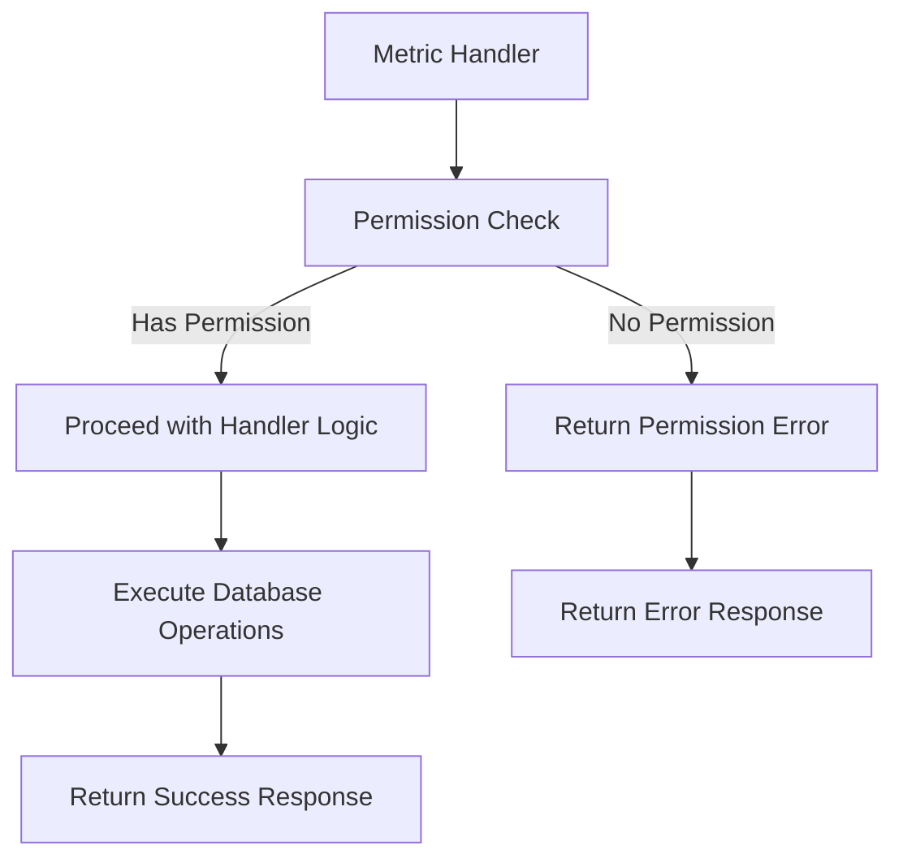

# Metric Permission Checks

## Problem Statement 

The metric-related handlers in `@libs/handlers/src/metrics` currently lack standardized permission checks using the `@libs/sharing` library. While some permission logic may exist, it doesn't consistently use the `check_asset_permission.rs` functions and doesn't properly handle organization admin access to metric resources.

Specific issues include:
- Inconsistent permission checks across metric handlers
- Hardcoded permission values in responses (e.g., `permission: AssetPermissionRole::Owner`)
- No automatic elevated access for workspace and data admins
- Risk of unauthorized access, modification, or deletion of metrics
- No clear error handling for permission denied cases

These issues affect the security and consistency of the application and need to be addressed to ensure proper access control across all metric resources, which often contain sensitive business data visualizations.

### Current Limitations
- Metric handlers may use ad-hoc permission checks or none at all
- No organization admin check for automatic access elevation
- Inconsistent error handling for permission failures
- Lack of proper permission filtering for list operations
- Comment in code indicates permission checks are needed: `// TODO: get the actual access check`

### Impact
- User Impact: Users may have incorrect access to metrics (too much or too little)
- System Impact: Security vulnerabilities and inconsistent behavior
- Business Impact: Potential unauthorized access to business-critical metrics and inability to properly administer them

## Requirements

### Functional Requirements 

#### Core Functionality
- Implement permission checks in all metric handlers
  - Details: Add permission checks at the beginning of each handler function
  - Acceptance Criteria: All metric handlers properly check permissions before performing operations
  - Dependencies: Sharing library, admin check utility

- Enforce correct permission levels for different operations
  - Details: Map operations to appropriate permission levels (view, edit, delete)
  - Acceptance Criteria: Each operation requires the correct minimum permission level
  - Dependencies: `AssetPermissionRole` enum

- Implement proper error handling
  - Details: Return appropriate error messages for permission denied cases
  - Acceptance Criteria: Consistent, secure error handling across all metric handlers
  - Dependencies: None

#### Handler-Specific Requirements

- get_metric_handler
  - Details: Require at least CanView permission
  - Acceptance Criteria: Users with at least CanView permission can access metric details
  - Dependencies: None

- delete_metric_handler
  - Details: Require FullAccess or Owner permission
  - Acceptance Criteria: Only users with FullAccess or Owner permission can delete metrics
  - Dependencies: None

- update_metric_handler
  - Details: Require at least CanEdit permission
  - Acceptance Criteria: Users with at least CanEdit permission can update metric details
  - Dependencies: None

- list_metrics_handler
  - Details: Filter results based on user's permissions
  - Acceptance Criteria: Only metrics the user has at least CanView permission for are returned
  - Dependencies: None

- get_metric_data_handler
  - Details: Require at least CanView permission
  - Acceptance Criteria: Users with at least CanView permission can access metric data
  - Dependencies: None

- sharing_endpoint_handlers
  - Details: Require FullAccess or Owner permission
  - Acceptance Criteria: Only users with FullAccess or Owner permission can modify sharing settings
  - Dependencies: None

### Non-Functional Requirements 

- Performance Requirements
  - Permission checks should add minimal overhead to handlers (<10ms)
- Security Requirements
  - Permission checks must happen before any data access or modification
  - Error messages must not reveal sensitive information
- Maintainability Requirements
  - All handlers should use consistent permission checking patterns
  - Code should be well-documented for future maintenance

## Technical Design 

### System Architecture



### Core Components 

#### Component 1: Permission Check Utility for Metric Handlers

```rust
/// Verifies a user has sufficient permissions for a metric operation
///
/// # Arguments
/// * `metric_id` - The ID of the metric to check
/// * `user_id` - The ID of the user requesting access
/// * `required_role` - The minimum role required for the operation
///
/// # Returns
/// * `Result<()>` - Ok if user has permission, Error otherwise
async fn verify_metric_permission(
    metric_id: &Uuid,
    user_id: &Uuid,
    required_role: AssetPermissionRole,
) -> Result<()> {
    // Get the organization ID for this metric
    let org_id = metric_files::table
        .filter(metric_files::id.eq(metric_id))
        .filter(metric_files::deleted_at.is_null())
        .select(metric_files::organization_id)
        .first::<Uuid>(&mut get_pg_pool().get().await?)
        .await
        .map_err(|e| anyhow!("Failed to find metric: {}", e))?;
    
    // Check if user is an org admin
    if is_user_org_admin(user_id, &org_id).await? {
        // Admins get everything except Owner permissions
        if required_role != AssetPermissionRole::Owner {
            return Ok(());
        }
    }
    
    // Check regular permissions
    let has_access = has_permission(
        *metric_id,
        AssetType::MetricFile,
        *user_id,
        IdentityType::User,
        required_role,
    )
    .await?;
    
    if has_access {
        Ok(())
    } else {
        Err(anyhow!("Insufficient permissions for metric operation"))
    }
}

/// Get the actual permission role a user has for a metric
///
/// # Arguments
/// * `metric_id` - The ID of the metric to check
/// * `user_id` - The ID of the user to check permissions for
///
/// # Returns
/// * `Result<AssetPermissionRole>` - The highest permission role the user has
async fn get_metric_permission_role(
    metric_id: &Uuid,
    user_id: &Uuid,
) -> Result<AssetPermissionRole> {
    // Get the organization ID for this metric
    let org_id = metric_files::table
        .filter(metric_files::id.eq(metric_id))
        .filter(metric_files::deleted_at.is_null())
        .select(metric_files::organization_id)
        .first::<Uuid>(&mut get_pg_pool().get().await?)
        .await
        .map_err(|e| anyhow!("Failed to find metric: {}", e))?;
    
    // Check if user is an org admin
    if is_user_org_admin(user_id, &org_id).await? {
        // Admins get FullAccess
        return Ok(AssetPermissionRole::FullAccess);
    }
    
    // Check regular permissions
    let user_role = check_access(
        *metric_id,
        AssetType::MetricFile,
        *user_id,
        IdentityType::User,
    )
    .await?;
    
    // If metric was created by the user, they're the owner
    let is_owner = metric_files::table
        .filter(metric_files::id.eq(metric_id))
        .filter(metric_files::created_by.eq(user_id))
        .first::<QueryableMetricFile>(&mut get_pg_pool().get().await?)
        .await
        .is_ok();
    
    if is_owner {
        Ok(AssetPermissionRole::Owner)
    } else {
        Ok(user_role.unwrap_or(AssetPermissionRole::CanView))
    }
}
```

#### Component 2: Modified get_metric_handler

```rust
pub async fn get_metric_handler(
    metric_id: &Uuid,
    user_id: &Uuid,
    version_number: Option<i32>,
) -> Result<BusterMetric> {
    // Verify user has at least CanView permission
    verify_metric_permission(metric_id, user_id, AssetPermissionRole::CanView).await?;
    
    // Existing handler logic continues below...
    // ...
    
    // Get the actual permission role for accurate response
    let permission_role = get_metric_permission_role(metric_id, user_id).await?;
    
    // Construct BusterMetric
    Ok(BusterMetric {
        // ... other fields ...
        permission: permission_role, // Use actual role instead of hardcoded Owner
        // ... other fields ...
    })
}
```

#### Component 3: Modified delete_metric_handler

```rust
pub async fn delete_metric_handler(
    metric_id: &Uuid,
    user_id: &Uuid,
) -> Result<()> {
    // Verify user has FullAccess permission (required for deletion)
    verify_metric_permission(metric_id, user_id, AssetPermissionRole::FullAccess).await?;
    
    // Existing handler logic continues below...
    // ...
}
```

#### Component 4: Modified update_metric_handler

```rust
pub async fn update_metric_handler(
    metric_id: &Uuid,
    user_id: &Uuid,
    request: UpdateMetricRequest,
) -> Result<BusterMetric> {
    // Verify user has at least CanEdit permission
    verify_metric_permission(metric_id, user_id, AssetPermissionRole::CanEdit).await?;
    
    // Existing handler logic continues below...
    // ...
    
    // Get the actual permission role for accurate response
    let permission_role = get_metric_permission_role(metric_id, user_id).await?;
    
    // Return with proper permission
    Ok(BusterMetric {
        // ... other fields ...
        permission: permission_role, // Use actual role instead of hardcoded Owner
        // ... other fields ...
    })
}
```

#### Component 5: Modified list_metrics_handler

```rust
pub async fn list_metrics_handler(user_id: &Uuid) -> Result<Vec<BusterMetricSummary>> {
    // For list operations, we'll filter by permissions rather than block entirely
    let mut conn = get_pg_pool().get().await?;
    
    // Get organization ID for this user
    let org_id = match get_user_organization_id(user_id).await {
        Ok(id) => id,
        Err(_) => return Ok(Vec::new()), // No organization, no metrics
    };
    
    // Check if user is an org admin
    let is_admin = is_user_org_admin(user_id, &org_id).await?;
    
    // If admin, return all metrics in organization
    if is_admin {
        let org_metrics = metric_files::table
            .filter(metric_files::organization_id.eq(org_id))
            .filter(metric_files::deleted_at.is_null())
            // ... additional query logic ...
            .load::<QueryableMetricFile>(&mut conn)
            .await?;
        
        // Transform to summary format
        let summaries = org_metrics
            .into_iter()
            .map(|metric| BusterMetricSummary {
                id: metric.id,
                name: metric.name,
                // ... other fields ...
                permission: AssetPermissionRole::FullAccess, // Admin gets FullAccess
            })
            .collect();
        
        return Ok(summaries);
    }
    
    // Otherwise, get metrics based on explicit permissions
    
    // Get all metrics the user has created (owner by default)
    let mut user_metrics = metric_files::table
        .filter(metric_files::created_by.eq(user_id))
        .filter(metric_files::deleted_at.is_null())
        // ... additional query logic ...
        .load::<QueryableMetricFile>(&mut conn)
        .await?;
    
    // Get all metrics where the user has been granted permissions
    let shared_metrics = asset_permissions::table
        .inner_join(metric_files::table.on(metric_files::id.eq(asset_permissions::asset_id)))
        .filter(asset_permissions::identity_id.eq(user_id))
        .filter(asset_permissions::identity_type.eq(IdentityType::User))
        .filter(asset_permissions::asset_type.eq(AssetType::MetricFile))
        .filter(asset_permissions::deleted_at.is_null())
        .filter(metric_files::deleted_at.is_null())
        // ... additional query logic ...
        .select((
            metric_files::all_columns,
            asset_permissions::role,
        ))
        .load::<(QueryableMetricFile, AssetPermissionRole)>(&mut conn)
        .await?;
    
    // Transform user metrics to summary format
    let mut summaries: Vec<BusterMetricSummary> = user_metrics
        .into_iter()
        .map(|metric| BusterMetricSummary {
            id: metric.id,
            name: metric.name,
            // ... other fields ...
            permission: AssetPermissionRole::Owner, // User is owner
        })
        .collect();
    
    // Add shared metrics to summaries
    let shared_summaries: Vec<BusterMetricSummary> = shared_metrics
        .into_iter()
        .map(|(metric, role)| BusterMetricSummary {
            id: metric.id,
            name: metric.name,
            // ... other fields ...
            permission: role, // Use the actual role
        })
        .collect();
    
    // Combine and deduplicate
    summaries.extend(shared_summaries);
    // ... deduplicate logic ...
    
    Ok(summaries)
}
```

#### Component 6: Modified get_metric_data_handler

```rust
pub async fn get_metric_data_handler(
    metric_id: &Uuid,
    user_id: &Uuid,
) -> Result<MetricDataResponse> {
    // Verify user has at least CanView permission
    verify_metric_permission(metric_id, user_id, AssetPermissionRole::CanView).await?;
    
    // Existing handler logic continues below...
    // ...
}
```

### File Changes 

#### Modified Files
- `api/libs/handlers/src/metrics/get_metric_handler.rs`
  - Changes: Add permission check at start of handler, use accurate permission role in response
  - Impact: Ensures user has appropriate view permissions, returns accurate permission info
  - Dependencies: Sharing library, admin check utility

- `api/libs/handlers/src/metrics/delete_metric_handler.rs`
  - Changes: Add permission check at start of handler
  - Impact: Ensures user has appropriate delete permissions
  - Dependencies: Sharing library, admin check utility

- `api/libs/handlers/src/metrics/update_metric_handler.rs`
  - Changes: Add permission check at start of handler, use accurate permission role in response
  - Impact: Ensures user has appropriate edit permissions, returns accurate permission info
  - Dependencies: Sharing library, admin check utility

- `api/libs/handlers/src/metrics/list_metrics_handler.rs`
  - Changes: Modify query to filter by permissions, add admin special handling
  - Impact: Ensures user only sees metrics they have permission to view
  - Dependencies: Sharing library, admin check utility

- `api/libs/handlers/src/metrics/get_metric_data_handler.rs`
  - Changes: Add permission check at start of handler
  - Impact: Ensures user has appropriate view permissions for metric data
  - Dependencies: Sharing library, admin check utility

## Implementation Plan

### Phase 1: Add Permission Utilities  (In Progress)

1. Create metric-specific permission utility functions
   - [ ] Implement `verify_metric_permission` helper function
   - [ ] Implement `get_metric_permission_role` helper function
   - [ ] Add error handling for permission failures
   - [ ] Create reusable query for getting metric organization ID

2. Add unit tests for permission utilities
   - [ ] Test permission verification with various roles
   - [ ] Test admin override functionality
   - [ ] Test error handling and edge cases

### Phase 2: Modify Metric Handlers  (Not Started)

1. Update get_metric_handler
   - [ ] Add permission check for CanView
   - [ ] Replace hardcoded permission with actual user permission
   - [ ] Ensure proper error handling
   - [ ] Update unit tests

2. Update delete_metric_handler
   - [ ] Add permission check for FullAccess
   - [ ] Ensure proper error handling
   - [ ] Update unit tests

3. Update update_metric_handler
   - [ ] Add permission check for CanEdit
   - [ ] Replace hardcoded permission with actual user permission
   - [ ] Ensure proper error handling
   - [ ] Update unit tests

4. Update list_metrics_handler
   - [ ] Modify queries to filter by permission
   - [ ] Add logic to include admin-accessible metrics
   - [ ] Include accurate permission levels in responses
   - [ ] Update unit tests

5. Update get_metric_data_handler
   - [ ] Add permission check for CanView
   - [ ] Ensure proper error handling
   - [ ] Update unit tests

### Phase 3: Testing & Documentation  (Not Started)

1. Add integration tests
   - [ ] Test end-to-end flows with different permission levels
   - [ ] Verify admin access works correctly
   - [ ] Test permission denial scenarios

2. Update documentation
   - [ ] Document permission requirements for each handler
   - [ ] Add examples of correct usage
   - [ ] Document error handling behavior

## Testing Strategy 

### Unit Tests

```rust
#[cfg(test)]
mod tests {
    use super::*;
    use database::enums::{AssetPermissionRole, AssetType, IdentityType};
    use mockall::{predicate::*, *};
    
    // Mock permission checking functions
    mock! {
        PermissionChecker {}
        impl PermissionChecker {
            async fn has_permission(
                asset_id: Uuid,
                asset_type: AssetType,
                identity_id: Uuid,
                identity_type: IdentityType,
                required_role: AssetPermissionRole,
            ) -> Result<bool>;
            
            async fn is_user_org_admin(
                user_id: &Uuid,
                org_id: &Uuid,
            ) -> Result<bool>;
        }
    }
    
    #[tokio::test]
    async fn test_get_metric_handler_with_permission() {
        // Test that handler succeeds when user has permission
        let metric_id = Uuid::new_v4();
        let user_id = Uuid::new_v4();
        
        // Mock permission check to return true
        // [mocking setup here]
        
        let result = get_metric_handler(&metric_id, &user_id, None).await;
        assert!(result.is_ok());
    }
    
    #[tokio::test]
    async fn test_get_metric_handler_without_permission() {
        // Test that handler fails when user lacks permission
        let metric_id = Uuid::new_v4();
        let user_id = Uuid::new_v4();
        
        // Mock permission check to return false
        // [mocking setup here]
        
        let result = get_metric_handler(&metric_id, &user_id, None).await;
        assert!(result.is_err());
        assert!(result.unwrap_err().to_string().contains("Insufficient permissions"));
    }
    
    #[tokio::test]
    async fn test_get_metric_permission_role_admin() {
        // Test that admin users get FullAccess role
        let metric_id = Uuid::new_v4();
        let user_id = Uuid::new_v4();
        let org_id = Uuid::new_v4();
        
        // Mock admin check to return true
        // [mocking setup here]
        
        let result = get_metric_permission_role(&metric_id, &user_id).await;
        assert!(result.is_ok());
        assert_eq!(result.unwrap(), AssetPermissionRole::FullAccess);
    }
    
    #[tokio::test]
    async fn test_list_metrics_handler_admin_user() {
        // Test that admins see all metrics in org
        let user_id = Uuid::new_v4();
        let org_id = Uuid::new_v4();
        
        // Mock admin check to return true
        // [mocking setup here]
        
        let result = list_metrics_handler(&user_id).await;
        assert!(result.is_ok());
        // Assert that result includes all metrics in org
    }
}
```

### Integration Tests

#### Scenario 1: Metric Access with Various Permission Levels
- Setup: Create test metric and users with different permission levels
- Steps:
  1. Attempt to view metric with CanView, CanEdit, and FullAccess permissions
  2. Attempt to edit metric with CanView, CanEdit, and FullAccess permissions
  3. Attempt to delete metric with CanView, CanEdit, and FullAccess permissions
- Expected Results: Operations succeed only with appropriate permission levels
- Validation Criteria: View works with any permission, edit requires CanEdit+, delete requires FullAccess+

#### Scenario 2: Admin Access to Metrics
- Setup: Create test metric and admin user in same organization
- Steps:
  1. Admin attempts to view, edit, and delete metric without explicit permissions
  2. System checks admin status and permits operations
- Expected Results: Admin can perform all operations except those requiring Owner permission
- Validation Criteria: Operations succeed due to admin status, not explicit permissions

#### Scenario 3: Metric Data Access
- Setup: Create test metric with data and users with different permission levels
- Steps:
  1. Attempt to view metric data with CanView, CanEdit, and FullAccess permissions
  2. Attempt to view metric data without appropriate permissions
- Expected Results: Data access is granted only with appropriate permissions
- Validation Criteria: Data access requires at least CanView permission

### Security Considerations
- Security Requirement 1: Permission Check Precedence
  - Description: Permission checks must happen before any data access or modification
  - Implementation: Place permission checks at the beginning of handler functions
  - Validation: Code review and tests that verify permission failures prevent data access

- Security Requirement 2: Data Exposure Control
  - Description: Metric data should only be accessible to authorized users
  - Implementation: Consistent permission checks across all data access points
  - Validation: Tests that verify unauthorized users cannot access metric data

### Performance Considerations
- Performance Requirement 1: Efficient Permission Checking
  - Description: Permission checks should not significantly impact handler performance
  - Implementation: Optimize database queries, consider caching for frequent checks
  - Validation: Performance benchmarks of handlers with and without permission checks

### References
- [Sharing Library Documentation](mdc:libs/sharing/src/lib.rs)
- [Metric Models](mdc:database/src/models.rs)
- [Asset Permission Roles](mdc:database/src/enums.rs)