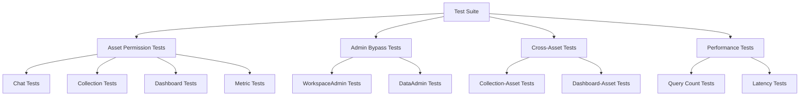

# Permission Integration Tests

## Problem Statement
While individual permission checks may be implemented correctly, there is a need for comprehensive integration testing to ensure that the entire permission system works correctly across all asset types and operation scenarios. Without proper integration testing, there's a risk of security gaps, inconsistent behavior, or performance issues in the permission system.

Specific issues that could arise without proper integration testing include:
- Inconsistencies in permission enforcement across different asset types
- Performance bottlenecks due to inefficient permission checking
- Edge cases where admin bypass might not work as expected
- Security vulnerabilities in cross-asset operations
- Regression issues when implementing new features

This PRD outlines a comprehensive integration testing strategy for the permission system, ensuring that all permission checks work correctly in real-world scenarios.

## Requirements

### Functional Requirements

#### Core Test Scenarios
- Test asset access with various permission levels
  - Details: Test view, edit, and delete operations with different permission levels
  - Acceptance Criteria: Operations succeed only with appropriate permission levels
  - Dependencies: All asset permission implementations

- Test organization admin bypass functionality
  - Details: Test access by workspace and data admins without explicit permissions
  - Acceptance Criteria: Admin users can access assets in their organization
  - Dependencies: Admin check implementation

- Test permission denied scenarios
  - Details: Test operations with insufficient permissions
  - Acceptance Criteria: Appropriate error messages returned
  - Dependencies: All asset permission implementations

- Test cross-asset operations
  - Details: Test operations involving multiple assets
  - Acceptance Criteria: Proper permission checks on all involved assets
  - Dependencies: Cross-asset permission implementation

#### Performance Testing
- Test cached user information performance
  - Details: Compare performance with and without cached info
  - Acceptance Criteria: Significant reduction in database queries with cached info
  - Dependencies: Authenticated user implementation

- Test permission check latency
  - Details: Measure latency of permission checks
  - Acceptance Criteria: Permission checks add minimal overhead (<10ms)
  - Dependencies: All permission implementations

### Non-Functional Requirements
- Test Coverage Requirements
  - Tests must cover all asset types (Chats, Collections, Dashboards, Metrics)
  - Tests must cover all permission levels
  - Tests must cover all operation types (view, edit, delete, share)
- Performance Requirements
  - Performance tests must measure database query count
  - Performance tests must measure latency
- Security Requirements
  - Tests must verify permission checks happen before data access
  - Tests must verify error messages don't reveal sensitive information

## Technical Design

### Test Architecture



### Core Components

#### Component 1: Asset Permission Test Framework

```rust
/// Base test fixture for permission tests
struct PermissionTestFixture {
    db_pool: PgPool,
    admin_user: AuthenticatedUser,
    regular_user: AuthenticatedUser,
    no_permission_user: AuthenticatedUser,
    test_organization: Uuid,
}

impl PermissionTestFixture {
    /// Set up test fixture with users and organization
    async fn setup() -> Self {
        // Create test database
        let db_pool = setup_test_database().await;
        
        // Create test organization
        let test_organization = create_test_organization(&db_pool).await;
        
        // Create test users with different roles
        let admin_user = create_test_user(
            &db_pool,
            test_organization,
            UserOrganizationRole::WorkspaceAdmin,
        ).await;
        
        let regular_user = create_test_user(
            &db_pool,
            test_organization,
            UserOrganizationRole::Member,
        ).await;
        
        let no_permission_user = create_test_user(
            &db_pool,
            Uuid::new_v4(), // Different organization
            UserOrganizationRole::Member,
        ).await;
        
        Self {
            db_pool,
            admin_user,
            regular_user,
            no_permission_user,
            test_organization,
        }
    }
    
    /// Clean up test fixture
    async fn cleanup(&self) {
        // Clean up test data
        cleanup_test_database(&self.db_pool).await;
    }
}
```

#### Component 2: Chat Permission Tests

```rust
/// Tests for chat permission checks
#[tokio::test]
async fn test_chat_permissions() {
    // Set up test fixture
    let fixture = PermissionTestFixture::setup().await;
    
    // Create test chat
    let chat_id = create_test_chat(
        &fixture.db_pool,
        fixture.test_organization,
        fixture.regular_user.id,
    ).await;
    
    // Test 1: Admin user can view chat without explicit permission
    let result = get_chat_handler(&chat_id, &fixture.admin_user).await;
    assert!(result.is_ok(), "Admin user should be able to view chat");
    
    // Test 2: Regular user with explicit permission can view chat
    grant_permission(
        &fixture.db_pool,
        chat_id,
        AssetType::Chat,
        fixture.regular_user.id,
        AssetPermissionRole::CanView,
    ).await;
    
    let result = get_chat_handler(&chat_id, &fixture.regular_user).await;
    assert!(result.is_ok(), "User with explicit permission should be able to view chat");
    
    // Test 3: User without permission cannot view chat
    let result = get_chat_handler(&chat_id, &fixture.no_permission_user).await;
    assert!(result.is_err(), "User without permission should not be able to view chat");
    
    // Additional tests for edit, delete, share operations...
    
    // Clean up test fixture
    fixture.cleanup().await;
}
```

#### Component 3: Admin Bypass Tests

```rust
/// Tests for admin bypass functionality
#[tokio::test]
async fn test_admin_bypass() {
    // Set up test fixture
    let fixture = PermissionTestFixture::setup().await;
    
    // Create test assets for each type
    let chat_id = create_test_chat(
        &fixture.db_pool,
        fixture.test_organization,
        fixture.regular_user.id,
    ).await;
    
    let collection_id = create_test_collection(
        &fixture.db_pool,
        fixture.test_organization,
        fixture.regular_user.id,
    ).await;
    
    let dashboard_id = create_test_dashboard(
        &fixture.db_pool,
        fixture.test_organization,
        fixture.regular_user.id,
    ).await;
    
    let metric_id = create_test_metric(
        &fixture.db_pool,
        fixture.test_organization,
        fixture.regular_user.id,
    ).await;
    
    // Test 1: WorkspaceAdmin can access all assets
    let workspace_admin = create_test_user(
        &fixture.db_pool,
        fixture.test_organization,
        UserOrganizationRole::WorkspaceAdmin,
    ).await;
    
    assert!(get_chat_handler(&chat_id, &workspace_admin).await.is_ok());
    assert!(get_collection_handler(&collection_id, &workspace_admin).await.is_ok());
    assert!(get_dashboard_handler(&dashboard_id, &workspace_admin).await.is_ok());
    assert!(get_metric_handler(&metric_id, &workspace_admin).await.is_ok());
    
    // Test 2: DataAdmin can access all assets
    let data_admin = create_test_user(
        &fixture.db_pool,
        fixture.test_organization,
        UserOrganizationRole::DataAdmin,
    ).await;
    
    assert!(get_chat_handler(&chat_id, &data_admin).await.is_ok());
    assert!(get_collection_handler(&collection_id, &data_admin).await.is_ok());
    assert!(get_dashboard_handler(&dashboard_id, &data_admin).await.is_ok());
    assert!(get_metric_handler(&metric_id, &data_admin).await.is_ok());
    
    // Test 3: Admin from different organization cannot access assets
    let other_admin = create_test_user(
        &fixture.db_pool,
        Uuid::new_v4(), // Different organization
        UserOrganizationRole::WorkspaceAdmin,
    ).await;
    
    assert!(get_chat_handler(&chat_id, &other_admin).await.is_err());
    assert!(get_collection_handler(&collection_id, &other_admin).await.is_err());
    assert!(get_dashboard_handler(&dashboard_id, &other_admin).await.is_err());
    assert!(get_metric_handler(&metric_id, &other_admin).await.is_err());
    
    // Clean up test fixture
    fixture.cleanup().await;
}
```

#### Component 4: Performance Tests

```rust
/// Tests for permission check performance
#[tokio::test]
async fn test_permission_performance() {
    // Set up test fixture
    let fixture = PermissionTestFixture::setup().await;
    
    // Create test assets
    let chat_id = create_test_chat(
        &fixture.db_pool,
        fixture.test_organization,
        fixture.regular_user.id,
    ).await;
    
    // Test 1: Measure database queries with cached user info
    let query_counter = QueryCounter::new();
    query_counter.start();
    
    let _ = get_chat_handler(&chat_id, &fixture.admin_user).await;
    
    let query_count_cached = query_counter.count();
    
    // Test 2: Measure database queries without cached user info
    let query_counter = QueryCounter::new();
    query_counter.start();
    
    // Simulate uncached info by using just the user ID
    let user_id = fixture.admin_user.id;
    let db_conn = fixture.db_pool.get().await.unwrap();
    let user_org_id = get_user_organization(&db_conn, &user_id).await.unwrap();
    let is_admin = is_user_org_admin(&db_conn, &user_id, &user_org_id).await.unwrap();
    
    let query_count_uncached = query_counter.count();
    
    // Verify cached info reduces query count
    assert!(
        query_count_cached < query_count_uncached,
        "Cached user info should reduce database queries"
    );
    
    // Test 3: Measure latency of permission checks
    let start_time = std::time::Instant::now();
    
    let _ = get_chat_handler(&chat_id, &fixture.admin_user).await;
    
    let elapsed = start_time.elapsed();
    
    // Verify permission check is fast enough
    assert!(
        elapsed.as_millis() < 10,
        "Permission check should complete in less than 10ms"
    );
    
    // Clean up test fixture
    fixture.cleanup().await;
}
```

### File Changes

#### New Files
- `api/tests/integration/permissions/mod.rs`
  - Purpose: Setup common test utilities for permission tests
  - Impact: Enables consistent permission testing

- `api/tests/integration/permissions/test_fixtures.rs`
  - Purpose: Define test fixtures and helper functions
  - Impact: Simplifies test setup and teardown

- `api/tests/integration/permissions/chat_tests.rs`
  - Purpose: Test chat permission checks
  - Impact: Verifies chat permission implementation

- `api/tests/integration/permissions/collection_tests.rs`
  - Purpose: Test collection permission checks
  - Impact: Verifies collection permission implementation

- `api/tests/integration/permissions/dashboard_tests.rs`
  - Purpose: Test dashboard permission checks
  - Impact: Verifies dashboard permission implementation

- `api/tests/integration/permissions/metric_tests.rs`
  - Purpose: Test metric permission checks
  - Impact: Verifies metric permission implementation

- `api/tests/integration/permissions/admin_tests.rs`
  - Purpose: Test admin bypass functionality
  - Impact: Verifies admin access works correctly

- `api/tests/integration/permissions/cross_asset_tests.rs`
  - Purpose: Test cross-asset operations
  - Impact: Verifies permission checks for multi-asset operations

- `api/tests/integration/permissions/performance_tests.rs`
  - Purpose: Test permission check performance
  - Impact: Verifies performance requirements

## Implementation Plan

### Phase 1: Test Framework

1. Create test fixtures and utilities
   - [ ] Implement PermissionTestFixture
   - [ ] Create helper functions for test setup and teardown
   - [ ] Implement utility functions for creating test assets
   - [ ] Create QueryCounter for measuring database queries

### Phase 2: Asset Permission Tests

1. Implement chat permission tests
   - [ ] Test view operations with different permission levels
   - [ ] Test edit operations with different permission levels
   - [ ] Test delete operations with different permission levels
   - [ ] Test share operations with different permission levels

2. Implement collection permission tests
   - [ ] Test view operations with different permission levels
   - [ ] Test edit operations with different permission levels
   - [ ] Test delete operations with different permission levels
   - [ ] Test share operations with different permission levels

3. Implement dashboard permission tests
   - [ ] Test view operations with different permission levels
   - [ ] Test edit operations with different permission levels
   - [ ] Test delete operations with different permission levels
   - [ ] Test share operations with different permission levels

4. Implement metric permission tests
   - [ ] Test view operations with different permission levels
   - [ ] Test edit operations with different permission levels
   - [ ] Test delete operations with different permission levels
   - [ ] Test share operations with different permission levels

### Phase 3: Advanced Tests

1. Implement admin bypass tests
   - [ ] Test WorkspaceAdmin access to all asset types
   - [ ] Test DataAdmin access to all asset types
   - [ ] Test admin access limited to user's organization
   - [ ] Test admin cannot take Owner actions without explicit permission

2. Implement cross-asset tests
   - [ ] Test collection-asset operations
   - [ ] Test dashboard-asset operations
   - [ ] Test operations requiring multiple permission checks

3. Implement performance tests
   - [ ] Test query count with cached user info
   - [ ] Test query count without cached user info
   - [ ] Test permission check latency
   - [ ] Test performance impact of full permission system

## Testing Strategy

### Test Environment
- Tests will run on a clean database instance
- Test data will be created and destroyed for each test
- Tests will use the same database schema as production

### Test Categories

#### Asset Permission Tests
- **View Operations**: Test accessing assets with different permission levels
- **Edit Operations**: Test modifying assets with different permission levels
- **Delete Operations**: Test deleting assets with different permission levels
- **Share Operations**: Test sharing assets with different permission levels

#### Admin Bypass Tests
- **WorkspaceAdmin**: Test access by workspace admins without explicit permissions
- **DataAdmin**: Test access by data admins without explicit permissions
- **Organization Boundaries**: Test admin access limited to user's organization
- **Permission Hierarchy**: Test admin cannot take Owner actions without explicit permission

#### Cross-Asset Tests
- **Collection-Asset**: Test adding and removing assets from collections
- **Dashboard-Asset**: Test linking and unlinking assets from dashboards
- **Multiple Permissions**: Test operations requiring multiple permission checks

#### Performance Tests
- **Query Count**: Test database query optimization
- **Latency**: Test permission check response time
- **Cached Info**: Test performance improvement with cached user info
- **System Impact**: Test overall system performance with permission checks

### Security Considerations
- Tests must verify permission checks happen before data access
- Tests must verify error messages don't reveal sensitive information
- Tests must verify admin bypass only works within user's organization
- Tests must verify permission checks fail closed (deny by default)

### Performance Considerations
- Tests must measure database query count
- Tests must measure latency of permission checks
- Tests must verify cached user info improves performance
- Benchmarks must be established for acceptable performance

## References
- [Testing Framework Documentation](mdc:tests/common/mod.rs)
- [Asset Permission Roles](mdc:database/src/enums.rs)
- [Sharing Library](mdc:libs/sharing/src/lib.rs)