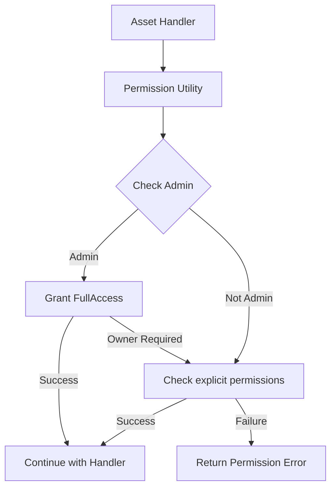

# Permission Utility Functions

## Problem Statement
The current implementation of permission checks across asset handlers lacks standardization and reusable utility functions. While the `@libs/sharing` library provides core permission checking functionality, there are no asset-specific utility functions that encapsulate the common permission checking patterns needed by handlers.

Specific issues include:
- Duplicate permission check code across handlers for the same asset type
- Inconsistent error handling for permission failures
- No standardized way to check permissions with organization admin bypass
- Lack of helper functions to retrieve organization IDs for different asset types
- No utility functions for retrieving accurate permission roles for responses

These issues lead to code duplication, inconsistent permission checking, and increased risk of security vulnerabilities. A set of reusable permission utility functions for each asset type would standardize permission checks and reduce duplication.

## Requirements

### Functional Requirements

#### Core Functionality
- Create permission utility functions for Chat assets
  - Details: Implement `verify_chat_permission` and related helper functions
  - Acceptance Criteria: Functions correctly verify permissions with admin bypass
  - Dependencies: None

- Create permission utility functions for Collection assets
  - Details: Implement `verify_collection_permission` and related helper functions
  - Acceptance Criteria: Functions correctly verify permissions with admin bypass
  - Dependencies: None

- Create permission utility functions for Dashboard assets
  - Details: Implement `verify_dashboard_permission` and related helper functions
  - Acceptance Criteria: Functions correctly verify permissions with admin bypass
  - Dependencies: None

- Create permission utility functions for Metric assets
  - Details: Implement `verify_metric_permission` and related helper functions
  - Acceptance Criteria: Functions correctly verify permissions with admin bypass
  - Dependencies: None

- Create permission level mapping functions
  - Details: Functions to map operations to required permission levels
  - Acceptance Criteria: Consistent permission level requirements across handlers
  - Dependencies: None

### Non-Functional Requirements
- Performance Requirements
  - Permission utility functions should add minimal overhead
  - Functions should use cached user information when possible
- Security Requirements
  - Functions must properly validate permissions
  - Error messages must not reveal sensitive information
- Maintainability Requirements
  - Functions should be well-documented
  - Functions should have comprehensive unit tests

## Technical Design

### System Architecture



### Core Components

#### Component 1: Chat Permission Utilities

```rust
/// Verifies a user has sufficient permissions for a chat operation
///
/// # Arguments
/// * `conn` - Database connection
/// * `chat_id` - The ID of the chat to check
/// * `user` - The authenticated user requesting access
/// * `required_level` - The minimum permission level required
///
/// # Returns
/// * `Result<()>` - Ok if user has permission, Error otherwise
pub async fn verify_chat_permission(
    conn: &mut AsyncPgConnection,
    chat_id: &Uuid,
    user: &AuthenticatedUser,
    required_level: AssetPermissionLevel,
) -> Result<()> {
    // Check permission with admin bypass using cached info
    let has_permission = has_permission_with_admin_check_cached(
        conn,
        chat_id,
        &AssetType::Chat,
        user,
        required_level,
    ).await?;
    
    if !has_permission {
        return Err(anyhow!("Insufficient permissions for chat operation"));
    }
    
    Ok(())
}

/// Get the actual permission role a user has for a chat
///
/// # Arguments
/// * `conn` - Database connection
/// * `chat_id` - The ID of the chat to check
/// * `user` - The authenticated user
///
/// # Returns
/// * `Result<AssetPermissionRole>` - The highest permission role the user has
pub async fn get_chat_permission_role(
    conn: &mut AsyncPgConnection,
    chat_id: &Uuid,
    user: &AuthenticatedUser,
) -> Result<AssetPermissionRole> {
    // Implementation details...
}
```

#### Component 2: Collection Permission Utilities

```rust
/// Verifies a user has sufficient permissions for a collection operation
///
/// # Arguments
/// * `conn` - Database connection
/// * `collection_id` - The ID of the collection to check
/// * `user` - The authenticated user requesting access
/// * `required_level` - The minimum permission level required
///
/// # Returns
/// * `Result<()>` - Ok if user has permission, Error otherwise
pub async fn verify_collection_permission(
    conn: &mut AsyncPgConnection,
    collection_id: &Uuid,
    user: &AuthenticatedUser,
    required_level: AssetPermissionLevel,
) -> Result<()> {
    // Check permission with admin bypass using cached info
    let has_permission = has_permission_with_admin_check_cached(
        conn,
        collection_id,
        &AssetType::Collection,
        user,
        required_level,
    ).await?;
    
    if !has_permission {
        return Err(anyhow!("Insufficient permissions for collection operation"));
    }
    
    Ok(())
}

/// Get the actual permission role a user has for a collection
///
/// # Arguments
/// * `conn` - Database connection
/// * `collection_id` - The ID of the collection to check
/// * `user` - The authenticated user
///
/// # Returns
/// * `Result<AssetPermissionRole>` - The highest permission role the user has
pub async fn get_collection_permission_role(
    conn: &mut AsyncPgConnection,
    collection_id: &Uuid,
    user: &AuthenticatedUser,
) -> Result<AssetPermissionRole> {
    // Implementation details...
}
```

#### Component 3: Dashboard Permission Utilities

```rust
/// Verifies a user has sufficient permissions for a dashboard operation
///
/// # Arguments
/// * `conn` - Database connection
/// * `dashboard_id` - The ID of the dashboard to check
/// * `user` - The authenticated user requesting access
/// * `required_level` - The minimum permission level required
///
/// # Returns
/// * `Result<()>` - Ok if user has permission, Error otherwise
pub async fn verify_dashboard_permission(
    conn: &mut AsyncPgConnection,
    dashboard_id: &Uuid,
    user: &AuthenticatedUser,
    required_level: AssetPermissionLevel,
) -> Result<()> {
    // Implementation details...
}
```

#### Component 4: Metric Permission Utilities

```rust
/// Verifies a user has sufficient permissions for a metric operation
///
/// # Arguments
/// * `conn` - Database connection
/// * `metric_id` - The ID of the metric to check
/// * `user` - The authenticated user requesting access
/// * `required_level` - The minimum permission level required
///
/// # Returns
/// * `Result<()>` - Ok if user has permission, Error otherwise
pub async fn verify_metric_permission(
    conn: &mut AsyncPgConnection,
    metric_id: &Uuid,
    user: &AuthenticatedUser,
    required_level: AssetPermissionLevel,
) -> Result<()> {
    // Implementation details...
}
```

#### Component 5: Permission Level Mapping

```rust
/// Maps a handler operation to the required permission level
///
/// # Arguments
/// * `operation` - The operation being performed
///
/// # Returns
/// * `AssetPermissionLevel` - The required permission level
pub fn map_operation_to_permission_level(operation: HandlerOperation) -> AssetPermissionLevel {
    match operation {
        HandlerOperation::View => AssetPermissionLevel::CanView,
        HandlerOperation::Filter => AssetPermissionLevel::CanFilter,
        HandlerOperation::Edit => AssetPermissionLevel::CanEdit,
        HandlerOperation::Delete => AssetPermissionLevel::FullAccess,
        HandlerOperation::Share => AssetPermissionLevel::FullAccess,
        HandlerOperation::TransferOwnership => AssetPermissionLevel::Owner,
    }
}
```

### File Changes

#### New Files
- `api/libs/handlers/src/utils/permissions/chat_permissions.rs`
  - Purpose: Implement chat permission utility functions
  - Impact: Standardizes chat permission checks

- `api/libs/handlers/src/utils/permissions/collection_permissions.rs`
  - Purpose: Implement collection permission utility functions
  - Impact: Standardizes collection permission checks

- `api/libs/handlers/src/utils/permissions/dashboard_permissions.rs`
  - Purpose: Implement dashboard permission utility functions
  - Impact: Standardizes dashboard permission checks

- `api/libs/handlers/src/utils/permissions/metric_permissions.rs`
  - Purpose: Implement metric permission utility functions
  - Impact: Standardizes metric permission checks

- `api/libs/handlers/src/utils/permissions/operation_mapping.rs`
  - Purpose: Map operations to permission levels
  - Impact: Ensures consistent permission requirements

- `api/libs/handlers/src/utils/permissions/mod.rs`
  - Purpose: Export all permission utility functions
  - Impact: Provides a unified interface for permission utilities

## Implementation Plan

### Phase 1: Basic Utility Functions

1. Create permission utility function modules
   - [ ] Create directory structure for permission utilities
   - [ ] Implement mod.rs for exporting functions
   - [ ] Define common types and interfaces

2. Implement Chat permission utilities
   - [ ] Implement `verify_chat_permission` function
   - [ ] Implement `get_chat_permission_role` function
   - [ ] Add unit tests for chat permission utilities

3. Implement Collection permission utilities
   - [ ] Implement `verify_collection_permission` function
   - [ ] Implement `get_collection_permission_role` function
   - [ ] Add unit tests for collection permission utilities

### Phase 2: Additional Asset Types

1. Implement Dashboard permission utilities
   - [ ] Implement `verify_dashboard_permission` function
   - [ ] Implement `get_dashboard_permission_role` function
   - [ ] Add unit tests for dashboard permission utilities

2. Implement Metric permission utilities
   - [ ] Implement `verify_metric_permission` function
   - [ ] Implement `get_metric_permission_role` function
   - [ ] Add unit tests for metric permission utilities

### Phase 3: Advanced Utilities

1. Implement operation mapping
   - [ ] Define handler operation enum
   - [ ] Implement mapping function
   - [ ] Add unit tests for operation mapping

2. Add documentation
   - [ ] Document all utility functions
   - [ ] Provide usage examples
   - [ ] Document error handling

## Testing Strategy

### Unit Tests

```rust
#[cfg(test)]
mod tests {
    use super::*;
    use database::enums::{AssetPermissionRole, AssetType, IdentityType, UserOrganizationRole};
    use middleware::types::{AuthenticatedUser, OrganizationMembership};
    use uuid::Uuid;
    
    #[tokio::test]
    async fn test_verify_chat_permission_admin_user() {
        // Create test authenticated user with admin role
        let org_id = Uuid::new_v4();
        let user = mock_authenticated_user(vec![
            (org_id, UserOrganizationRole::WorkspaceAdmin)
        ]);
        
        // Mock database connection and queries
        let mut conn = mock_connection();
        conn.expect_get_chat_org_id().returning(|_| Ok(org_id));
        
        // Call verify function
        let result = verify_chat_permission(
            &mut conn,
            &Uuid::new_v4(),
            &user,
            AssetPermissionLevel::CanView,
        ).await;
        
        // Admin should have access
        assert!(result.is_ok());
    }
    
    #[tokio::test]
    async fn test_verify_chat_permission_no_permission() {
        // Create test authenticated user with non-admin role
        let org_id = Uuid::new_v4();
        let user = mock_authenticated_user(vec![
            (org_id, UserOrganizationRole::Viewer)
        ]);
        
        // Mock database connection and queries
        let mut conn = mock_connection();
        conn.expect_get_chat_org_id().returning(|_| Ok(org_id));
        conn.expect_has_permission().returning(|_, _, _, _, _| Ok(false));
        
        // Call verify function
        let result = verify_chat_permission(
            &mut conn,
            &Uuid::new_v4(),
            &user,
            AssetPermissionLevel::CanEdit,
        ).await;
        
        // User should not have access
        assert!(result.is_err());
    }
}
```

### Integration Tests

#### Scenario 1: Permission Check with Admin User
- Setup: Create test asset and user with admin role
- Steps:
  1. Call permission utility function
  2. Verify function grants access based on admin role
- Expected Results: Function returns success (Ok)
- Validation Criteria: Permission check passes without explicit permissions

#### Scenario 2: Permission Check with Explicit Permissions
- Setup: Create test asset and user with explicit permissions
- Steps:
  1. Call permission utility function
  2. Verify function checks explicit permissions
- Expected Results: Function returns success (Ok)
- Validation Criteria: Permission check passes based on explicit permissions

#### Scenario 3: Permission Check with Insufficient Permissions
- Setup: Create test asset and user without required permissions
- Steps:
  1. Call permission utility function
  2. Verify function denies access
- Expected Results: Function returns error
- Validation Criteria: Permission check fails with appropriate error message

### Performance Considerations
- Measure performance impact of permission utility functions
- Ensure minimal database queries when using cached information
- Compare performance with and without admin bypass

### Security Considerations
- Ensure admin bypass only works within user's organization
- Verify permission checks fail closed (deny by default)
- Validate error messages don't expose sensitive information

## References
- [Sharing Library](mdc:libs/sharing/src/lib.rs)
- [Admin Check](mdc:libs/sharing/src/admin_check.rs)
- [Asset Permission Roles](mdc:database/src/enums.rs)