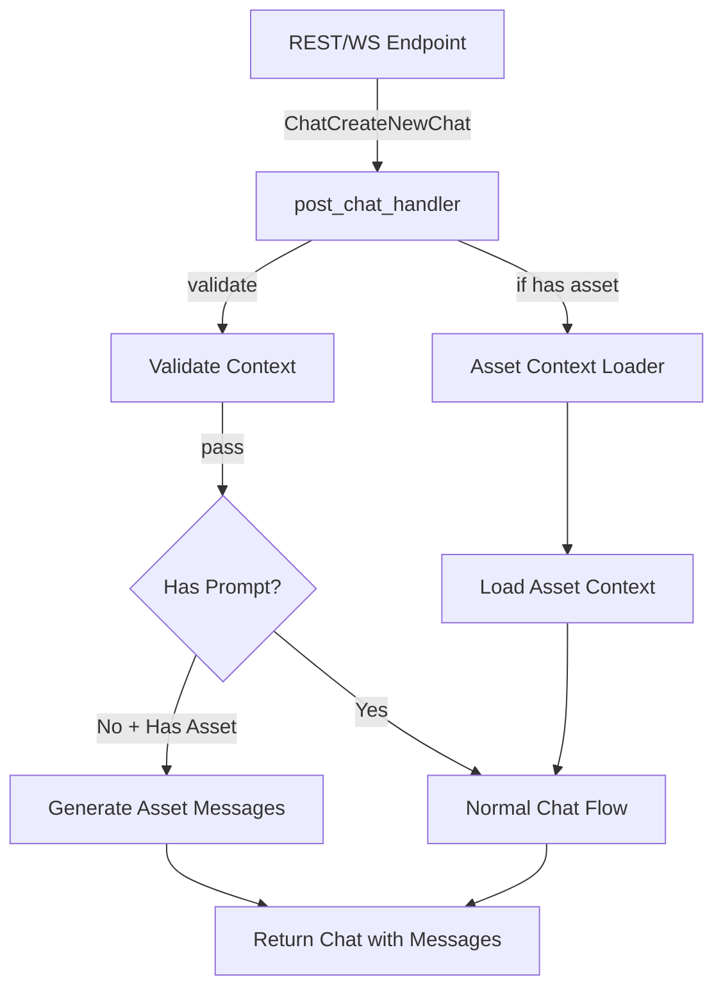

# Post Chat Handler Implementation

## Parent Project

This is a sub-PRD of the [Optional Prompt Asset Chat System](optional_prompt_asset_chat.md) project. Please refer to the parent PRD for the overall project context, goals, and implementation plan.

## Problem Statement

The current `post_chat_handler` implementation requires users to provide a prompt when creating a new chat, even when including metric or dashboard context. Additionally, it handles specific asset types (metrics and dashboards) through separate parameters (`metric_id` and `dashboard_id`), limiting extensibility and creating redundant code paths.

This component will update the post_chat_handler to support:
1. Optional prompts when an asset is provided
2. Generic asset references through asset_id and asset_type
3. Auto-generated messages for prompt-less asset-based chats
4. A unified context loader system for all asset types

## Goals

1. ✅ Update the `post_chat_handler` to accept optional prompts when asset context is provided
2. ✅ Modify the handler to use generic asset references (asset_id and asset_type) instead of specific asset parameters
3. ✅ Implement auto-generation of file and text messages for prompt-less requests
4. ✅ Create a unified context loader system that works with any asset type
5. ✅ Maintain backward compatibility with existing clients

## Non-Goals

1. Changing the core chat flow for normal prompts
2. Modifying the database schema
3. Changing the format of messages returned to clients
4. Implementing custom text generation for prompt-less chats (placeholder text will be used)
5. Supporting arbitrary combinations of context types beyond the current validation rules

## Technical Design

### Component Overview

The `post_chat_handler` sits at the core of Buster's chat functionality, processing chat creation requests from both REST and WebSocket endpoints. It:
1. Validates the request parameters
2. Loads appropriate context based on provided IDs
3. Initializes and runs an agent to generate responses
4. Processes agent messages and tool outputs
5. Streams results back through a channel (for WebSocket) or returns a complete response (for REST)

The updated handler will maintain this flow but modify the parameter handling and add support for optional prompts and generic asset references.



### Interfaces

#### Exposed Interfaces

```rust
// Updated handler signature (unchanged)
pub async fn post_chat_handler(
    request: ChatCreateNewChat,
    user: AuthenticatedUser,
    tx: Option<mpsc::Sender<Result<(BusterContainer, ThreadEvent)>>>,
) -> Result<ChatWithMessages> {
    // Implementation
}

// Updated request structure
pub struct ChatCreateNewChat {
    pub prompt: Option<String>,  // Now optional
    pub chat_id: Option<Uuid>,
    pub message_id: Option<Uuid>,
    // Replace specific asset IDs with generic asset reference
    pub asset_id: Option<Uuid>,
    pub asset_type: Option<AssetType>,
}
```

#### Consumed Interfaces

```rust
// Updated context validation
pub fn validate_context_request(
    chat_id: Option<Uuid>,
    asset_id: Option<Uuid>,
    asset_type: Option<AssetType>,
) -> Result<()> {
    // Implementation
}

// Asset context loader factory
pub fn create_asset_context_loader(
    asset_id: Uuid,
    asset_type: AssetType,
) -> Box<dyn ContextLoader> {
    // Implementation
}

// Auto message generator
pub async fn generate_asset_messages(
    asset_id: Uuid,
    asset_type: AssetType,
    user: &AuthenticatedUser,
) -> Result<Vec<Message>> {
    // Implementation
}
```

### Implementation Details

#### Core Logic

The updated handler will have the following key changes:

```rust
pub async fn post_chat_handler(
    request: ChatCreateNewChat,
    user: AuthenticatedUser,
    tx: Option<mpsc::Sender<Result<(BusterContainer, ThreadEvent)>>>,
) -> Result<ChatWithMessages> {
    // Validate context (only one of chat_id or asset_id can be provided)
    validate_context_request(request.chat_id, request.asset_id, request.asset_type)?;
    
    // Check if asset_id is provided without asset_type
    if request.asset_id.is_some() && request.asset_type.is_none() {
        return Err(anyhow!("asset_type must be provided when asset_id is specified"));
    }
    
    // Initialize chat and add to database
    let (chat_id, message_id, mut chat_with_messages) = 
        initialize_chat(&request, &user).await?;
    
    // If prompt is None but asset_id is provided, generate asset messages
    if request.prompt.is_none() && request.asset_id.is_some() {
        let messages = generate_asset_messages(
            request.asset_id.unwrap(),
            request.asset_type.unwrap(),
            &user,
        ).await?;
        
        // Add messages to chat
        for message in messages {
            chat_with_messages.messages.insert(message.id, message.clone());
        }
        
        // Update chat in database
        update_chat_with_messages(chat_id, &chat_with_messages).await?;
        
        // Return early - no need for agent processing
        return Ok(chat_with_messages);
    }
    
    // Normal chat flow with prompt
    // ...rest of the handler logic remains the same
}
```

#### Context Loader Factory

```rust
pub fn create_asset_context_loader(
    asset_id: Uuid,
    asset_type: AssetType,
) -> Box<dyn ContextLoader> {
    match asset_type {
        AssetType::MetricFile => Box::new(MetricContextLoader::new(asset_id)),
        AssetType::DashboardFile => Box::new(DashboardContextLoader::new(asset_id)),
        // Support for future asset types
        _ => Box::new(GenericAssetContextLoader::new(asset_id, asset_type)),
    }
}
```

#### Auto Message Generator

```rust
pub async fn generate_asset_messages(
    asset_id: Uuid,
    asset_type: AssetType,
    user: &AuthenticatedUser,
) -> Result<Vec<Message>> {
    // Verify user has permission to access the asset
    check_asset_permission(asset_id, asset_type, user, AssetPermissionLevel::CanView).await?;
    
    // Fetch asset details based on type
    let asset_details = fetch_asset_details(asset_id, asset_type).await?;
    
    // Create file message
    let file_message = Message {
        id: Uuid::new_v4(),
        type_: "file".to_string(),
        metadata: vec![
            MessageMetadata {
                status: "completed".to_string(),
                message: format!("File {} completed", asset_details.name),
                timestamp: Utc::now().timestamp(),
            }
        ],
        file_name: asset_details.name,
        file_type: asset_type.to_string().to_lowercase(),
        version_id: asset_id,
        version_number: 1,
        filter_version_id: None,
    };
    
    // Create text message
    let text_message = Message {
        id: Uuid::new_v4(),
        type_: "text".to_string(),
        message: "DALLIN NEEDS TO PUT VALUE HERE".to_string(),
        message_chunk: None,
        is_final_message: true,
    };
    
    // Create association in messages_to_files table
    create_message_file_association(file_message.id, asset_id, asset_type).await?;
    
    Ok(vec![file_message, text_message])
}
```

### File Changes

#### Modified Files
- ✅ `libs/handlers/src/chats/post_chat_handler.rs`
  - Changes:
    - ✅ Update to make prompt optional when asset is provided
    - ✅ Add support for generic asset_id and asset_type
    - ✅ Add auto message generation for prompt-less requests
    - ✅ Update context validation logic
    - ✅ Replace specific asset context loaders with factory approach
  - Purpose: Core handler implementation

- ✅ `libs/handlers/src/chats/mod.rs`
  - Changes:
    - ✅ Export new modules
  - Purpose: Module organization

- ✅ `libs/handlers/src/chats/context_loaders/mod.rs`
  - Changes:
    - ✅ Add context loader factory
    - ✅ Update trait definition to require Send + Sync
    - ✅ Update validation function
  - Purpose: Context loading functionality

#### New Files
- ✅ `libs/handlers/src/chats/asset_messages.rs`
  - Purpose: Implements auto-generation of messages for prompt-less asset requests
  - Key components:
    - ✅ generate_asset_messages function
    - ✅ create_message_file_association helper
    - ✅ properly documented functions
  - Dependencies: database, types

- ✅ `libs/handlers/src/chats/context_loaders/generic_asset_context.rs`
  - Purpose: Generic asset context loading
  - Key components:
    - ✅ GenericAssetContextLoader implementation
    - ✅ fetch_asset_details utility
    - ✅ AssetDetails structure
  - Dependencies: database, agent

## Testing Strategy

### Unit Tests

- ✅ Test `validate_context_request`
  - ✅ Input: Various combinations of chat_id, asset_id, and asset_type
  - ✅ Expected output: Valid or error result
  - ✅ Edge cases:
    - ✅ All parameters None
    - ✅ Multiple context types provided
    - ✅ asset_id without asset_type
    - ✅ asset_type without asset_id

- ✅ Test `normalize_asset_fields`
  - ✅ Input: Request with different combinations of asset fields
  - ✅ Expected output: Properly normalized asset ID and type
  - ✅ Edge cases:
    - ✅ Only generic fields
    - ✅ Only legacy fields
    - ✅ No asset fields

- ✅ Test `create_asset_context_loader`
  - ✅ Input: asset_id and different asset_type values
  - ✅ Expected output: Appropriate context loader instance
  - ✅ Edge cases:
    - ✅ Unsupported asset types

- ✅ Test `generate_asset_messages`
  - ✅ Input: asset_id, asset_type, and user
  - ✅ Expected output: Two messages (file and text)
  - ✅ Edge cases:
    - ✅ Different asset types

### Integration Tests

- ✅ Test scenario: Create chat with asset but no prompt
  - ✅ Components involved: post_chat_handler, generate_asset_messages, database
  - ✅ Test steps:
    1. ✅ Create request with asset_id, asset_type, but no prompt
    2. ✅ Call post_chat_handler
    3. ✅ Verify response contains expected messages
  - ✅ Expected outcome: Chat created with file and text messages, no agent invocation

- ✅ Test scenario: Create chat with asset and prompt
  - ✅ Components involved: post_chat_handler, context loaders, agent
  - ✅ Test steps:
    1. ✅ Create request with asset_id, asset_type, and prompt
    2. ✅ Call post_chat_handler
    3. ✅ Verify agent is invoked and processes prompt
  - ✅ Expected outcome: Normal chat flow with context loaded from asset

- ✅ Test scenario: Legacy asset parameters
  - ✅ Components involved: post_chat_handler, normalize_asset_fields
  - ✅ Test steps:
    1. ✅ Create request with metric_id or dashboard_id
    2. ✅ Call post_chat_handler
    3. ✅ Verify correct handling
  - ✅ Expected outcome: Legacy parameters properly converted to new format

- ✅ Test scenario: Permission checks
  - ✅ Components involved: post_chat_handler, asset permissions
  - ✅ Test steps:
    1. ✅ Create request with asset user doesn't have access to
    2. ✅ Call post_chat_handler
    3. ✅ Verify permission error
  - ✅ Expected outcome: Permission error returned

## Security Considerations

- ✅ Asset permission checks must be maintained in both prompt and prompt-less flows
- ✅ Validate asset_type to prevent injection attacks
- ✅ Ensure file/asset associations are created with proper ownership
- ✅ Maintain audit trails for all asset access through the handler

## Dependencies on Other Components

### Required Components
- ✅ Asset Permission System: Required for checking user access to assets
- ✅ Asset Database Models: Required for accessing asset data

### Concurrent Development
- ✅ WebSocket and REST endpoints: Can be updated concurrently
  - Potential conflicts: Request validation logic
  - Mitigation strategy: Coordinate on request structure changes

## Implementation Timeline

- ✅ Update handler parameter structure: 1 day
- ✅ Implement prompt-less flow: 2 days
- ✅ Create context loader factory: 1 day
- ✅ Implement auto message generation: 1 day
- ✅ Testing: 1 day

Total estimated time: 6 days ✅ Complete