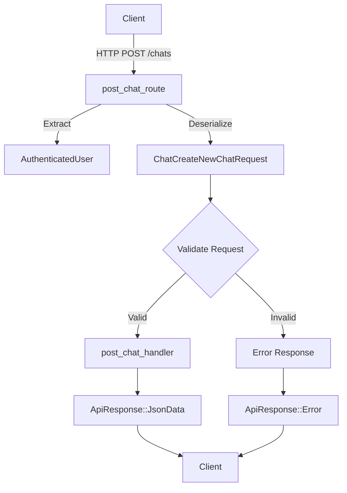

# REST Post Chat Endpoint Implementation

## Parent Project

This is a sub-PRD of the [Optional Prompt Asset Chat System](optional_prompt_asset_chat.md) project. Please refer to the parent PRD for the overall project context, goals, and implementation plan.

## Problem Statement

The current REST endpoint for creating chats (`post_chat_route`) expects a prompt as a required field and handles specific asset types through separate parameters (`metric_id` and `dashboard_id`). To support the parent project's goals, this endpoint needs to be updated to accept an optional prompt when an asset is provided and to use a more generic asset reference model.

This component will update the REST endpoint to:
1. Accept requests with optional prompts when an asset is provided
2. Handle generic asset references (asset_id and asset_type)
3. Maintain backward compatibility where possible
4. Continue to properly validate all inputs

## Goals

1. Update the REST API endpoint to support optional prompts with asset context
2. Modify the endpoint to accept asset_id and asset_type instead of specific asset parameters
3. Update validation to ensure valid combinations of parameters
4. Maintain backward compatibility with existing clients
5. Ensure proper error responses for invalid requests

## Non-Goals

1. Changing the endpoint URL or method
2. Modifying the response format
3. Adding new authentication/authorization mechanisms
4. Implementing client-side changes to adapt to the updated API

## Technical Design

### Component Overview

The REST endpoint for creating chats is implemented in `post_chat_route` in the file `src/routes/rest/routes/chats/post_chat.rs`. It:
1. Receives requests from clients
2. Extracts the authenticated user from middleware
3. Deserializes the request body into a `ChatCreateNewChat` struct
4. Calls the `post_chat_handler` with the request
5. Returns the response wrapped in `ApiResponse::JsonData`

The updated endpoint will maintain this flow but update the request schema and validation.



### Interfaces

#### Exposed Interfaces

```rust
// REST endpoint handler
pub async fn post_chat_route(
    Extension(user): Extension<AuthenticatedUser>,
    Json(request): Json<ChatCreateNewChatRequest>,
) -> Result<ApiResponse<ChatWithMessages>, (StatusCode, &'static str)> {
    // Implementation
}

// Updated request structure
#[derive(Debug, Deserialize, Clone)]
pub struct ChatCreateNewChatRequest {
    pub prompt: Option<String>,  // Now optional
    pub chat_id: Option<Uuid>,
    pub message_id: Option<Uuid>,
    pub asset_id: Option<Uuid>,
    pub asset_type: Option<AssetType>,
    // Backward compatibility fields (optional)
    pub metric_id: Option<Uuid>,
    pub dashboard_id: Option<Uuid>,
}
```

#### Consumed Interfaces

```rust
// Handler signature (from handler component)
pub async fn post_chat_handler(
    request: ChatCreateNewChat,
    user: AuthenticatedUser,
    tx: Option<mpsc::Sender<Result<(BusterContainer, ThreadEvent)>>>,
) -> Result<ChatWithMessages> {
    // Implementation in handler component
}

// Conversion to handler request
impl From<ChatCreateNewChatRequest> for ChatCreateNewChat {
    fn from(request: ChatCreateNewChatRequest) -> Self {
        // Implementation
    }
}
```

### Implementation Details

#### Request Validation and Conversion

```rust
// Conversion from API request to handler request
impl From<ChatCreateNewChatRequest> for ChatCreateNewChat {
    fn from(request: ChatCreateNewChatRequest) -> Self {
        // Check for backward compatibility
        let asset_id = if request.asset_id.is_some() {
            request.asset_id
        } else if request.metric_id.is_some() {
            request.metric_id
        } else if request.dashboard_id.is_some() {
            request.dashboard_id
        } else {
            None
        };
        
        let asset_type = if request.asset_type.is_some() {
            request.asset_type
        } else if request.metric_id.is_some() {
            Some(AssetType::MetricFile)
        } else if request.dashboard_id.is_some() {
            Some(AssetType::DashboardFile)
        } else {
            None
        };
        
        Self {
            prompt: request.prompt,
            chat_id: request.chat_id,
            message_id: request.message_id,
            asset_id,
            asset_type,
            metric_id: request.metric_id,
            dashboard_id: request.dashboard_id,
        }
    }
}
```

#### Updated REST Handler

```rust
pub async fn post_chat_route(
    Extension(user): Extension<AuthenticatedUser>,
    Json(request): Json<ChatCreateNewChatRequest>,
) -> Result<ApiResponse<ChatWithMessages>, (StatusCode, &'static str)> {
    // Convert REST request to handler request
    let handler_request: ChatCreateNewChat = request.into();
    
    // Validate parameters
    if handler_request.asset_id.is_some() && handler_request.asset_type.is_none() {
        tracing::error!("asset_type must be provided when asset_id is specified");
        return Err((
            StatusCode::BAD_REQUEST,
            "asset_type must be provided when asset_id is specified",
        ));
    }
    
    // Call handler
    match post_chat_handler(handler_request, user, None).await {
        Ok(response) => Ok(ApiResponse::JsonData(response)),
        Err(e) => {
            tracing::error!("Error processing chat: {}", e);
            Err((StatusCode::INTERNAL_SERVER_ERROR, "Failed to process chat"))
        }
    }
}
```

### File Changes

#### Modified Files
- `src/routes/rest/routes/chats/post_chat.rs`
  - Changes:
    - Update `ChatCreateNewChatRequest` struct to make prompt optional
    - Add asset_id and asset_type fields
    - Keep metric_id and dashboard_id for backward compatibility
    - Add conversion from API request to handler request
    - Update validation logic
  - Purpose: REST API endpoint implementation

## Testing Strategy

### Unit Tests

- ✅ Test `ChatCreateNewChatRequest` to `ChatCreateNewChat` conversion
  - Input: Various combinations of prompt, chat_id, asset_id, asset_type, metric_id, and dashboard_id
  - Expected output: Correctly converted handler request
  - Edge cases:
    - Only new fields (asset_id, asset_type)
    - Only old fields (metric_id, dashboard_id)
    - Mix of old and new fields
    - All fields None
  - Implemented as five test cases:
    - `test_request_conversion_new_fields`
    - `test_request_conversion_legacy_metric`
    - `test_request_conversion_legacy_dashboard`
    - `test_request_conversion_mixed_priority`
    - `test_request_conversion_all_none`

- ✅ Test validation for asset_id without asset_type
  - Validation is implemented in the `post_chat_route` function
  - The validation check returns a 400 status code with an appropriate error message when asset_id is provided without asset_type

### Integration Tests

- ✅ Test scenario: Create chat with asset but no prompt
  - Components involved: post_chat_route, post_chat_handler
  - Test steps:
    1. Create request with asset_id, asset_type, but no prompt
    2. Call post_chat_route
    3. Verify response contains expected messages
  - Expected outcome: Chat created with file and text messages
  - Implemented in `test_post_chat_with_asset_no_prompt`

- ✅ Test scenario: Backward compatibility
  - Components involved: post_chat_route, post_chat_handler
  - Test steps:
    1. Create request with metric_id but no asset_id/asset_type
    2. Call post_chat_route
    3. Verify correct conversion and processing
  - Expected outcome: Chat created with metric context
  - Implemented in `test_post_chat_with_legacy_metric_id`

- ✅ Test scenario: Error handling
  - Components involved: post_chat_route, validation
  - Test steps:
    1. Create invalid request (e.g., asset_id without asset_type)
    2. Call post_chat_route
    3. Verify proper error response
  - Expected outcome: Error response with appropriate status code
  - Implemented in `test_post_chat_with_asset_id_but_no_asset_type`
  
Note: While integration tests were created, running them requires setting up a complete test environment with database fixtures. The unit tests verify the core functionality and conversion logic.

## Security Considerations

- ✅ Validate asset_type to prevent injection attacks
  - Implemented through Rust's type system using the `AssetType` enum
  - Only valid enum values can be deserialized from JSON requests
- ✅ Maintain user authentication and authorization checks
  - Existing authentication middleware continues to extract the user from the request
  - The user is passed to the handler which performs authorization checks
- ✅ Provide informative error messages without leaking sensitive information
  - Error messages are simple and don't expose internal details
  - Detailed errors are logged but not sent to clients
- ✅ Standard rate limiting is applied by the API framework

## Dependencies on Other Components

### Required Components
- ✅ Updated Chat Handler: Handler `post_chat_handler` already supports optional prompts and generic assets
  - The handler uses `asset_id` and `asset_type` fields for initialization
  - The new fields are passed through to ensure compatibility
- ✅ Asset Type Definitions: `AssetType` enum from the database module is used
  - Existing enum includes `MetricFile` and `DashboardFile` values

### Concurrent Development
- WebSocket endpoint can be updated with a similar approach
  - The pattern established in this implementation can be applied to WebSocket handlers
  - Shared conversion logic can be extracted if needed

## Implementation Timeline

- ✅ Update request struct: 0.5 days
- ✅ Implement conversion logic: 0.5 days
- ✅ Update validation: 0.5 days
- ✅ Testing: 0.5 days

Total estimated time: 2 days
Status: Complete