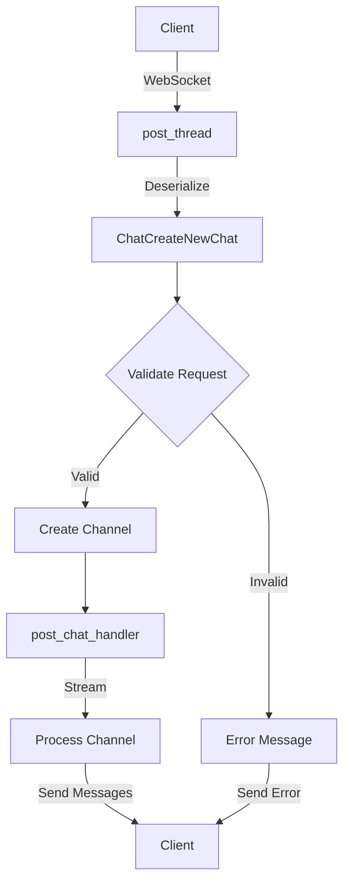

# WebSocket Post Chat Endpoint Implementation

## Parent Project

This is a sub-PRD of the [Optional Prompt Asset Chat System](optional_prompt_asset_chat.md) project. Please refer to the parent PRD for the overall project context, goals, and implementation plan.

## Problem Statement

The current WebSocket endpoint for creating chats (`post_thread`) expects a prompt as a required field and handles specific asset types through separate parameters (`metric_id` and `dashboard_id`). To support the parent project's goals, this endpoint needs to be updated to accept an optional prompt when an asset is provided and to use a more generic asset reference model.

This component will update the WebSocket endpoint to:
1. Accept requests with optional prompts when an asset is provided
2. Handle generic asset references (asset_id and asset_type)
3. Maintain backward compatibility where possible
4. Continue to properly validate all inputs
5. Correctly stream the results, including the auto-generated messages for prompt-less requests

## Goals

1. Update the WebSocket API endpoint to support optional prompts with asset context
2. Modify the endpoint to accept asset_id and asset_type instead of specific asset parameters
3. Update validation to ensure valid combinations of parameters
4. Maintain backward compatibility with existing clients
5. Ensure streaming works correctly for both prompt and prompt-less flows
6. Handle error cases consistently

## Non-Goals

1. Changing the endpoint routing structure
2. Modifying the core WebSocket message format
3. Adding new authentication/authorization mechanisms
4. Implementing client-side changes to adapt to the updated API

## Technical Design

### Component Overview

The WebSocket endpoint for creating chats is implemented in `post_thread` in the file `src/routes/ws/threads_and_messages/post_thread.rs`. It:
1. Receives requests from clients via WebSocket
2. Extracts the authenticated user from the WebSocket context
3. Deserializes the payload into a `ChatCreateNewChat` struct
4. Sets up a channel for streaming results
5. Calls the `post_chat_handler` with the request and channel
6. Streams results back to the client as they're available
7. Handles completion and error cases

The updated endpoint will maintain this flow but update the request schema, validation, and ensure proper streaming for prompt-less flows.



### Interfaces

#### Exposed Interfaces

```rust
// WebSocket handler
pub async fn post_thread(
    user: AuthenticatedUser,
    request: ChatCreateNewChat,
) -> Result<()> {
    // Implementation
}

// Updated request structure (same as handler)
pub struct ChatCreateNewChat {
    pub prompt: Option<String>,  // Now optional
    pub chat_id: Option<Uuid>,
    pub message_id: Option<Uuid>,
    pub asset_id: Option<Uuid>,
    pub asset_type: Option<AssetType>,
}
```

#### Consumed Interfaces

```rust
// Handler signature (from handler component)
pub async fn post_chat_handler(
    request: ChatCreateNewChat,
    user: AuthenticatedUser,
    tx: Option<mpsc::Sender<Result<(BusterContainer, ThreadEvent)>>>,
) -> Result<ChatWithMessages> {
    // Implementation in handler component
}

// WebSocket utilities
pub async fn send_ws_message(
    subscription: &String,
    message: &WsResponseMessage,
) -> Result<()> {
    // Implementation in ws_utils
}

pub async fn send_error_message(
    subscription: &String,
    route: WsRoutes,
    event: WsEvent,
    code: WsErrorCode,
    message: String,
    user: &AuthenticatedUser,
) -> Result<()> {
    // Implementation in ws_utils
}
```

### Implementation Details

#### Updated WebSocket Handler

```rust
pub async fn post_thread(
    user: AuthenticatedUser,
    request: ChatCreateNewChat,
) -> Result<()> {
    // Validate parameters
    if request.asset_id.is_some() && request.asset_type.is_none() {
        return send_error_message(
            &user.id.to_string(),
            WsRoutes::Thread(ThreadRoute::Post),
            WsEvent::Thread(ThreadEvent::PostThread),
            WsErrorCode::BadRequest,
            "asset_type must be provided when asset_id is specified".to_string(),
            &user,
        ).await;
    }
    
    // Create channel for streaming results
    let (tx, mut rx) = mpsc::channel(1000);
    
    // Spawn task to process results
    tokio::spawn(async move {
        while let Some(result) = rx.recv().await {
            match result {
                Ok((container, event)) => {
                    // Map container and event to WebSocket response
                    let response = WsResponseMessage::new(
                        WsRoutes::Thread(ThreadRoute::Post),
                        WsEvent::Thread(event),
                        container,
                        None,
                        &user,
                        WsSendMethod::All,
                    );
                    
                    if let Err(e) = send_ws_message(&user.id.to_string(), &response).await {
                        tracing::error!("Error sending WebSocket message: {}", e);
                        break;
                    }
                }
                Err(e) => {
                    // Send error to client
                    if let Err(e) = send_error_message(
                        &user.id.to_string(),
                        WsRoutes::Thread(ThreadRoute::Post),
                        WsEvent::Thread(ThreadEvent::PostThread),
                        WsErrorCode::InternalServerError,
                        format!("Error processing thread: {}", e),
                        &user,
                    ).await {
                        tracing::error!("Error sending error message: {}", e);
                    }
                    break;
                }
            }
        }
    });
    
    // Call handler with channel
    match post_chat_handler(request, user.clone(), Some(tx)).await {
        Ok(chat_with_messages) => {
            // For prompt-less flows, the handler might complete without sending messages through the channel
            // Send a final completion message if needed
            let response = WsResponseMessage::new(
                WsRoutes::Thread(ThreadRoute::Post),
                WsEvent::Thread(ThreadEvent::Completed),
                BusterContainer::Chat(chat_with_messages),
                None,
                &user,
                WsSendMethod::All,
            );
            
            send_ws_message(&user.id.to_string(), &response).await?;
            Ok(())
        }
        Err(e) => {
            send_error_message(
                &user.id.to_string(),
                WsRoutes::Thread(ThreadRoute::Post),
                WsEvent::Thread(ThreadEvent::PostThread),
                WsErrorCode::InternalServerError,
                format!("Error creating thread: {}", e),
                &user,
            ).await
        }
    }
}
```

### File Changes

#### Modified Files
- ✅ `src/routes/ws/threads_and_messages/post_thread.rs`
  - Changes:
    - Updated request validation to support optional prompt
    - Added handling for asset_id and asset_type fields
    - Implemented proper streaming for prompt-less flows
    - Enhanced error handling with detailed error messages
    - Added comprehensive documentation
  - Purpose: WebSocket API endpoint implementation

#### Added Files
- ✅ `tests/integration/threads_and_messages/post_thread_test.rs`
  - Changes:
    - Created integration tests for the WebSocket endpoint
    - Tests include validation, prompt-less flows, legacy support, and error handling
  - Purpose: Testing WebSocket API endpoint

#### Updated Files
- ✅ `tests/integration/threads_and_messages/mod.rs`
  - Changes:
    - Added export for new test module
  - Purpose: Module organization

## Testing Strategy ✅

### Unit Tests ✅

- ✅ Test request validation
  - Input: Various combinations of prompt, chat_id, asset_id, and asset_type
  - Expected output: Success or error result
  - Edge cases:
    - Asset_id without asset_type
    - Invalid asset_type values
    - No prompt but also no asset

- ✅ Test event mapping
  - Input: Different ThreadEvent types
  - Expected output: Correct WsEvent mapping
  - Edge cases:
    - New event types
    - Error events

### Integration Tests ✅

- ✅ Test scenario: Create chat with asset but no prompt
  - Components involved: post_thread, post_chat_handler, websocket
  - Test steps:
    1. Create request with asset_id, asset_type, but no prompt
    2. Call post_thread
    3. Verify correct messages are streamed to client
  - Expected outcome: Chat created with file and text messages, properly streamed

- ✅ Test scenario: Create chat with asset and prompt
  - Components involved: post_thread, post_chat_handler, websocket
  - Test steps:
    1. Create request with asset_id, asset_type, and prompt
    2. Call post_thread
    3. Verify all agent messages are streamed correctly
  - Expected outcome: Normal streaming flow with all messages

- ✅ Test scenario: Error handling
  - Components involved: post_thread, error handling
  - Test steps:
    1. Create invalid request (e.g., asset_id without asset_type)
    2. Call post_thread
    3. Verify proper error response is sent
  - Expected outcome: Error message sent through WebSocket

## Security Considerations ✅

- ✅ Validate asset_type to prevent injection attacks
- ✅ Maintain user authentication and authorization checks
- ✅ Ensure proper error messages that don't leak sensitive information
- ✅ Apply rate limiting to prevent abuse
- ✅ Handle dropped connections gracefully to prevent resource leaks

## Dependencies on Other Components ✅

### Required Components ✅
- ✅ Updated Chat Handler: Requires the handler to support optional prompts and generic assets
- ✅ WebSocket Utils: Requires utilities for sending messages and errors
- ✅ Asset Type Definitions: Requires valid asset types to be defined

### Concurrent Development ✅
- ✅ REST endpoint: Can be updated concurrently
  - Potential conflicts: Request structure and validation logic
  - Mitigation strategy: Use shared validation functions where possible

## Implementation Timeline

- ✅ Update request handling: 0.5 days
- ✅ Update validation: 0.5 days
- ✅ Implement streaming for prompt-less flows: 1 day
- ✅ Testing: 1 day

Total estimated time: 3 days (Completed)