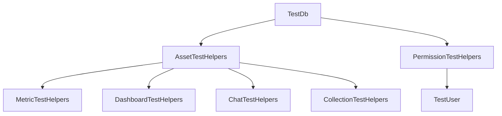

# Test Infrastructure Setup

## Problem Statement

Our current testing infrastructure lacks standardized utilities for common testing scenarios, particularly around database operations and permission testing. This makes it difficult to write comprehensive tests and leads to duplicated test setup code.

Current pain points:
- Duplicated database setup code across test files
- Inconsistent permission testing patterns
- No standard way to create test assets with permissions
- Lack of cleanup utilities for test data
- No helpers for common permission scenarios

## Goals

1. Create reusable database test utilities
2. Establish permission testing helpers
3. Provide asset creation utilities
4. Implement test data cleanup
5. Document testing patterns

## Non-Goals

1. Rewriting existing tests
2. Changing test framework
3. Modifying production code
4. Adding new test types

## Technical Design

### Overview

The test infrastructure will provide a set of utilities and helpers that make it easier to write tests for our asset-related functionality. These utilities will be implemented in the `tests/common` directory of each library that needs them.



### File Changes

1. Create new test utility files:

```rust
// libs/database/tests/common/mod.rs
pub mod db;
pub mod permissions;
pub mod assets;
pub mod users;
```

2. Implement TestDb struct using existing pool:

```rust
// libs/database/tests/common/db.rs
use anyhow::{anyhow, Result};
use uuid::Uuid;
use database::pool::{init_test_pools, get_pg_pool, get_sqlx_pool, get_redis_pool};
use diesel_async::AsyncPgConnection;
use sqlx::postgres::PgConnection;
use bb8_redis::RedisConnection;
use tracing;
use dotenv::dotenv;

pub struct TestDb {
    pub test_id: String,
    pub organization_id: Uuid,
    pub user_id: Uuid,
    initialized: bool,
}

impl TestDb {
    pub async fn new() -> Result<Self> {
        // Load environment variables from .env file
        dotenv().ok();
        
        // Initialize test pools
        if let Err(e) = init_test_pools().await {
            tracing::error!("Failed to initialize test database pools: {}", e);
            return Err(anyhow!("Failed to initialize test database pools: {}", e));
        }
        
        let test_id = format!("test-{}", Uuid::new_v4());
        let organization_id = Uuid::new_v4();
        let user_id = Uuid::new_v4();
        
        let db = Self {
            test_id,
            organization_id,
            user_id,
            initialized: true,
        };
        
        Ok(db)
    }
    
    pub async fn diesel_conn(&self) -> Result<AsyncPgConnection> {
        get_pg_pool()
            .get()
            .await
            .map_err(|e| anyhow!("Failed to get diesel connection: {}", e))
    }
    
    pub async fn sqlx_conn(&self) -> Result<PgConnection> {
        get_sqlx_pool()
            .acquire()
            .await
            .map_err(|e| anyhow!("Failed to get sqlx connection: {}", e))
    }
    
    pub async fn redis_conn(&self) -> Result<RedisConnection> {
        get_redis_pool()
            .get()
            .await
            .map_err(|e| anyhow!("Failed to get redis connection: {}", e))
    }
    
    pub fn user(&self) -> AuthenticatedUser {
        AuthenticatedUser {
            id: self.user_id,
            organization_id: self.organization_id,
            // ... other fields ...
        }
    }
    
    pub async fn cleanup(&self) -> Result<()> {
        let mut conn = self.diesel_conn().await?;
        
        // Delete test data using the test_id prefix
        diesel::delete(assets::table)
            .filter(assets::name.like(format!("{}%", self.test_id)))
            .execute(&mut conn)
            .await
            .map_err(|e| anyhow!("Failed to cleanup test data: {}", e))?;
            
        // ... cleanup other tables ...
        
        Ok(())
    }
}

impl Drop for TestDb {
    fn drop(&mut self) {
        if self.initialized {
            // Spawn cleanup in a new runtime
            match tokio::runtime::Runtime::new() {
                Ok(rt) => {
                    if let Err(e) = rt.block_on(self.cleanup()) {
                        tracing::error!("Failed to cleanup test data: {}", e);
                    }
                }
                Err(e) => {
                    tracing::error!("Failed to create runtime for cleanup: {}", e);
                }
            }
        }
    }
}
```

3. Implement permission helpers:

```rust
// libs/database/tests/common/permissions.rs
use database::enums::AssetPermissionRole;

pub struct PermissionTestHelpers;

impl PermissionTestHelpers {
    pub async fn create_permission(
        test_db: &TestDb,
        asset_id: Uuid,
        role: AssetPermissionRole,
    ) -> Result<()> {
        let mut conn = test_db.diesel_conn().await?;
        
        diesel::insert_into(permissions::table)
            .values((
                permissions::asset_id.eq(asset_id),
                permissions::user_id.eq(test_db.user_id),
                permissions::role.eq(role),
                permissions::granted_at.eq(Utc::now()),
                permissions::granted_by.eq(test_db.user_id),
            ))
            .execute(&mut conn)
            .await?;
            
        Ok(())
    }
    
    pub async fn verify_permission(
        test_db: &TestDb,
        asset_id: Uuid,
        expected_role: AssetPermissionRole,
    ) -> Result<()> {
        let mut conn = test_db.diesel_conn().await?;
        
        let permission = permissions::table
            .filter(permissions::asset_id.eq(asset_id))
            .filter(permissions::user_id.eq(test_db.user_id))
            .first::<Permission>(&mut conn)
            .await?;
            
        assert_eq!(permission.role, expected_role);
        Ok(())
    }
}
```

4. Implement asset helpers:

```rust
// libs/database/tests/common/assets.rs
pub struct AssetTestHelpers;

impl AssetTestHelpers {
    pub async fn create_test_metric(
        test_db: &TestDb,
        name: &str,
    ) -> Result<Uuid> {
        let mut conn = test_db.diesel_conn().await?;
        let metric_id = Uuid::new_v4();
        
        diesel::insert_into(metric_files::table)
            .values((
                metric_files::id.eq(metric_id),
                metric_files::name.eq(format!("{}-{}", test_db.test_id, name)),
                metric_files::organization_id.eq(test_db.organization_id),
                metric_files::created_by.eq(test_db.user_id),
                metric_files::created_at.eq(Utc::now()),
                metric_files::updated_at.eq(Utc::now()),
            ))
            .execute(&mut conn)
            .await?;
            
        Ok(metric_id)
    }
    
    // Similar helpers for other asset types
}
```

### Dependencies

1. Database pool from `@database` lib
2. Asset type definitions
3. Permission enums
4. Test framework

## Implementation Plan

### Phase 1: Core Infrastructure

1. Set up test directory structure
2. Implement TestDb with pool integration
3. Add cleanup functionality
4. Create example tests

### Phase 2: Permission Helpers

1. Implement permission creation helpers
2. Add permission verification utilities
3. Create common permission scenarios
4. Document permission testing patterns

### Phase 3: Asset Helpers

1. Implement metric test helpers
2. Add dashboard test helpers
3. Create chat test helpers
4. Add collection test helpers

### Phase 4: Documentation

1. Write usage documentation
2. Create example tests
3. Document best practices
4. Add troubleshooting guide

## Testing Strategy

### Unit Tests

- Test database connection handling
- Verify cleanup functionality
- Test permission helper methods
- Validate asset creation utilities

### Integration Tests

- Test complete workflows
- Verify cleanup works across tests
- Test concurrent test execution
- Validate isolation between tests

## Example Usage

```rust
#[tokio::test]
async fn test_metric_permissions() -> Result<()> {
    // Setup test environment
    let test_db = TestDb::new().await?;
    
    // Create test metric
    let metric_id = AssetTestHelpers::create_test_metric(
        &test_db,
        "Test Metric"
    ).await?;
    
    // Add permission
    PermissionTestHelpers::create_permission(
        &test_db,
        metric_id,
        AssetPermissionRole::CanView
    ).await?;
    
    // Verify permission
    PermissionTestHelpers::verify_permission(
        &test_db,
        metric_id,
        AssetPermissionRole::CanView
    ).await?;
    
    // Cleanup happens automatically when test_db is dropped
    Ok(())
}
```

## Success Criteria

1. All utility functions implemented and tested
2. Documentation complete and clear
3. Example tests provided
4. No test flakiness
5. Cleanup working reliably

## Rollout Plan

1. Implement core infrastructure
2. Add to one test file as proof of concept
3. Gather feedback and iterate
4. Roll out to all test files

## Appendix

### Related Files

- `libs/database/tests/common/mod.rs`
- `libs/database/tests/common/db.rs`
- `libs/database/tests/common/permissions.rs`
- `libs/database/tests/common/assets.rs`
- `libs/database/tests/common/users.rs`

### Core Test Types

```rust
// libs/database/tests/common/auth.rs

use uuid::Uuid;
use chrono::{DateTime, Utc};
use serde_json::json;

impl TestDb {
    /// Creates a new test organization
    pub async fn create_organization(&self) -> Result<Organization> {
        let org = Organization {
            id: Uuid::new_v4(),
            name: "Test Organization".to_string(),
            domain: Some("test.org".to_string()),
            created_at: Utc::now(),
            updated_at: Utc::now(),
            deleted_at: None,
        };
        
        let mut conn = self.diesel_conn().await?;
        diesel::insert_into(organizations::table)
            .values(&org)
            .execute(&mut conn)
            .await?;
            
        Ok(org)
    }

    /// Creates a new test user
    pub async fn create_user(&self) -> Result<User> {
        let user = User {
            id: Uuid::new_v4(),
            email: format!("test-{}@example.com", Uuid::new_v4()),
            name: Some("Test User".to_string()),
            config: json!({}),
            created_at: Utc::now(),
            updated_at: Utc::now(),
            attributes: json!({}),
            avatar_url: None,
        };
        
        let mut conn = self.diesel_conn().await?;
        diesel::insert_into(users::table)
            .values(&user)
            .execute(&mut conn)
            .await?;
            
        Ok(user)
    }

    /// Creates a user-organization relationship with specified role
    pub async fn create_user_to_org(
        &self,
        user_id: Uuid,
        org_id: Uuid,
        role: UserOrganizationRole,
    ) -> Result<UserToOrganization> {
        let user_org = UserToOrganization {
            user_id,
            organization_id: org_id,
            role,
            sharing_setting: SharingSetting::Private,
            edit_sql: true,
            upload_csv: true,
            export_assets: true,
            email_slack_enabled: true,
            created_at: Utc::now(),
            updated_at: Utc::now(),
            deleted_at: None,
            created_by: user_id, // Self-created for test
            updated_by: user_id,
            deleted_by: None,
            status: UserOrganizationStatus::Active,
        };
        
        let mut conn = self.diesel_conn().await?;
        diesel::insert_into(users_to_organizations::table)
            .values(&user_org)
            .execute(&mut conn)
            .await?;
            
        Ok(user_org)
    }

    /// Creates an authenticated user with organization for testing
    pub async fn create_authenticated_user(
        &self,
        role: Option<UserOrganizationRole>,
    ) -> Result<(AuthenticatedUser, Organization)> {
        // Create org and user
        let org = self.create_organization().await?;
        let user = self.create_user().await?;
        
        // Create relationship with specified role (default to Admin)
        let role = role.unwrap_or(UserOrganizationRole::Admin);
        self.create_user_to_org(user.id, org.id, role).await?;
        
        // Create authenticated user
        let auth_user = AuthenticatedUser {
            id: user.id,
            email: user.email,
            name: user.name,
            organization_id: org.id,
            role,
            sharing_setting: SharingSetting::Private,
            edit_sql: true,
            upload_csv: true,
            export_assets: true,
            email_slack_enabled: true,
        };
        
        Ok((auth_user, org))
    }
}

/// Helper struct for test setup
pub struct TestSetup {
    pub user: AuthenticatedUser,
    pub organization: Organization,
    pub db: TestDb,
}

impl TestSetup {
    /// Creates a new test setup with authenticated user
    pub async fn new(role: Option<UserOrganizationRole>) -> Result<Self> {
        let test_db = TestDb::new().await?;
        let (user, org) = test_db.create_authenticated_user(role).await?;
        
        Ok(Self {
            user,
            organization: org,
            db: test_db,
        })
    }
}
```

### Example Usage

```rust
#[tokio::test]
async fn test_with_authenticated_user() -> Result<()> {
    // Create test setup with admin user
    let setup = TestSetup::new(Some(UserOrganizationRole::Admin)).await?;
    
    // Use authenticated user in handler
    let result = some_handler(
        &setup.user,
        &setup.organization,
        // ... other params ...
    ).await?;
    
    // Test assertions
    assert!(result.is_ok());
    
    Ok(())
}

#[tokio::test]
async fn test_with_different_roles() -> Result<()> {
    // Test with viewer role
    let viewer_setup = TestSetup::new(Some(UserOrganizationRole::Viewer)).await?;
    let viewer_result = some_handler(&viewer_setup.user).await;
    assert!(viewer_result.is_err()); // Expect permission denied
    
    // Test with editor role
    let editor_setup = TestSetup::new(Some(UserOrganizationRole::Editor)).await?;
    let editor_result = some_handler(&editor_setup.user).await;
    assert!(editor_result.is_ok()); // Expect success
    
    Ok(())
} 