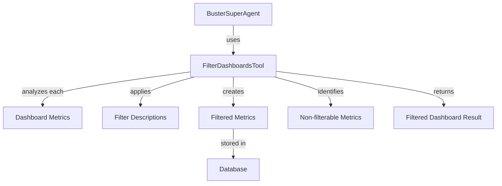

# Dashboard Filtering Tool PRD

## Problem Statement

Buster users need the ability to dynamically filter dashboard metrics based on specific criteria through conversational interactions with Buster agents. Currently, to view different filtered versions of the same metrics, users must manually create separate metric files with different filters. This is inefficient and creates duplication across the system.

The BusterSuperAgent needs to be able to interpret natural language requests to filter dashboards and apply appropriate SQL filters to individual metric queries, without modifying the original metrics.

Key issues:
- No mechanism for dynamically filtering individual dashboard metrics
- Agents cannot modify metric SQL to add filtering conditions specific to each metric
- No storage system for temporary filtered metrics
- No way to track which metrics can or cannot be filtered
- No method to present filtered and unfiltered metrics in a cohesive way

### Current Limitations
- Metric filtering must be done manually by modifying SQL
- No distinction between original metrics and filtered versions
- No tracking of applied filters
- Agents cannot create temporary filtered metrics that don't affect originals
- No mechanism to indicate which metrics couldn't be filtered and why

### Impact
- **User Impact**: Users must create multiple versions of metrics for different views, leading to dashboard and metric proliferation.
- **System Impact**: Dashboard duplication increases storage requirements and creates maintenance challenges.
- **Business Impact**: Reduced user productivity and satisfaction due to limitations in dashboard flexibility.

## Requirements

### Functional Requirements

#### Core Functionality
- Create new `filter_dashboards` tool for agent usage
  - **Details**: Implement a new ToolExecutor that takes dashboard metrics and filter descriptions as input, analyzes each metric individually, and returns both filterable and non-filterable metrics.
  - **Acceptance Criteria**: Tool successfully accepts dashboard ID and filter descriptions, returns appropriate filtered metrics.
  - **Dependencies**: Existing ToolExecutor framework, MetricYml structure, dashboard systems.

- SQL Analysis and Modification
  - **Details**: The tool must analyze each metric's SQL individually to determine if the specified filter can be applied, and properly modify the SQL with the appropriate filter criteria.
  - **Acceptance Criteria**: Correctly identify filterable metrics, apply appropriate SQL modifications to each individual metric, maintain query integrity.
  - **Dependencies**: SQL parsing capabilities, understanding of different SQL query structures.

- Filtered Metric Storage
  - **Details**: Store filtered metrics separate from originals, either in a new table or with parent reference.
  - **Acceptance Criteria**: Filtered metrics are stored without affecting originals, clear relationship maintained.
  - **Dependencies**: Database schema updates, metric storage system.

- Filter Result Reporting
  - **Details**: Provide comprehensive information on which metrics were filtered, which couldn't be filtered and why.
  - **Acceptance Criteria**: Complete output with both successful and unsuccessful filter attempts.
  - **Dependencies**: None.

#### User Interface
- No direct UI changes required; this is an agent tool that will be used via conversational interface.

#### Data Management
- Filtered Metric Lifecycle
  - **Details**: Implement automatic expiry or cleanup for filtered metrics.
  - **Acceptance Criteria**: Filtered metrics don't accumulate indefinitely.
  - **Dependencies**: Background job system or time-based cleanup mechanism.

### Non-Functional Requirements

- Performance Requirements
  - SQL processing should take < 1 second per metric
  - Total filter operation should complete within 5 seconds for dashboards with up to 20 metrics
  - Filtered metrics should render with no noticeable performance difference from originals

- Security Requirements
  - Filtered metrics inherit permissions from original metrics
  - SQL injection protection for all filter criteria
  - No elevation of privileges through filtered views

- Scalability Requirements
  - Support filtering of dashboards with up to 50 metrics
  - Support concurrent filtering operations from multiple users

## Technical Design

### System Architecture



### Core Components

#### Component 1: FilterDashboardsTool
```rust
pub struct FilterDashboardsTool {
    agent: Arc<Agent>,
}

#[async_trait]
impl ToolExecutor for FilterDashboardsTool {
    type Output = FilterDashboardsOutput;
    type Params = FilterDashboardsParams;
    
    fn get_name(&self) -> String {
        "filter_dashboards".to_string()
    }
    
    async fn execute(&self, params: Self::Params, tool_call_id: String) -> Result<Self::Output> {
        // Implementation will:
        // 1. Fetch dashboard and all associated metrics
        // 2. For each metric:
        //    a. Analyze SQL to determine if it can be filtered with provided description
        //    b. Apply the appropriate filter modification per metric
        //    c. Create a filtered version of each filterable metric
        // 3. Store filtered metrics
        // 4. Return results with both filterable and non-filterable metrics
    }
    
    fn get_schema(&self) -> Value {
        json!({
            "name": "filter_dashboards",
            "description": "Individually filters metrics in a dashboard based on specified criteria",
            "parameters": {
                "type": "object",
                "properties": {
                    "dashboard_id": {
                        "type": "string",
                        "description": "UUID of the dashboard to filter"
                    },
                    "filter_descriptions": {
                        "type": "array",
                        "description": "Array of filter descriptions to apply to individual metrics",
                        "items": {
                            "type": "object",
                            "properties": {
                                "description": {
                                    "type": "string",
                                    "description": "Natural language description of the filter to apply (e.g., 'filter where region is USA')"
                                }
                            },
                            "required": ["description"]
                        }
                    }
                },
                "required": ["dashboard_id", "filter_descriptions"]
            }
        })
    }
}
```

#### Component 2: SQL Filter Analyzer and Modifier
```rust
pub struct SqlFilterAnalyzer;

impl SqlFilterAnalyzer {
    // Analyze metric to determine appropriate filter
    pub fn determine_filter_for_metric(
        metric: &MetricYml, 
        filter_description: &str
    ) -> Result<Option<SqlFilterDefinition>> {
        // Use metric structure and filter description to determine
        // the appropriate filter to apply for this specific metric
        // Returns None if this metric cannot be filtered by this description
    }
    
    // Apply filter to SQL
    pub fn apply_filter(sql: &str, filter: &SqlFilterDefinition) -> Result<String> {
        // Apply metric-specific filter to SQL
        // Return modified SQL
    }
    
    // Helper methods to handle different metric types and chart configurations
    fn analyze_metric_structure(metric: &MetricYml) -> MetricQueryStructure {
        // Analyze metric structure to understand available columns and query type
    }
    
    fn extract_filterable_columns(metric: &MetricYml) -> Vec<String> {
        // Extract column names that can be filtered based on metric structure
    }
}
```

#### Component 3: Filtered Metric Storage
```rust
pub struct FilteredMetricStorage {
    conn: DbPoolConnection,
}

impl FilteredMetricStorage {
    // Store filtered metric
    pub async fn store_filtered_metric(
        &self, 
        original_metric: &MetricFile, 
        modified_sql: &str,
        filter_description: &str
    ) -> Result<Uuid> {
        // Create a copy of the original metric with modified SQL
        // Store in database with reference to original
        // Return ID of new filtered metric
    }
    
    // Get filtered metric
    pub async fn get_filtered_metric(&self, id: Uuid) -> Result<MetricFile> {
        // Retrieve filtered metric by ID
    }
    
    // Clean up expired filtered metrics
    pub async fn cleanup_expired_metrics(&self) -> Result<usize> {
        // Remove filtered metrics that have expired
        // Return count of removed metrics
    }
}
```

### Database Changes (If applicable)

Option 1: New Filtered Metrics Table

```sql
CREATE TABLE filtered_metric_files (
    id UUID PRIMARY KEY DEFAULT gen_random_uuid(),
    original_metric_id UUID NOT NULL REFERENCES metric_files(id),
    name VARCHAR NOT NULL,
    file_name VARCHAR NOT NULL,
    content JSONB NOT NULL,
    filter_description TEXT NOT NULL,
    applied_filter JSONB NOT NULL,
    organization_id UUID NOT NULL REFERENCES organizations(id),
    created_by UUID NOT NULL REFERENCES users(id),
    created_at TIMESTAMPTZ NOT NULL DEFAULT NOW(),
    updated_at TIMESTAMPTZ NOT NULL DEFAULT NOW(),
    deleted_at TIMESTAMPTZ,
    expiry TIMESTAMPTZ NOT NULL -- Auto-expire filtered metrics
);

CREATE INDEX idx_filtered_metric_original ON filtered_metric_files(original_metric_id);
CREATE INDEX idx_filtered_metric_org ON filtered_metric_files(organization_id);
CREATE INDEX idx_filtered_metric_expiry ON filtered_metric_files(expiry);
```

Option 2: Modify Existing Metrics Table

```sql
ALTER TABLE metric_files 
ADD COLUMN parent_id UUID REFERENCES metric_files(id),
ADD COLUMN filter_description TEXT,
ADD COLUMN applied_filter JSONB,
ADD COLUMN is_filtered_version BOOLEAN NOT NULL DEFAULT FALSE,
ADD COLUMN expiry TIMESTAMPTZ;

CREATE INDEX idx_metric_files_parent ON metric_files(parent_id) WHERE parent_id IS NOT NULL;
CREATE INDEX idx_metric_files_filtered ON metric_files(is_filtered_version) WHERE is_filtered_version = TRUE;
CREATE INDEX idx_metric_files_expiry ON metric_files(expiry) WHERE expiry IS NOT NULL;
```

### File Changes (If applicable)

#### New Files
- `api/libs/agents/src/tools/categories/file_tools/filter_dashboards.rs`
  - Purpose: Implement the FilterDashboardsTool
  - Key components: FilterDashboardsTool, SqlFilterAnalyzer
  - Dependencies: agents, database, tools framework

- `api/libs/agents/src/tools/categories/file_tools/sql_filter.rs`
  - Purpose: SQL analysis and manipulation utilities
  - Key components: SqlFilterAnalyzer, QueryType
  - Dependencies: None

- `api/libs/database/src/filtered_metrics.rs`
  - Purpose: Database operations for filtered metrics
  - Key components: FilteredMetricStorage
  - Dependencies: database, diesel

#### Modified Files
- `api/libs/agents/src/tools/categories/file_tools/mod.rs`
  - Changes: Add export for filter_dashboards module
  - Dependencies: None

- `api/libs/agents/src/agents/buster_super_agent.rs`
  - Changes: Register FilterDashboardsTool with agent
  - Dependencies: tools framework

- `api/libs/database/src/schema.rs`
  - Changes: Add new filtered_metric_files table or modify metric_files table
  - Dependencies: diesel

- `api/libs/database/src/models.rs`
  - Changes: Add FilteredMetricFile model or update MetricFile model
  - Dependencies: schema, types

## Implementation Plan

### Phase 1: SQL Analysis and Filtering

1. Create SQL filter analyzer
   - [ ] Implement SQL parsing logic for individual metrics
   - [ ] Add natural language filter description analysis
   - [ ] Add filter application for WHERE clauses
   - [ ] Add filter application for HAVING clauses
   - [ ] Handle edge cases (subqueries, complex queries)

2. Set up test framework
   - [ ] Create unit tests for SQL analysis
   - [ ] Create unit tests for SQL modification
   - [ ] Validate against different SQL patterns

### Phase 2: Filtered Metric Storage

1. Database changes
   - [ ] Decide between new table or modified existing table
   - [ ] Implement schema changes
   - [ ] Create migration script

2. Storage implementation
   - [ ] Implement storage operations
   - [ ] Add expiry mechanism
   - [ ] Create cleanup job

### Phase 3: Tool Implementation

1. Create FilterDashboardsTool
   - [ ] Implement tool structure
   - [ ] Add dashboard fetching logic
   - [ ] Integrate SQL analyzer
   - [ ] Implement filtered metric creation
   - [ ] Process each metric individually with filter descriptions

2. Dashboard integration
   - [ ] Create filtered dashboard representation
   - [ ] Maintain references to filtered metrics
   - [ ] Return comprehensive results

### Phase 4: Testing and Documentation

1. Comprehensive testing
   - [ ] Unit tests for all components
   - [ ] Integration tests for end-to-end flow
   - [ ] Performance testing

2. Documentation
   - [ ] Code documentation
   - [ ] Usage examples
   - [ ] Update agent documentation

## Testing Strategy

### Unit Tests

- SQL analyzer tests
  - Test parsing of different query types
  - Test filter application to different clauses
  - Test handling of edge cases
  - Test error handling

- Storage tests
  - Test creation of filtered metrics
  - Test retrieval of filtered metrics
  - Test expiry and cleanup

- Tool tests
  - Test parameter validation
  - Test output structure
  - Test error handling

### Integration Tests

- End-to-end flow tests
  - Test filtering of real dashboards
  - Test handling of mixed filterable/non-filterable metrics
  - Test storage and retrieval of filtered metrics

### Performance Tests

- Test with large dashboards (20+ metrics)
- Test with complex SQL queries
- Test concurrent filtering operations

## Security Considerations

- Ensure filtered metrics inherit permissions from originals
- Sanitize all filter inputs to prevent SQL injection
- Validate user permissions before allowing filtering
- Ensure expiry mechanism works correctly to prevent data bloat

## Future Enhancements

- Support for more complex filter criteria (multiple conditions)
- UI for viewing and managing filtered dashboards
- Persistent filtered dashboards (save for later use)
- Filter templates (reusable filters)
- Dashboard-level filter application
- Time-range filtering optimization

## Appendix

### Glossary

- **Dashboard**: A collection of metrics displayed together
- **Metric**: A visualization of data queried from a database
- **Filter**: A condition that restricts the data shown in a metric
- **SQL**: Structured Query Language used to query databases
- **WHERE clause**: Part of an SQL query that filters rows
- **HAVING clause**: Part of an SQL query that filters groups

### References

- [Dashboard YML Structure](/Users/dallin/buster/buster/api/libs/database/src/types/dashboard_yml.rs)
- [Metric YML Structure](/Users/dallin/buster/buster/api/libs/database/src/types/metric_yml.rs)
- [Modify Metrics Tool](/Users/dallin/buster/buster/api/libs/agents/src/tools/categories/file_tools/modify_metrics.rs)
- [BusterSuperAgent](/Users/dallin/buster/buster/api/libs/agents/src/agents/buster_super_agent.rs)
