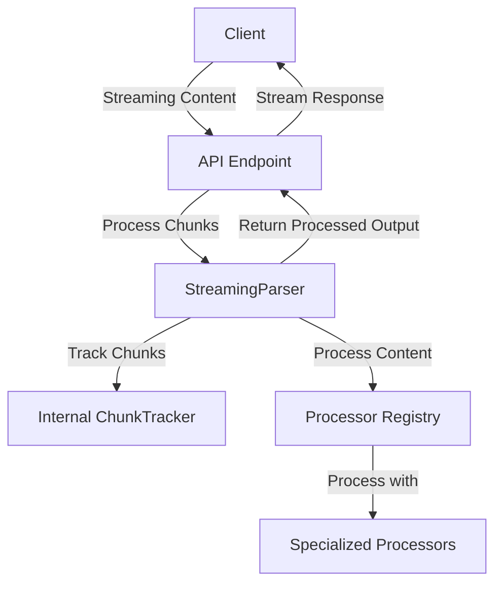

# PRD: Integrating ChunkTracker with StreamingParser

## Problem Statement ✅

The current implementation of streaming content processing in the Buster API has two separate components that handle related functionality:

1. The `ChunkTracker` in `libs/handlers/src/chats/post_chat_handler.rs` - Tracks and manages streaming content chunks, calculating deltas between chunks and maintaining complete text.
2. The `StreamingParser` in `libs/streaming/src/parser.rs` - Handles parsing of incomplete JSON streams and processes them through specialized processors.

This separation creates several issues:

- **Code duplication**: Similar streaming functionality exists in two places
- **Inconsistent handling**: Different approaches to handling streaming content
- **Maintenance overhead**: Changes to streaming logic need to be made in multiple places
- **Limited reusability**: The `ChunkTracker` is only available in the chat handler context

### Current Limitations
- `ChunkTracker` is implemented as a singleton with global state in the chat handler
- `StreamingParser` doesn't have built-in tracking for incremental content changes
- No unified approach to handling streaming content across the application
- Difficult to reuse the chunk tracking functionality in other contexts

### Impact
- **Developer Experience**: Developers need to understand and maintain two separate systems
- **Code Quality**: Duplicated logic increases the chance of bugs and inconsistencies
- **Maintainability**: Changes to streaming behavior require updates in multiple places
- **Feature Development**: New streaming features are harder to implement consistently

## Requirements

### Functional Requirements ✅

#### Core Functionality
- Integrate `ChunkTracker` functionality directly into the `StreamingParser`
  - Details: Move the chunk tracking logic from the chat handler to the streaming library
  - Acceptance Criteria: All existing functionality preserved with a unified API
  - Dependencies: None

- Support calculating deltas between chunks
  - Details: Maintain the ability to identify only the new content in each chunk
  - Acceptance Criteria: Delta calculation works identically to current implementation
  - Dependencies: None

- Maintain complete text tracking
  - Details: Keep track of the complete accumulated text for each chunk ID
  - Acceptance Criteria: Complete text retrieval works identically to current implementation
  - Dependencies: None

- Support clearing tracked chunks
  - Details: Allow clearing tracked chunks when they're no longer needed
  - Acceptance Criteria: Chunk clearing works identically to current implementation
  - Dependencies: None

#### API Design
- Provide a clean, intuitive API for chunk tracking
  - Details: Design methods that are easy to use and understand
  - Acceptance Criteria: API follows Rust best practices and is well-documented
  - Dependencies: None

- Support both raw text and JSON processing
  - Details: Handle both raw text chunks and JSON-structured content
  - Acceptance Criteria: Both types of content can be processed with appropriate methods
  - Dependencies: None

### Non-Functional Requirements ✅

- Performance Requirements
  - Maintain or improve current performance characteristics
  - Efficient memory usage for long-running streams
  - Thread-safe implementation for concurrent access

- Maintainability Requirements
  - Well-documented code with clear comments
  - Comprehensive unit tests for all functionality
  - Clear separation of concerns within the implementation

## Technical Design ✅

### System Architecture

The integration will enhance the StreamingParser to include chunk tracking functionality, creating a unified streaming content processing system:



### Core Components ✅

#### Enhanced StreamingParser

```rust
pub struct StreamingParser {
    /// Buffer to accumulate chunks of data
    buffer: String,
    /// Registry of processors for different types of content
    processors: ProcessorRegistry,
    /// Regex for extracting YAML content
    yml_content_regex: Regex,
    /// Tracks chunks and their state
    chunk_tracker: ChunkTracker,
}

impl StreamingParser {
    /// Creates a new StreamingParser with an empty processor registry
    pub fn new() -> Self {
        StreamingParser {
            buffer: String::new(),
            processors: ProcessorRegistry::new(),
            yml_content_regex: Regex::new(
                r#""yml_content":\s*"((?:[^"\\]|\\.|[\r\n])*?)(?:"|$)"#,
            )
            .unwrap(),
            chunk_tracker: ChunkTracker::new(),
        }
    }
    
    // Existing methods...
    
    /// Process a chunk of data and track changes
    pub fn process_chunk_with_tracking(
        &mut self,
        chunk_id: String,
        chunk: &str,
        processor_type: &str,
    ) -> Result<(Option<ProcessedOutput>, String)> {
        // Calculate delta using chunk tracker
        let delta = self.chunk_tracker.add_chunk(chunk_id.clone(), chunk.to_string());
        
        // Process with the appropriate processor
        let processed = self.process_chunk(chunk_id, chunk, processor_type)?;
        
        // Return both the processed output and the delta
        Ok((processed, delta))
    }
    
    /// Get complete text for a chunk ID
    pub fn get_complete_text(&self, chunk_id: String) -> Option<String> {
        self.chunk_tracker.get_complete_text(chunk_id)
    }
    
    /// Clear tracking for a chunk ID
    pub fn clear_chunk(&mut self, chunk_id: String) {
        self.chunk_tracker.clear_chunk(chunk_id)
    }
}
```

#### Internal ChunkTracker Component

```rust
/// Tracks and manages streaming content chunks
struct ChunkTracker {
    chunks: Mutex<HashMap<String, ChunkState>>,
}

struct ChunkState {
    complete_text: String,
    last_seen_content: String,
}

impl ChunkTracker {
    pub fn new() -> Self {
        Self {
            chunks: Mutex::new(HashMap::new()),
        }
    }

    pub fn add_chunk(&self, chunk_id: String, new_chunk: String) -> String {
        if let Ok(mut chunks) = self.chunks.lock() {
            let state = chunks.entry(chunk_id).or_insert(ChunkState {
                complete_text: String::new(),
                last_seen_content: String::new(),
            });

            // Calculate the delta by finding what's new since last_seen_content
            let delta = if state.last_seen_content.is_empty() {
                // First chunk, use it as is
                new_chunk.clone()
            } else if new_chunk.starts_with(&state.last_seen_content) {
                // New chunk contains all previous content at the start, extract only the new part
                new_chunk[state.last_seen_content.len()..].to_string()
            } else {
                // If we can't find the previous content, try to find where the new content starts
                match new_chunk.find(&state.last_seen_content) {
                    Some(pos) => new_chunk[pos + state.last_seen_content.len()..].to_string(),
                    None => {
                        // If we can't find any overlap, this might be completely new content
                        new_chunk.clone()
                    }
                }
            };

            // Update tracking state only if we found new content
            if !delta.is_empty() {
                state.complete_text.push_str(&delta);
                state.last_seen_content = new_chunk;
            }

            delta
        } else {
            new_chunk
        }
    }

    pub fn get_complete_text(&self, chunk_id: String) -> Option<String> {
        self.chunks.lock().ok().and_then(|chunks| {
            chunks
                .get(&chunk_id)
                .map(|state| state.complete_text.clone())
        })
    }

    pub fn clear_chunk(&self, chunk_id: String) {
        if let Ok(mut chunks) = self.chunks.lock() {
            chunks.remove(&chunk_id);
        }
    }
}
```

### File Changes ✅

#### Modified Files

- `libs/streaming/src/parser.rs`
  - Purpose: Enhance the StreamingParser to include chunk tracking functionality
  - Key changes:
    - Add ChunkTracker as an internal component
    - Add methods for chunk tracking and delta calculation
    - Integrate chunk tracking with existing processing logic

- `libs/streaming/src/lib.rs`
  - Purpose: Update exports to include new functionality
  - Key changes:
    - Re-export new chunk tracking methods

- `libs/handlers/src/chats/post_chat_handler.rs`
  - Purpose: Update to use the enhanced StreamingParser
  - Key changes:
    - Remove the existing ChunkTracker implementation
    - Update code to use the StreamingParser's chunk tracking functionality

## Implementation Plan ✅

### Phase 1: Core Implementation ⏳

1. Enhance StreamingParser with ChunkTracker functionality
   - [ ] Add ChunkTracker as an internal component in StreamingParser
   - [ ] Implement chunk tracking methods in StreamingParser
   - [ ] Add unit tests for new functionality

2. Update exports in streaming library
   - [ ] Update lib.rs to export new functionality
   - [ ] Ensure backward compatibility

### Phase 2: Integration with Existing Code 🔜

1. Update post_chat_handler.rs
   - [ ] Remove existing ChunkTracker implementation
   - [ ] Update code to use StreamingParser's chunk tracking
   - [ ] Test to ensure functionality is preserved

2. Comprehensive testing
   - [ ] End-to-end testing of streaming functionality
   - [ ] Performance testing to ensure no regressions

### Phase 3: Documentation and Cleanup 🔜

1. Documentation
   - [ ] Add comprehensive documentation for new functionality
   - [ ] Update existing documentation to reflect changes

2. Code cleanup
   - [ ] Remove any redundant code
   - [ ] Address any technical debt identified during implementation

## Testing Strategy ✅

### Unit Tests

- Test chunk tracking functionality
  - Test adding first chunk
  - Test adding subsequent chunks with various overlap patterns
  - Test retrieving complete text
  - Test clearing chunks

- Test integration with existing StreamingParser
  - Test processing chunks with tracking
  - Test combined functionality of processing and tracking

### Integration Tests

- Test end-to-end streaming scenarios
  - Test with various types of streaming content
  - Test with different chunk sizes and patterns
  - Test with concurrent access

### Performance Tests

- Benchmark memory usage
  - Compare before and after implementation
  - Test with large streams

- Benchmark processing time
  - Compare before and after implementation
  - Test with various content types and sizes

## Success Criteria ✅

- All existing functionality is preserved
- Code is more maintainable and reusable
- No performance regressions
- Comprehensive test coverage
- Clear, well-documented API

## Dependencies ✅

- `std::collections::HashMap`
- `std::sync::Mutex`
- Existing StreamingParser implementation
- Existing processor infrastructure

## Security Considerations ✅

- Thread safety for concurrent access
- Memory management for large streams
- Proper error handling

## Rollback Plan ✅

If issues are encountered:
1. Revert changes to StreamingParser
2. Restore original ChunkTracker implementation in post_chat_handler.rs
3. Update any dependent code to use the original implementation

## Monitoring and Metrics ✅

- Track memory usage during streaming
- Monitor processing time for chunks
- Track error rates related to streaming functionality
