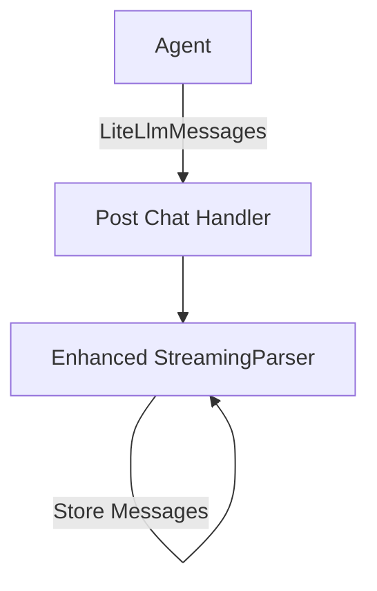

# Streaming Library Enhancement for Agent Integration

## Problem Statement

The current implementation of the chat handling system in `libs/handlers/src/chats/post_chat_handler.rs` lacks clean abstraction for managing streaming logic for agent messages. The post chat handler is responsible for too many concerns, including agent instantiation, chat context loading, message processing, and streaming management. This has led to:

1. Difficulty in maintaining and extending the streaming functionality
2. Lack of clear separation between different message types (assistant text, assistant tool, tool output)
3. Inconsistent chunk tracking across message types
4. Complex code that is difficult to test and debug

### Current Limitations

- The streaming library does not handle caching and chunk tracking for all tool calls consistently
- There's no clear distinction between assistant tool calls and tool outputs
- The chunk tracking mechanism is not centralized, making it difficult to ensure all message chunks are properly tracked
- The `post_chat_handler.rs` has too many responsibilities, making it hard to maintain and extend
- No consistent way to collect and store reasoning messages for later display

### Impact

- **User Impact**: Inconsistent user experience when streaming messages, especially with complex tool calls
- **System Impact**: Increased complexity and potential for bugs in message handling
- **Business Impact**: Slower development velocity due to complex codebase, increased maintenance cost

## Requirements

### Functional Requirements

#### Core Functionality

- The streaming library must handle all streaming logic for agent messages
- It must support different LiteLlmMessage types (Assistant with tool calls, Assistant with content, Tool messages)
- It must track and cache all tool calls and their outputs using shared IDs
- It must store messages for redisplay
- It must support both reasoning and response messages

#### Message Handling

- **Message Parsing**: The StreamingParser must parse and process LiteLlmMessage types
  - Acceptance Criteria: Successfully parse and process all LiteLlmMessage variants
  - Dependencies: Current StreamingParser implementation

- **Tool Call Tracking**: The system must track tool calls and their outputs using shared IDs
  - Acceptance Criteria: Successfully associate tool calls with their outputs
  - Dependencies: LiteLlmMessage format from Agent

- **Message Storage**: The system must store messages for future reference
  - Acceptance Criteria: Successfully retrieve stored messages
  - Dependencies: StreamingParser implementation

#### Post Chat Handler Integration

- **Simplified Interface**: The post chat handler must have a clean interface for streaming
  - Acceptance Criteria: Post chat handler code is significantly simplified
  - Dependencies: Current post_chat_handler implementation

### Non-Functional Requirements

- **Performance Requirements**
  - Message processing must not introduce significant latency (<50ms per message)
  - Memory usage should be optimized for large message streams

- **Maintainability Requirements**
  - Clear separation of concerns between components
  - Comprehensive test coverage (>80%) for all new components
  - Well-documented public API

- **Compatibility Requirements**
  - Must be backward compatible with existing processors and message formats
  - Must integrate seamlessly with the current agent implementation

## Technical Design

### System Architecture



### Core Components

#### Component 1: Message Types

```rust
/// Represents the different types of LiteLlmMessages that can be processed
pub enum MessageType {
    /// An Assistant message with tool calls (not null)
    AssistantToolCall,
    /// An Assistant message with content (text response)
    AssistantResponse,
    /// A Tool message (output from executed tool call)
    ToolOutput,
}

/// A tool call with its associated information
pub struct ToolCallInfo {
    /// The ID of the tool call
    pub id: String,
    /// The name of the tool
    pub name: String,
    /// The input parameters
    pub input: Value,
    /// The output content (if available)
    pub output: Option<Value>,
    /// The timestamp when the tool call was created
    pub timestamp: DateTime<Utc>,
    /// The current state of the tool call
    pub state: ToolCallState,
    /// The chunks received so far for this tool call
    pub chunks: Vec<String>,
}

/// The state of a tool call
pub enum ToolCallState {
    /// The tool call is in progress
    InProgress,
    /// The tool call is complete
    Complete,
    /// The tool call has an output
    HasOutput,
}

/// A processed message
pub struct ProcessedMessage {
    /// The ID of the message
    pub id: String,
    /// The type of the message
    pub message_type: MessageType,
    /// The processed content
    pub content: ProcessedOutput,
    /// The timestamp when the message was created
    pub timestamp: DateTime<Utc>,
}
```

#### Component 2: Enhanced StreamingParser

```rust
/// Enhanced StreamingParser with support for LiteLlmMessage types
pub struct StreamingParser {
    /// Buffer for incomplete JSON
    buffer: String,
    /// Registry of processors for different message types
    processors: ProcessorRegistry,
    /// Map of tool call IDs to their information
    tool_calls: HashMap<String, ToolCallInfo>,
    /// List of reasoning messages (tool calls and outputs)
    reasoning_messages: Vec<ProcessedMessage>,
    /// List of response messages
    response_messages: Vec<String>,
}

impl StreamingParser {
    /// Creates a new StreamingParser
    pub fn new() -> Self {
        Self {
            buffer: String::new(),
            processors: ProcessorRegistry::new(),
            tool_calls: HashMap::new(),
            reasoning_messages: Vec::new(),
            response_messages: Vec::new(),
        }
    }
    
    /// Process a LiteLlmMessage
    pub fn process_message(&mut self, message: &LiteLlmMessage) -> Result<Option<ProcessedOutput>> {
        match message {
            LiteLlmMessage::Assistant { tool_calls: Some(tool_calls), .. } => {
                self.process_assistant_tool_call(message, tool_calls)
            },
            LiteLlmMessage::Assistant { content: Some(content), tool_calls: None, .. } => {
                self.process_assistant_response(message, content)
            },
            LiteLlmMessage::Tool { content, tool_call_id, .. } => {
                self.process_tool_output(message, tool_call_id, content)
            },
            _ => Ok(None), // Ignore other message types
        }
    }
    
    /// Process an Assistant message with tool calls
    fn process_assistant_tool_call(
        &mut self, 
        message: &LiteLlmMessage, 
        tool_calls: &[ToolCall]
    ) -> Result<Option<ProcessedOutput>> {
        for tool_call in tool_calls {
            let id = tool_call.id.clone();
            let name = tool_call.function.name.clone();
            let arguments = tool_call.function.arguments.clone();
            
            // Parse arguments as JSON
            let input = serde_json::from_str::<Value>(&arguments)
                .unwrap_or_else(|_| serde_json::json!({"raw": arguments}));
            
            // Register or update tool call
            if let Some(existing_tool_call) = self.tool_calls.get_mut(&id) {
                // Update existing tool call with new chunks
                existing_tool_call.chunks.push(arguments.clone());
                existing_tool_call.input = input.clone();
                if existing_tool_call.state == ToolCallState::InProgress {
                    existing_tool_call.state = ToolCallState::Complete;
                }
            } else {
                // Register new tool call
                self.tool_calls.insert(id.clone(), ToolCallInfo {
                    id: id.clone(),
                    name: name.clone(),
                    input: input.clone(),
                    output: None,
                    timestamp: Utc::now(),
                    state: ToolCallState::Complete,
                    chunks: vec![arguments.clone()],
                });
            }
            
            // Process with appropriate processor
            if let Some(processor) = self.processors.get_processor_for_tool(&name) {
                let processed = processor.process(&input)?;
                
                // Store as reasoning message
                self.add_reasoning_message(id.clone(), MessageType::AssistantToolCall, processed.clone());
                
                return Ok(Some(processed));
            }
        }
        
        Ok(None)
    }
    
    /// Process an Assistant message with content (text response)
    fn process_assistant_response(
        &mut self, 
        message: &LiteLlmMessage, 
        content: &str
    ) -> Result<Option<ProcessedOutput>> {
        // For response messages, we just store the text
        self.response_messages.push(content.to_string());
        
        // Create a simple processed output
        let processed = ProcessedOutput::Text(ReasoningText {
            id: message.get_id().unwrap_or_else(|| Uuid::new_v4().to_string()),
            reasoning_type: "response".to_string(),
            title: "Assistant Response".to_string(),
            secondary_title: "".to_string(),
            message: Some(content.to_string()),
            message_chunk: None,
            status: Some("complete".to_string()),
        });
        
        Ok(Some(processed))
    }
    
    /// Process a Tool message (output from executed tool call)
    fn process_tool_output(
        &mut self, 
        message: &LiteLlmMessage, 
        tool_call_id: &str, 
        content: &str
    ) -> Result<Option<ProcessedOutput>> {
        // Parse content as JSON if possible
        let output = serde_json::from_str::<Value>(content)
            .unwrap_or_else(|_| serde_json::json!({"text": content}));
        
        // Update tool call with output
        if let Some(tool_call) = self.tool_calls.get_mut(tool_call_id) {
            tool_call.output = Some(output.clone());
            tool_call.state = ToolCallState::HasOutput;
            
            // Get the tool name
            let name = tool_call.name.clone();
            
            // Process with appropriate processor
            if let Some(processor) = self.processors.get_processor_for_tool(&name) {
                let processed = processor.process_output(&output)?;
                
                // Store as reasoning message
                self.add_reasoning_message(
                    tool_call_id.to_string(), 
                    MessageType::ToolOutput, 
                    processed.clone()
                );
                
                return Ok(Some(processed));
            }
        }
        
        Ok(None)
    }
    
    /// Adds a reasoning message
    fn add_reasoning_message(&mut self, id: String, message_type: MessageType, content: ProcessedOutput) {
        self.reasoning_messages.push(ProcessedMessage {
            id,
            message_type,
            content,
            timestamp: Utc::now(),
        });
    }
    
    /// Gets all reasoning messages
    pub fn get_reasoning_messages(&self) -> &[ProcessedMessage] {
        &self.reasoning_messages
    }
    
    /// Gets all response messages
    pub fn get_response_messages(&self) -> &[String] {
        &self.response_messages
    }
    
    /// Gets all tool calls
    pub fn get_tool_calls(&self) -> &HashMap<String, ToolCallInfo> {
        &self.tool_calls
    }
    
    /// Gets a specific tool call by ID
    pub fn get_tool_call(&self, id: &str) -> Option<&ToolCallInfo> {
        self.tool_calls.get(id)
    }
    
    /// Registers a processor for a specific tool
    pub fn register_processor(&mut self, name: &str, processor: Box<dyn Processor>) {
        self.processors.register_tool_processor(name, processor);
    }
}
```

### Data Flow

The streaming library enhancement will follow this simplified data flow:

1. **Agent Execution**: The agent runs and produces LiteLlmMessage objects (Assistant with tool calls, Assistant with content, Tool messages)
2. **Message Streaming**: LiteLlmMessages stream into the post_chat_handler
3. **Parsing and Processing**: Messages are passed to the StreamingParser, which:
   - Identifies the message type (AssistantToolCall, AssistantResponse, ToolOutput)
   - Processes messages through appropriate processors
   - Tracks tool calls and their outputs using shared IDs
   - Stores messages internally for later retrieval
4. **Message Storage**: After the agent finishes execution, the collected messages are retrieved from the StreamingParser for storage and display

This flow ensures a clean separation of concerns while minimizing the number of components:

- StreamingParser handles both real-time processing and message storage
- Tool calls and their outputs are linked using shared IDs
- All chunk tracking is handled within the StreamingParser

### Example Usage in post_chat_handler

```rust
pub async fn post_chat_handler(
    request: ChatCreateNewChat,
    user: AuthenticatedUser,
    tx: Option<mpsc::Sender<Result<(BusterContainer, ThreadEvent)>>>,
) -> Result<ChatWithMessages> {
    // Initialize enhanced StreamingParser
    let mut streaming_parser = StreamingParser::new();
    
    // Register processors for different tool types
    streaming_parser.register_processor("create_plan", Box::new(CreatePlanProcessor::new()));
    streaming_parser.register_processor("create_metrics", Box::new(CreateMetricsProcessor::new()));
    // ... register other processors
    
    // Initialize agent and get stream receiver
    let mut agent = BusterSuperAgent::new(user.clone(), chat_id).await?;
    let mut chat = AgentThread::new(Some(chat_id), user.id, initial_messages);
    let mut rx = agent.run(&mut chat).await?;
    
    // Process streaming messages
    while let Ok(message_result) = rx.recv().await {
        match message_result {
            Ok(message) => {
                // Process the LiteLlmMessage with the StreamingParser
                if let Some(processed) = streaming_parser.process_message(&message)? {
                    // Send to client if tx is available
                    if let Some(tx) = &tx {
                        match message {
                            LiteLlmMessage::Assistant { tool_calls: Some(_), .. } => {
                                let event = ThreadEvent::ReasoningMessage {
                                    id: message.get_id().unwrap_or_default(),
                                    content: processed,
                                };
                                tx.send(Ok((BusterContainer::new(), event))).await?;
                            },
                            LiteLlmMessage::Assistant { content: Some(_), .. } => {
                                let event = ThreadEvent::ResponseMessage {
                                    content: processed,
                                };
                                tx.send(Ok((BusterContainer::new(), event))).await?;
                            },
                            LiteLlmMessage::Tool { .. } => {
                                let event = ThreadEvent::ReasoningMessage {
                                    id: message.get_id().unwrap_or_default(),
                                    content: processed,
                                };
                                tx.send(Ok((BusterContainer::new(), event))).await?;
                            },
                            _ => {}
                        }
                    }
                }
            },
            Err(e) => {
                tracing::error!("Error receiving message: {}", e);
                return Err(anyhow!("Error receiving message: {}", e));
            }
        }
    }
    
    // After agent execution, collect all messages
    let reasoning_messages = streaming_parser.get_reasoning_messages();
    let response_messages = streaming_parser.get_response_messages();
    
    // Create chat with messages
    // ...
}
```

## Implementation Plan

### Phase 1: Core Functionality

1. ✅ **Update Message Types**
   - ✅ Define MessageType enum for different message types
   - ✅ Create ToolCallInfo struct for managing tool calls
   - ✅ Define ToolCallState enum for tracking tool call state
   - ✅ Create ProcessedMessage struct for encapsulating processed messages

2. ✅ **Enhance StreamingParser**
   - ✅ Update the StreamingParser to handle LiteLlmMessage types
   - ✅ Implement methods for processing different message types
   - ✅ Add storage for tool calls, reasoning messages, and response messages

### Phase 2: Integration

1. ✅ **Update ProcessorRegistry**
   - ✅ Enhance the ProcessorRegistry to support tool-specific processors
   - ✅ Add methods for retrieving processors by tool name

2. **Integrate with post_chat_handler**
   - Update post_chat_handler to use the enhanced StreamingParser
   - Simplify the message handling logic in post_chat_handler

3. **Phase 3: Testing and Validation**
   - Write unit tests for the enhanced StreamingParser
   - Write integration tests for the entire flow
   - Validate that all requirements are met

## Testing Strategy

### Unit Testing

1. **StreamingParser Tests**
   - Test processing of different LiteLlmMessage types
   - Test tool call tracking and association with outputs
   - Test message storage and retrieval

2. **ProcessorRegistry Tests**
   - Test registration and retrieval of processors
   - Test processor selection based on tool name

### Integration Testing

1. **End-to-End Flow Tests**
   - Test the entire flow from agent execution to message display
   - Verify that all message types are correctly processed and stored

2. **Performance Tests**
   - Test with large message streams to ensure performance requirements are met
   - Measure latency and memory usage

## Success Criteria

1. **Functional Success**
   - All LiteLlmMessage types are correctly processed
   - Tool calls and their outputs are correctly associated using shared IDs
   - Messages are stored and can be retrieved for display

2. **Non-Functional Success**
   - Performance requirements are met
   - Code is maintainable and well-documented
   - Test coverage is at least 80%

## Risks and Mitigations

1. **Risk**: Incompatibility with existing processors
   - **Mitigation**: Ensure backward compatibility by maintaining the existing processor interface

2. **Risk**: Performance degradation with large message streams
   - **Mitigation**: Implement efficient caching and chunk tracking mechanisms

3. **Risk**: Incomplete or malformed messages in the stream
   - **Mitigation**: Implement robust error handling and recovery mechanisms

## Appendix

### Glossary

- **LiteLlmMessage**: A message from the LiteLLM library, which can be an Assistant message with tool calls, an Assistant message with content, or a Tool message
- **Tool Call**: A request from the assistant to execute a tool
- **Tool Output**: The result of executing a tool
- **StreamingParser**: The component responsible for parsing and processing messages
- **ProcessorRegistry**: A registry of processors for different message types
