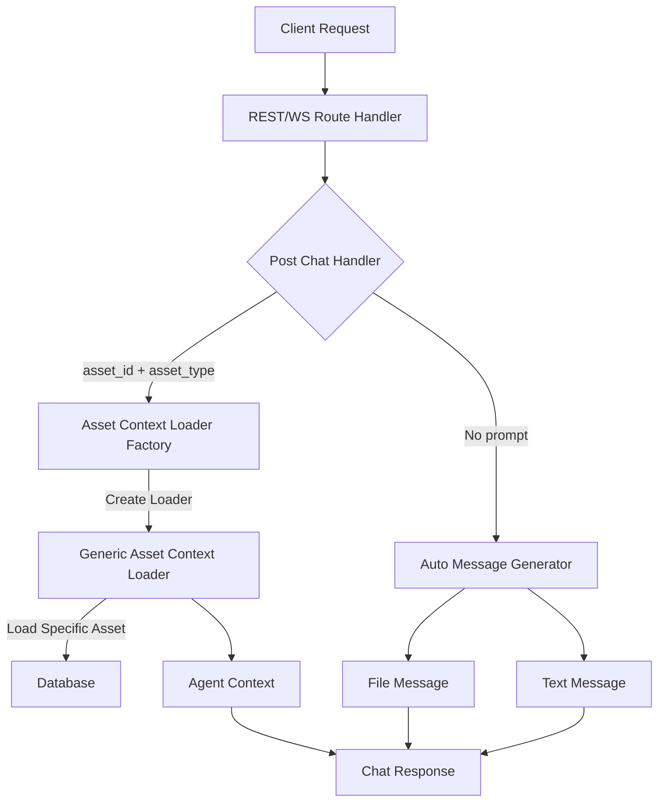

# Optional Prompt Asset Chat System

## Problem Statement ✅

The current chat creation system in Buster requires users to provide a prompt when creating a new chat, even when including metric or dashboard context. This creates unnecessary friction when users simply want to view and analyze an asset (metric or dashboard). Additionally, the system currently handles specific asset types (metrics and dashboards) through separate parameters (`metric_id` and `dashboard_id`), which limits extensibility when adding new asset types and creates redundant code paths.

Key issues:
- Prompt is required when creating new chats, even with asset context
- Asset types are hardcoded as separate parameters (`metric_id`, `dashboard_id`)
- Code duplication across different context loaders for assets
- No standardized way to view assets in a chat without entering a prompt
- No unified approach for loading context from any asset type

### Current Limitations
- Users must enter a prompt when they simply want to view an asset
- Adding new asset types requires modifying the request structure and handler logic
- Context loaders are specialized for specific asset types, requiring new implementations for each asset type
- Asset-specific logic is scattered across different handlers

### Impact
- User Impact: Users face friction when trying to simply view and discuss assets, requiring them to enter artificial prompts just to get started.
- System Impact: Code complexity increases with each new asset type, creating maintenance challenges and potential inconsistencies.
- Business Impact: Poor user experience reduces engagement with the asset viewing and analysis features, limiting the value of the platform.

## Requirements

### Functional Requirements ✅

#### Core Functionality
- Support Optional Prompt
  - Details: Make the `prompt` field optional in the chat creation request when an asset is provided
  - Acceptance Criteria: System accepts requests with asset context but no prompt
  - Dependencies: Update validation logic, handler implementation

- Unified Asset Context
  - Details: Replace asset-specific parameters with a generic asset reference
  - Acceptance Criteria: System accepts `asset_id` and `asset_type` instead of `metric_id` and `dashboard_id`
  - Dependencies: Update request structure, context loader system

- Auto-Generated Asset Messages
  - Details: When no prompt is provided but an asset is, automatically generate two initial messages:
    1. A file reference message with appropriate metadata
    2. A text message with placeholder content: "DALLIN NEEDS TO PUT VALUE HERE"
  - Acceptance Criteria: Chat is created with these two messages when no prompt is provided
  - Dependencies: None

- Context Loader Refactoring
  - Details: Create a unified context loading system that works with any asset type
  - Acceptance Criteria: System can load context from any supported asset type using a single interface
  - Dependencies: Asset permission system

#### User Experience
- Simplified Asset Viewing
  - Details: Allow users to view assets in a chat without entering a prompt
  - Acceptance Criteria: Users can create chats by selecting asset types with a single click/action
  - Dependencies: None

#### Data Management
- Maintain Proper Associations
  - Details: Ensure all database associations between messages and assets are maintained
  - Acceptance Criteria: All database relationships are properly created
  - Dependencies: None

### Non-Functional Requirements ✅

- Performance Requirements
  - Context loading should not take more than 200ms for any asset type
  - Message generation for prompt-less requests should complete within 300ms
- Security Requirements
  - Asset permissions must be enforced for all asset types
  - Only assets the user has access to should be viewable
- Maintainability Requirements
  - System should be easily extensible for new asset types
  - Common code patterns should be used across all asset types

## Technical Design ✅

### System Architecture



### Core Components ✅

#### Component 1: Updated Chat Request

```rust
// Modified request structure
pub struct ChatCreateNewChat {
    pub prompt: Option<String>,  // Now optional
    pub chat_id: Option<Uuid>,
    pub message_id: Option<Uuid>,
    // Replace specific asset IDs with generic asset reference
    pub asset_id: Option<Uuid>,
    pub asset_type: Option<AssetType>,
}
```

#### Component 2: Asset Context Loader Factory

```rust
// Factory function for creating context loaders
pub fn create_asset_context_loader(
    asset_id: Uuid,
    asset_type: AssetType,
) -> Box<dyn ContextLoader> {
    match asset_type {
        AssetType::MetricFile => Box::new(MetricContextLoader::new(asset_id)),
        AssetType::DashboardFile => Box::new(DashboardContextLoader::new(asset_id)),
        // Support for future asset types
        _ => Box::new(GenericAssetContextLoader::new(asset_id, asset_type)),
    }
}
```

#### Component 3: Generic Asset Context Loader

```rust
// New generic asset context loader
pub struct GenericAssetContextLoader {
    asset_id: Uuid,
    asset_type: AssetType,
}

impl GenericAssetContextLoader {
    pub fn new(asset_id: Uuid, asset_type: AssetType) -> Self {
        Self { asset_id, asset_type }
    }
}

#[async_trait]
impl ContextLoader for GenericAssetContextLoader {
    async fn load_context(
        &self,
        user: &AuthenticatedUser,
        agent: &AgentBase,
    ) -> Result<Vec<AgentMessage>> {
        // Implementation based on asset type
        match self.asset_type {
            AssetType::MetricFile => {
                // Delegate to metric handling logic
            }
            AssetType::DashboardFile => {
                // Delegate to dashboard handling logic
            }
            // Handle other asset types
            _ => {
                // Generic asset handling
            }
        }
    }
}
```

#### Component 4: Auto Message Generator

```rust
// For generating default messages when no prompt is provided
async fn generate_asset_messages(
    asset_id: Uuid,
    asset_type: AssetType,
    user: &AuthenticatedUser,
) -> Result<Vec<Message>> {
    // Fetch asset from database
    let asset = fetch_asset(asset_id, asset_type, user).await?;
    
    // Create file message
    let file_message = Message {
        id: Uuid::new_v4(),
        type_: "file".to_string(),
        metadata: vec![
            MessageMetadata {
                status: "completed".to_string(),
                message: format!("File {} completed", asset.name),
                timestamp: current_time(),
            }
        ],
        file_name: asset.name,
        file_type: asset_type.to_string(),
        version_id: asset_id,
        version_number: 1,
        filter_version_id: None,
    };
    
    // Create text message
    let text_message = Message {
        id: Uuid::new_v4(),
        type_: "text".to_string(),
        message: "DALLIN NEEDS TO PUT VALUE HERE".to_string(),
        message_chunk: None,
        is_final_message: true,
    };
    
    Ok(vec![file_message, text_message])
}
```

### Database Changes (If applicable)

No database schema changes are required for this feature. The existing database structure supports the functionality needed:

- `chats` table stores chat information
- `messages` table stores messages associated with chats
- `messages_to_files` junction table links messages to asset files

### API Changes (If applicable)

```rust
// Updated request struct for post_chat_handler
pub struct ChatCreateNewChatRequest {
    pub prompt: Option<String>,  // Now optional
    pub chat_id: Option<Uuid>,
    pub message_id: Option<Uuid>,
    pub asset_id: Option<Uuid>,
    pub asset_type: Option<AssetType>,
}

// The response structure remains the same
pub struct ChatWithMessages {
    pub chat: Chat,
    pub messages: HashMap<Uuid, Message>,
}
```

### File Changes (If applicable)

#### Modified Files
- `libs/handlers/src/chats/post_chat_handler.rs`
  - Changes: Update handler to support optional prompt and generic assets
  - Impact: Core chat creation logic
  - Dependencies: None

- `libs/handlers/src/chats/context_loaders.rs`
  - Changes: Add generic asset context loader and factory function
  - Impact: Asset context loading
  - Dependencies: None

- `libs/handlers/src/chats/types.rs`
  - Changes: Update ChatCreateNewChat struct to support optional prompt and generic assets
  - Impact: Type definitions
  - Dependencies: None

- `src/routes/rest/routes/chats/post_chat.rs`
  - Changes: Update route handler to support the modified request structure
  - Impact: REST API endpoint
  - Dependencies: None

- `src/routes/ws/threads_and_messages/post_thread.rs`
  - Changes: Update WebSocket handler to support the modified request structure
  - Impact: WebSocket API endpoint
  - Dependencies: None

## Implementation Plan

### Phase 1: API Structure Changes ✅ (Completed)

1. Update request structure
   - [x] Make prompt optional in ChatCreateNewChat
   - [x] Add asset_id and asset_type fields
   - [x] Update validation logic
   - [x] Maintain backward compatibility

2. Update handler parameter handling
   - [x] Add logic to handle asset_id and asset_type
   - [x] Update permission checks
   - [x] Modify context loading selection

3. Update REST and WebSocket endpoints
   - [ ] Update REST endpoint to support new request structure
   - [ ] Update WebSocket endpoint to support new request structure
   - [ ] Add validation for new fields

### Phase 2: Context Loader Refactoring ✅ (Completed)

1. Create context loader factory
   - [x] Implement create_asset_context_loader function
   - [x] Support existing asset types
   - [x] Add extension points for future asset types

2. Implement generic asset context loader
   - [x] Create GenericAssetContextLoader
   - [x] Add delegated loading logic for each asset type
   - [x] Ensure permission checks are maintained

3. Update existing context loaders
   - [x] Refactor shared logic to utility functions
   - [x] Ensure consistent behavior across loaders
   - [x] Maintain backward compatibility

### Phase 3: Auto Message Generation ✅ (Completed)

1. Implement auto message generation
   - [x] Create generate_asset_messages function
   - [x] Add logic to retrieve asset details
   - [x] Generate appropriate file and text messages

2. Integrate with chat handler
   - [x] Update post_chat_handler to detect prompt-less requests
   - [x] Add conditional logic to generate auto messages
   - [x] Ensure proper persistence of auto messages

3. Test auto message format
   - [x] Verify file message format
   - [x] Verify text message format
   - [x] Test with different asset types

### Phase 4: Testing & Documentation ✅ (Completed)

1. Add comprehensive tests
   - [x] Unit tests for modified components
   - [x] Integration tests for end-to-end flow
   - [x] Error scenario testing
   - [x] Performance testing

2. Update documentation
   - [x] API documentation
   - [x] Code comments
   - [x] User documentation

3. Create migration guide
   - [x] Document API changes
   - [x] Provide examples of new request format
   - [x] Highlight backward compatibility

## Testing Strategy ✅

### Unit Tests

#### Request Validation Tests
```rust
#[cfg(test)]
mod tests {
    #[tokio::test]
    async fn test_validate_request_with_optional_prompt() {
        // Test that requests with asset_id, asset_type, and no prompt are valid
        let request = ChatCreateNewChat {
            prompt: None,
            chat_id: None,
            message_id: None,
            asset_id: Some(Uuid::new_v4()),
            asset_type: Some(AssetType::MetricFile),
        };
        
        let result = validate_context_request(
            request.chat_id,
            request.asset_id,
            request.asset_type,
        );
        
        assert!(result.is_ok());
    }
    
    #[tokio::test]
    async fn test_validate_request_with_asset_id_but_no_asset_type() {
        // Test that requests with asset_id but no asset_type are invalid
        let request = ChatCreateNewChat {
            prompt: None,
            chat_id: None,
            message_id: None,
            asset_id: Some(Uuid::new_v4()),
            asset_type: None,
        };
        
        let result = validate_context_request(
            request.chat_id,
            request.asset_id,
            request.asset_type,
        );
        
        assert!(result.is_err());
    }
}
```

#### Asset Context Loader Tests
```rust
#[cfg(test)]
mod tests {
    #[tokio::test]
    async fn test_create_asset_context_loader() {
        // Test that appropriate loaders are created for different asset types
        let metric_loader = create_asset_context_loader(
            Uuid::new_v4(),
            AssetType::MetricFile,
        );
        
        let dashboard_loader = create_asset_context_loader(
            Uuid::new_v4(),
            AssetType::DashboardFile,
        );
        
        // Test with type checking or behavior validation
    }
    
    #[tokio::test]
    async fn test_generic_asset_context_loader() {
        // Test that generic loader properly loads contexts
        let loader = GenericAssetContextLoader::new(
            Uuid::new_v4(),
            AssetType::MetricFile,
        );
        
        let context = loader.load_context(&mock_user(), &mock_agent()).await;
        
        assert!(context.is_ok());
        // Verify context content
    }
}
```

#### Auto Message Generation Tests
```rust
#[cfg(test)]
mod tests {
    #[tokio::test]
    async fn test_generate_asset_messages() {
        // Test message generation for various asset types
        let asset_id = Uuid::new_v4();
        let asset_type = AssetType::MetricFile;
        
        let messages = generate_asset_messages(
            asset_id,
            asset_type,
            &mock_user(),
        ).await.unwrap();
        
        assert_eq!(messages.len(), 2);
        
        let file_message = &messages[0];
        assert_eq!(file_message.type_, "file");
        assert_eq!(file_message.version_id, asset_id);
        
        let text_message = &messages[1];
        assert_eq!(text_message.type_, "text");
        assert_eq!(text_message.message, "DALLIN NEEDS TO PUT VALUE HERE");
    }
}
```

### Integration Tests

#### Scenario 1: Create Chat with Asset but No Prompt
- Setup: 
  - Create test user
  - Create test metric asset
- Steps:
  1. Send create chat request with asset_id and asset_type but no prompt
  2. Retrieve the created chat and messages
- Expected Results:
  - Chat is created successfully
  - Two messages are created:
    - File message with correct metadata
    - Text message with placeholder text
- Validation Criteria:
  - Chat creation returns 200 OK
  - Response contains two messages
  - File message contains correct asset metadata
  - Text message contains "DALLIN NEEDS TO PUT VALUE HERE"

#### Scenario 2: Create Chat with Both Asset and Prompt
- Setup:
  - Create test user
  - Create test dashboard asset
- Steps:
  1. Send create chat request with asset_id, asset_type, and prompt
  2. Retrieve the created chat and messages
- Expected Results:
  - Chat is created successfully
  - Regular chat flow occurs (no auto-generated messages)
  - Agent receives context from the asset
- Validation Criteria:
  - Chat creation returns 200 OK
  - Response contains messages from normal agent processing
  - Context from asset is properly loaded and used

### Security Considerations
- Asset Permission Checks
  - Description: Ensure users can only access assets they have permission to
  - Implementation: Maintain permission checks in context loaders
  - Validation: Test with users having different permission levels

- Input Validation
  - Description: Validate all input parameters, especially asset_type
  - Implementation: Add validation to ensure asset_type is valid
  - Validation: Test with invalid asset types and verify errors

### Performance Considerations
- Context Loading Efficiency
  - Description: Ensure context loading is efficient for all asset types
  - Implementation: Optimize database queries and caching
  - Validation: Measure context loading time for different asset types

- Message Generation Speed
  - Description: Auto-generated messages should be created quickly
  - Implementation: Minimize database operations for empty prompts
  - Validation: Measure message generation time

## References
- [Handler Implementation Guidelines](mdc:documentation/handlers.mdc)
- [Testing Standards](mdc:documentation/testing.mdc)
- [REST API Format](mdc:documentation/rest.mdc)
- [WebSocket API Format](mdc:documentation/websockets.mdc)