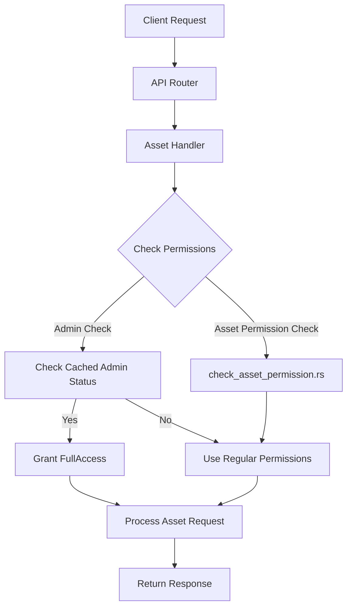

# Asset Permission Checks Implementation

## Problem Statement

Currently, the Buster application's asset endpoints (Chats, Collections, Dashboards, and Metrics) have inconsistent access control logic. While there is a sharing library (`@libs/sharing`) with permission checking functionality, it is not uniformly applied across all asset types and endpoints.

The current state leads to several issues:
- Inconsistent access control enforcement across different asset types
- Potentially allowing unauthorized access to certain assets
- Lack of admin-level permission checks for organization administrators
- Duplicated permission-checking logic across different handlers
- No proper checks for granular permission levels based on asset types
- Redundant database queries for user role information already available in the AuthenticatedUser object

This project aims to standardize asset permission checks across all asset endpoints using the `@libs/sharing` library's `check_asset_permission.rs` functionality, with a specific enhancement to automatically grant FullAccess permissions to users with WorkspaceAdmin or DataAdmin roles in the organization that owns the asset, utilizing cached user information to optimize performance.

## Goals

1. Implement consistent permission checks across all asset types (Chats, Collections, Dashboards, and Metrics)
2. Add organization admin bypass mechanism to grant FullAccess to DataAdmin and WorkspaceAdmin roles
3. Ensure proper permission levels are enforced based on asset type (CanView, CanFilter, CanEdit, FullAccess, Owner)
4. Standardize error handling for permission-denied scenarios
5. Ensure comprehensive test coverage for permission checks
6. Enforce consistent permission requirements for adding assets to collections/dashboards
7. Enforce consistent permission requirements for accessing and modifying sharing settings
8. Optimize performance by using cached user organization roles from the AuthenticatedUser object

## Non-Goals

1. Modify the permission model itself (only implementing checks against existing model)
2. Re-architect the sharing library
3. Implement new permission-granting interfaces
4. Modify the database schema for permissions
5. Add new permission types

## Technical Design

### Overview

The implementation will follow these key principles:

1. Use the `check_asset_permission` functions from `@libs/sharing/src/check_asset_permission.rs`
2. Add a new helper function to check organization admin status using cached user information
3. Modify each asset handler to include permission checks as early as possible in the handler logic
4. Follow consistent patterns across different asset types
5. Implement comprehensive testing for each asset type
6. Utilize the cached organization roles in the AuthenticatedUser object to avoid redundant database queries

### Component Breakdown

#### Component 1: Authenticated User Object Enhancement
- Purpose: Ensure all REST and WebSocket routes pass the AuthenticatedUser object to handlers
- Sub-PRD: [Authenticated User Object Enhancement](api_auth_user_enhancement.md)
- Interfaces:
  - Input: REST/WebSocket routes that invoke handlers
  - Output: Modified routes that pass AuthenticatedUser to handlers

#### Component 2: Permission Utility Functions
- Purpose: Create reusable permission check functions for each asset type
- Sub-PRD: [Permission Utility Functions](api_permission_utilities.md)
- Interfaces:
  - Input: Asset ID, AuthenticatedUser, required permission level
  - Output: Permission verification result

#### Component 3: Chat Permission Implementation
- Purpose: Implement permission checks for all Chat handlers
- Sub-PRD: [Chat Permission Checks](api_chat_permission_checks.md)
- Interfaces:
  - Input: Chat handlers, AuthenticatedUser
  - Output: Modified handlers with permission checks

#### Component 4: Collection Permission Implementation
- Purpose: Implement permission checks for all Collection handlers
- Sub-PRD: [Collection Permission Checks](api_collection_permission_checks.md)
- Interfaces:
  - Input: Collection handlers, AuthenticatedUser
  - Output: Modified handlers with permission checks

#### Component 5: Dashboard Permission Implementation
- Purpose: Implement permission checks for all Dashboard handlers
- Sub-PRD: [Dashboard Permission Checks](api_dashboard_permission_checks.md)
- Interfaces:
  - Input: Dashboard handlers, AuthenticatedUser
  - Output: Modified handlers with permission checks

#### Component 6: Metric Permission Implementation
- Purpose: Implement permission checks for all Metric handlers
- Sub-PRD: [Metric Permission Checks](api_metric_permission_checks.md)
- Interfaces:
  - Input: Metric handlers, AuthenticatedUser
  - Output: Modified handlers with permission checks

#### Component 7: Cross-Asset Operations
- Purpose: Implement permission checks for operations involving multiple asset types
- Sub-PRD: [Cross-Asset Operations](api_cross_asset_operations.md)
- Interfaces:
  - Input: Operations involving multiple assets, AuthenticatedUser
  - Output: Modified operations with consistent permission checks

#### Component 8: Integration Testing
- Purpose: Implement comprehensive testing for permission system
- Sub-PRD: [Permission Integration Tests](api_permission_integration_tests.md)
- Interfaces:
  - Input: Permission implementation
  - Output: Test suite verifying correctness and performance

### Dependencies

1. `@libs/sharing/src/check_asset_permission.rs` - Used for asset permission checks
2. `middleware/src/types.rs` - For AuthenticatedUser struct with cached organization roles
3. `database/enums.rs` - For AssetPermissionRole and other enums
4. `database/schema.rs` - For database queries
5. `database/models.rs` - For asset data models
6. `@libs/handlers/src` directories for assets - To modify handlers

## Implementation Plan

The implementation will be broken down into a series of more focused and manageable PRDs organized by both functionality and asset type. This approach allows for more modular development and clearer tracking of progress.

### Revised PRD Structure

1. [Authenticated User Object Enhancement](api_auth_user_enhancement.md) - **Required First** 🔄
   - Ensures all REST and WebSocket routes pass the AuthenticatedUser object to handlers
   - Dependencies: None
   - Required for: All other PRDs
   - This is a foundational update that enables all permission checks

2. [Permission Utility Functions](api_permission_utilities.md) - **Required Second** 🔄
   - Creates reusable permission check functions for each asset type
   - Dependencies: Authenticated User Object Enhancement
   - Required for: All asset-specific PRDs
   - Provides consistent patterns for permission checks

These asset-specific PRDs can be developed concurrently after the utility functions are implemented:

3. [Chat Permission Checks](api_chat_permission_checks.md) - **Can be developed concurrently** 
   - Dependencies: Permission Utility Functions
   - Required for: None
   - Update all chat handlers with permission checks

4. [Collection Permission Checks](api_collection_permission_checks.md) - **Can be developed concurrently** ⏳
   - Dependencies: Permission Utility Functions
   - Required for: None
   - Update all collection handlers with permission checks

5. [Dashboard Permission Checks](api_dashboard_permission_checks.md) - **Can be developed concurrently** 
   - Dependencies: Permission Utility Functions
   - Required for: None
   - Update all dashboard handlers with permission checks

6. [Metric Permission Checks](api_metric_permission_checks.md) - **Can be developed concurrently** 
   - Dependencies: Permission Utility Functions
   - Required for: None
   - Update all metric handlers with permission checks

These should be implemented after the asset-specific PRDs:

7. [Cross-Asset Operations](api_cross_asset_operations.md) - **Implement after asset-specific PRDs** 🆕
   - Dependencies: All asset-specific PRDs
   - Implements permission checks for operations involving multiple asset types
   - Handles adding assets to collections, linking dashboards, etc.

8. [Permission Integration Tests](api_permission_integration_tests.md) - **Final Step** 🆕
   - Dependencies: All other PRDs
   - Creates comprehensive test suite for permission checking
   - Validates performance and security

### Concurrent Development Strategy

The revised implementation strategy:

1. **Sequential Foundation**: Complete Authentication and Utility PRDs first
2. **Parallel Asset Implementation**: Develop asset-specific PRDs concurrently
3. **Integration Step**: Complete cross-asset operations and integration testing

### Phase 1: Foundation

**Components:**
- Authenticated User Object Enhancement
- Permission Utility Functions

**Success Criteria:**
- All handlers receive the AuthenticatedUser object
- Common utility functions implemented for each asset type
- Unit tests passing at 100% coverage

### Phase 2: Parallel Asset Permission Implementation

**Components:**
- Chat Permission Checks
- Collection Permission Checks
- Dashboard Permission Checks
- Metric Permission Checks

**Success Criteria:**
- All handlers implement permission checks
- Consistent error handling across asset types
- Admin bypass working correctly using cached info
- Unit tests passing

### Phase 3: Integration and Testing

**Components:**
- Cross-Asset Operations
- Integration Testing

**Success Criteria:**
- Operations involving multiple assets implement correct permission checks
- Comprehensive test suite validates all permission scenarios
- Performance metrics show reduced database queries

## Testing Strategy

### Unit Tests

- Each handler's permission check will have unit tests that:
  - Test normal permission scenarios
  - Test admin bypass scenarios using cached roles
  - Test no-permission scenarios
  - Test edge cases (null permissions, etc.)
  - Verify performance using cached info vs. database queries

### Integration Tests

- For each asset type, integration tests will:
  - Test an end-to-end flow where permissions determine access
  - Verify correct permission enforcement for view/edit/delete operations
  - Test admin users can bypass regular permission checks
  - Test users with explicit permissions get appropriate access
  - Verify database query count is optimized

## Security Considerations

- Permission checks must happen before any data is accessed or returned
- All permission-based exceptions must be properly logged
- Admin bypass should only work within the user's organization
- Permission checks should fail closed (deny by default)
- No permission information should be exposed in error messages
- Cached user information must be properly validated for security-critical operations

## Performance Considerations

- Use cached user organization role information to avoid redundant database queries
- Measure and track the number of database queries per request
- Implement benchmarking to compare performance before and after optimization
- Monitor latency of permission check operations

## Monitoring and Logging

- Log permission check failures with appropriate detail
- Monitor permission check performance
- Track admin bypass usage for auditing
- Record metrics on database query reduction

## Rollout Plan

1. Implement and test in development environment
2. Progressive rollout by asset type, starting with less critical assets
3. Monitor for permission issues or unexpected access denials
4. Measure performance impact in production
5. Full deployment once all asset types are validated

## Appendix

### Related PRDs

- [Authenticated User Object Enhancement](api_auth_user_enhancement.md) 🆕
- [Permission Utility Functions](api_permission_utilities.md) 🆕
- [Chat Permission Checks](api_chat_permission_checks.md)
- [Collection Permission Checks](api_collection_permission_checks.md)
- [Dashboard Permission Checks](api_dashboard_permission_checks.md)
- [Metric Permission Checks](api_metric_permission_checks.md)
- [Cross-Asset Operations](api_cross_asset_operations.md) 🆕
- [Permission Integration Tests](api_permission_integration_tests.md) 🆕