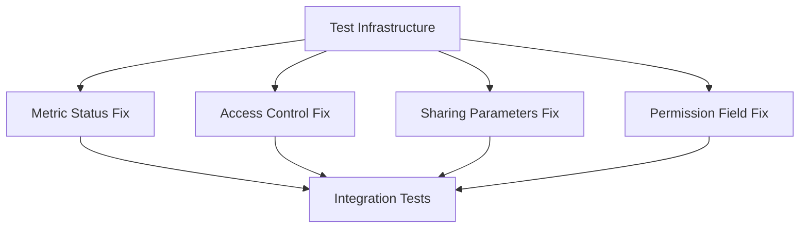

# Bug Fixes and Testing Improvements

## Problem Statement

Several bugs have been identified in our asset handling and permission management systems that need to be addressed:

1. Metric status updates are not being properly propagated to the metric_file object (BUS-1069)
2. Asset access control is not returning appropriate HTTP status codes (BUS-1067)
3. Public sharing parameters are not being properly updated (BUS-1064)
4. Permission field inconsistencies across asset types (BUS-1063)

These issues affect core functionality around asset access, sharing, and status management. Additionally, our testing infrastructure needs improvement to prevent similar issues in the future.

## Goals

1. Establish robust testing utilities for database and permission testing
2. Fix metric status update propagation
3. Standardize HTTP status codes for asset access control
4. Ensure proper updating of public sharing parameters
5. Standardize permission field handling across asset types
6. Improve test coverage for asset-related functionality

## Non-Goals

1. Refactoring the entire permission system
2. Adding new sharing features
3. Modifying the underlying database schema
4. Changing the existing API contracts

## Technical Design

### Overview

The implementation will focus on fixing bugs while establishing better testing infrastructure. The changes will be made in a way that maintains backward compatibility and doesn't require database migrations.

### Component Breakdown

#### Component 1: Test Infrastructure
- Purpose: Establish common test utilities for database and permission testing
- Sub-PRD: [Test Infrastructure Setup](api_test_infrastructure.md)
- Interfaces:
  - Input: Test configuration
  - Output: Test utilities and helpers

#### Component 2: Metric Status Fix
- Purpose: Fix metric status update propagation
- Sub-PRD: [Metric Status Update Fix](api_metric_status_fix.md)
- Interfaces:
  - Input: Metric update request
  - Output: Updated metric with correct status

#### Component 3: Access Control Fix
- Purpose: Standardize HTTP status codes
- Sub-PRD: [Asset Access Control Fix](api_access_control_fix.md)
- Interfaces:
  - Input: Asset access request
  - Output: Appropriate HTTP status code

#### Component 4: Sharing Parameters Fix
- Purpose: Fix public sharing parameter updates
- Sub-PRD: [Sharing Parameters Fix](api_sharing_parameters_fix.md)
- Interfaces:
  - Input: Sharing update request
  - Output: Updated sharing settings

#### Component 5: Permission Field Fix
- Purpose: Standardize permission field handling
- Sub-PRD: [Permission Field Fix](api_permission_field_fix.md)
- Interfaces:
  - Input: Asset access request
  - Output: Consistent permission field

### Dependencies

1. Database access for testing
2. Existing permission models and enums
3. HTTP status code definitions
4. Asset type definitions

## Implementation Plan

The implementation will be broken down into the following sub-PRDs, with their dependencies and concurrent development opportunities clearly defined:

1. [Test Infrastructure Setup](api_test_infrastructure.md) - **Must be completed first**
   - Establishes testing utilities needed by all other components
   - Dependencies: None
   - Required for: All other PRDs
   - Status: 🆕 Not Started

After Test Infrastructure is complete, the following tickets can be worked on concurrently:

2. [HTTP Status Code Fix](api_http_status_fix.md) - **Can be developed concurrently with 3, 4, and 5**
   - BUS-1067: Asset access control HTTP status codes
   - Dependencies: Test Infrastructure
   - Can be worked on concurrently with: Metric Status Fix, Sharing Parameters Fix, Permission Field Fix
   - Reason for concurrency: Modifies error handling layer which is independent of other changes
   - Status: 🆕 Not Started

3. [Metric Status Update Fix](api_metric_status_fix.md) - **Can be developed concurrently with 2, 4, and 5**
   - BUS-1069: Metric status propagation
   - Dependencies: Test Infrastructure
   - Can be worked on concurrently with: HTTP Status Fix, Sharing Parameters Fix, Permission Field Fix
   - Reason for concurrency: Modifies metric-specific logic that doesn't affect other components
   - Status: 🆕 Not Started

4. [Sharing Parameters Fix](api_sharing_parameters_fix.md) - **Can be developed concurrently with 2, 3, and 5**
   - BUS-1064: Public sharing parameters
   - Dependencies: Test Infrastructure
   - Can be worked on concurrently with: HTTP Status Fix, Metric Status Fix, Permission Field Fix
   - Reason for concurrency: Focuses on sharing validation logic that is separate from other changes
   - Status: 🆕 Not Started

5. [Permission Field Fix](api_permission_field_fix.md) - **Can be developed concurrently with 2, 3, and 4**
   - BUS-1063: Permission field consistency
   - Dependencies: Test Infrastructure
   - Can be worked on concurrently with: HTTP Status Fix, Metric Status Fix, Sharing Parameters Fix
   - Reason for concurrency: Changes permission response structure without affecting core permission logic
   - Status: 🆕 Not Started

### Concurrent Development Strategy

To enable efficient concurrent development without conflicts:

1. **Independent Code Paths**
   - HTTP Status Fix: Modifies error handling layer
   - Metric Status Fix: Updates metric-specific update logic
   - Sharing Parameters Fix: Changes sharing validation
   - Permission Field Fix: Standardizes permission response format

2. **Isolated Test Data**
   - Each test will use unique identifiers with test_id prefix
   - Test database connections managed by TestDb
   - Automatic cleanup after each test

3. **Clear Integration Points**
   - HTTP Status Fix: Other fixes will adopt new error types as they're completed
   - Permission Field Fix: Other components will use new permission field format
   - No circular dependencies between fixes

4. **Merge Strategy**
   - Test Infrastructure must be merged first
   - Other fixes can be merged in any order
   - Each fix includes its own tests and documentation

### Development Phases

Phase 1: Foundation (Sequential)
- Complete Test Infrastructure
- Review and merge

Phase 2: Bug Fixes (Concurrent)
- Assign teams to each fix
- Develop and test independently
- Regular sync meetings to discuss integration

Phase 3: Integration (Sequential)
- Merge completed fixes
- Run full test suite
- Verify all features working together

## Testing Strategy

### Unit Tests

- Each fix must include comprehensive unit tests
- Test both success and failure cases
- Mock external dependencies where appropriate
- Use test utilities for common setup

### Integration Tests

- Test complete workflows
- Verify HTTP status codes
- Test permission combinations
- Verify database state after operations

## Security Considerations

- Maintain existing permission checks
- No exposure of sensitive data in error messages
- Proper validation of public access parameters
- Audit logging of permission changes

## Monitoring and Logging

- Log permission changes
- Track HTTP status code distribution
- Monitor test execution times
- Alert on test failures

## Rollout Plan

1. Deploy test infrastructure changes
2. Roll out fixes one at a time
3. Monitor for any issues
4. Update documentation

## Appendix

### Related PRDs

- [Test Infrastructure Setup](api_test_infrastructure.md)
- [Metric Status Update Fix](api_metric_status_fix.md)
- [Asset Access Control Fix](api_access_control_fix.md)
- [Sharing Parameters Fix](api_sharing_parameters_fix.md)
- [Permission Field Fix](api_permission_field_fix.md) 