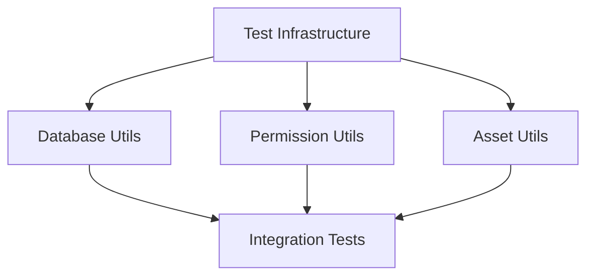

# Bug Fixes and Testing Improvements

## Problem Statement

<!-- 
Clearly articulate the problem you're solving. Include:
- Current state and behavior
- Expected behavior
- Pain points
- Impact on users/system
- Why it needs to be solved now
-->

Current behavior:
1. Metric status updates not propagating to metric_file object (BUS-1069)
2. Asset access control returning incorrect HTTP status codes (BUS-1067)
3. Public sharing parameters not updating properly (BUS-1064)
4. Permission field inconsistencies across asset types (BUS-1063)
5. Lack of standardized testing utilities and patterns

Expected behavior:
1. Metric status updates correctly reflected in all objects
2. Consistent and correct HTTP status codes for all asset operations
3. Public sharing parameters properly validated and updated
4. Consistent permission field format across all asset types
5. Robust testing infrastructure with standardized patterns

Impact:
- User Impact: Inconsistent error handling and permissions cause confusion
- System Impact: Bugs affecting core asset functionality
- Testing Impact: Duplicate test code and missing edge cases

## Goals

1. Establish robust testing utilities for database and permission testing
2. Fix metric status update propagation
3. Standardize HTTP status codes for asset access control
4. Ensure proper updating of public sharing parameters
5. Standardize permission field handling across asset types
6. Improve test coverage for asset-related functionality

## Non-Goals

1. Refactoring the entire permission system
2. Adding new sharing features
3. Modifying the underlying database schema
4. Changing the existing API contracts

## Implementation Plan

### Phase 1: Test Infrastructure ⏳ (In Progress)

#### Technical Design



#### Sub-PRDs
1. [Test Infrastructure Setup](api_test_infrastructure.md)
   - Purpose: Establish common test utilities
   - Dependencies: None
   - Required for: All other PRDs
   - Status: 🆕 Not Started
   - Testing Requirements:
     - Unit Tests:
       - Database connection management
       - Test data creation/cleanup
       - Permission setup helpers
     - Integration Tests:
       - Full test workflow
       - Database state verification
       - Permission validation

#### Implementation Steps
1. [ ] Database test utilities
   - Connection pool management
   - Test data isolation
   - Automatic cleanup

2. [ ] Permission test utilities
   - User/role setup
   - Permission verification
   - Access control testing

3. [ ] Asset test utilities
   - Test asset creation
   - Version management
   - Status verification

#### Tests

##### Unit Tests
```rust
#[cfg(test)]
mod tests {
    #[test]
    fn test_database_connection() {
        // Test connection pool
    }

    #[test]
    fn test_permission_setup() {
        // Test permission helpers
    }

    #[test]
    fn test_asset_creation() {
        // Test asset utilities
    }
}
```

##### Integration Tests
- Test Scenario: Full Asset Lifecycle
  - Setup:
    - Test database
    - Test users with roles
    - Test organization
  - Steps:
    1. Create asset
    2. Update permissions
    3. Verify access
  - Assertions:
    - Database state
    - Permission checks
  - Edge Cases:
    - Connection failures
    - Concurrent access
    - Invalid permissions

#### Success Criteria
- [ ] All test utilities implemented
- [ ] Documentation complete
- [ ] Integration tests passing
- [ ] Example usage provided

### Phase 2: Bug Fixes (Concurrent) 🔜 (Not Started)

#### Sub-PRDs
1. [HTTP Status Code Fix](api_http_status_fix.md) ✅
   - Dependencies: Test Infrastructure
   - Can be developed concurrently with: 2, 3, 4
   - Testing Requirements:
     - Unit Tests:
       - Error mapping
       - Status code validation
     - Integration Tests:
       - Error scenarios
       - Permission checks

2. [Metric Status Update Fix](api_metric_status_fix.md) ⏳
   - Dependencies: Test Infrastructure
   - Can be developed concurrently with: 1, 3, 4
   - Testing Requirements:
     - Unit Tests:
       - Status propagation
       - Update validation
     - Integration Tests:
       - Full update flow
       - State verification

3. [Sharing Parameters Fix](api_sharing_parameters_fix.md) ✅
   - Dependencies: Test Infrastructure
   - Can be developed concurrently with: 1, 2, 4
   - Testing Requirements:
     - Unit Tests:
       - Parameter validation
       - Update logic
     - Integration Tests:
       - Sharing scenarios
       - Permission checks

4. [Permission Field Fix](api_permission_field_fix.md) ⏳
   - Dependencies: Test Infrastructure
   - Can be developed concurrently with: 1, 2, 3
   - Testing Requirements:
     - Unit Tests:
       - Field format
       - Inheritance logic
     - Integration Tests:
       - Cross-asset consistency
       - Permission validation

#### Concurrent Development Strategy

1. **Independent Code Paths**
   - Each fix modifies separate layers
   - Clear interface boundaries
   - Isolated test data

2. **Integration Testing**
   - Component interaction tests
   - System-wide integration
   - Performance validation

## Security Considerations

- Consideration 1: Permission Validation
  - Risk: Incorrect access control
  - Mitigation: Comprehensive permission tests
  - Testing: Edge case validation

- Consideration 2: Error Messages
  - Risk: Information exposure
  - Mitigation: Standardized error responses
  - Testing: Message content validation

## Dependencies

1. Database Layer
   - Interface: Connection pool
   - Testing: Transaction isolation

2. Permission System
   - Interface: Access control
   - Testing: Role validation

## References

- [Test Infrastructure Design](link_to_design_doc)
- [Permission System Documentation](link_to_docs)
- [HTTP Status Code Standards](link_to_standards) 