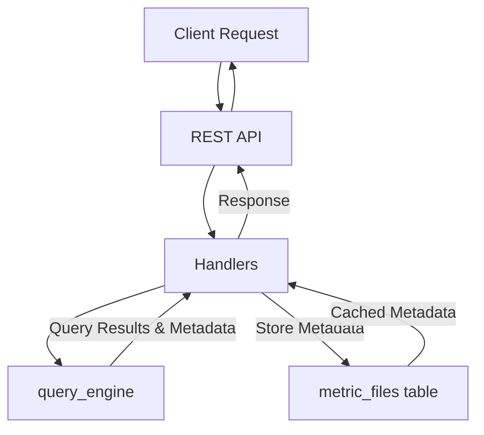

# Refactoring Metric Data Metadata Storage

## Problem Statement ✅

The `MetricYml` structure currently contains a `data_metadata` field that stores column metadata information as part of the metric definition. This approach has several issues:

1. The data metadata is derived from query results rather than being an intrinsic property of the metric definition
2. It can become outdated when underlying data changes, as it's not automatically updated
3. Including it in the metric definition adds unnecessary complexity to the metric YAML schema
4. It requires redundant validation logic in multiple places

By moving data metadata from the metric definition to a database column on the `metric_files` table, we'll separate the metric definition from its execution results, maintain cleaner YAML schema for metrics, and provide a more reliable caching mechanism for metadata.

### Current Limitations
- Data metadata in MetricYml can become stale when source data changes
- Validation requires redundant computation of metadata in multiple places
- `METRIC_YML_SCHEMA` includes unnecessary complexity for data_metadata validation 
- Users may be confused about whether to update data_metadata manually

### Impact
- User Impact: Cleaner metric definition format, more reliable metadata information in UI
- System Impact: More efficient caching of query metadata, reduced redundancy
- Business Impact: Improved reliability of metric visualizations and metadata analysis

## Requirements

### Functional Requirements ✅

#### Core Functionality
- Remove `data_metadata` field from `MetricYml` struct
  - Details: Field should be completely removed from the structure
  - Acceptance Criteria: All metric-related code builds and functions without the field
  - Dependencies: None

- Add `data_metadata` column to `metric_files` table
  - Details: A new JSONB column added to the metric_files table to store cached metadata
  - Acceptance Criteria: Successful migration that adds the column
  - Dependencies: None

- Update query_engine to return data metadata alongside results
  - Details: The query_engine should compute and return metadata for every query
  - Acceptance Criteria: query_engine returns both results and metadata
  - Dependencies: None

- Update validate_sql to store computed metadata in the metric file
  - Details: When validating SQL, save the computed metadata to the metric file record
  - Acceptance Criteria: Validation updates the data_metadata field with current metadata
  - Dependencies: data_metadata column added to metric_files

- Update create_metrics.rs and update_metric.rs to handle data_metadata in the database
  - Details: Any SQL changes should trigger metadata recalculation and storage
  - Acceptance Criteria: Metadata is correctly updated when SQL is modified
  - Dependencies: query_engine metadata calculation

- Continue saving data_metadata in version_history for metrics
  - Details: Include data_metadata in version history to preserve historical metadata
  - Acceptance Criteria: Version history preserves data_metadata for each version
  - Dependencies: None

### Non-Functional Requirements ✅

- Performance Requirements
  - Metadata computation should not significantly impact query performance
  - Accessing cached metadata should be faster than recomputing it
- Security Requirements
  - No additional security requirements (using existing table and permissions)
- Scalability Requirements
  - Metadata should be compact enough to not significantly increase database size

## Technical Design ✅

### System Architecture



### Core Components ✅

#### Component 1: Updated MetricYml Structure
```rust
// Remove data_metadata from MetricYml
#[derive(Debug, Serialize, Deserialize, Clone, FromSqlRow, AsExpression)]
#[diesel(sql_type = Jsonb)]
pub struct MetricYml {
    pub name: String,
    pub description: Option<String>,
    pub time_frame: String,
    pub sql: String,
    pub chart_config: ChartConfig,
    // data_metadata field removed
    pub dataset_ids: Vec<Uuid>,
}
```

#### Component 2: Updated metric_files Schema
```rust
// Updated MetricFile model
#[derive(Queryable, Insertable, Identifiable, Debug, Clone, Serialize)]
#[diesel(table_name = metric_files)]
pub struct MetricFile {
    pub id: Uuid,
    pub name: String,
    pub file_name: String,
    pub content: MetricYml,
    pub verification: Verification,
    pub evaluation_obj: Option<Value>,
    pub evaluation_summary: Option<String>,
    pub evaluation_score: Option<f64>,
    pub organization_id: Uuid,
    pub created_by: Uuid,
    pub created_at: DateTime<Utc>,
    pub updated_at: DateTime<Utc>,
    pub deleted_at: Option<DateTime<Utc>>,
    pub publicly_accessible: bool,
    pub publicly_enabled_by: Option<Uuid>,
    pub public_expiry_date: Option<DateTime<Utc>>,
    pub version_history: VersionHistory,
    pub data_metadata: Option<Value>, // New field for cached metadata
}
```

// DataMetadata structure definition
#[derive(Debug, Serialize)]
pub struct DataMetadata {
    pub column_count: i64,
    pub row_count: i64,
    pub column_metadata: Vec<ColumnMetaData>,
}

#### Component 3: Updated query_engine Interface
```rust
// Define a QueryResult structure to hold both results and metadata
#[derive(Debug, Clone)]
pub struct QueryResult {
    pub data: Vec<IndexMap<String, DataType>>,
    pub metadata: DataMetadata,
}

// Enhance existing query_engine to include metadata in response
pub async fn query_engine(
    data_source_id: &Uuid,
    sql: &str,
    limit: Option<i64>,
) -> Result<QueryResult> {
    let corrected_sql = sql.to_owned();
    let secure_sql = corrected_sql.clone();

    if let Some(warning) = query_safety_filter(secure_sql.clone()).await { 
        return Err(anyhow!(warning));
    }

    let results = match route_to_query(data_source_id, &secure_sql, limit).await {
        Ok(results) => results,
        Err(e) => {
            tracing::error!(
                "There was an issue while querying the data source: {}",
                e
            );
            return Err(anyhow!(e));
        }
    };
    
    // Compute metadata from results
    let column_count = results.first().map(|row| row.len()).unwrap_or(0) as i64;
    let row_count = results.len() as i64;
    let column_metadata = compute_column_metadata(&results);
    
    // Return both results and metadata in the QueryResult structure
    Ok(QueryResult {
        data: results,
        metadata: DataMetadata {
            column_count,
            row_count,
            column_metadata,
        }
    })
}

// Helper function to compute column metadata from query results
fn compute_column_metadata(results: &[IndexMap<String, DataType>]) -> Vec<ColumnMetaData> {
    let mut column_metadata = Vec::new();
    if let Some(first_row) = results.first() {
        for (col_name, sample_value) in first_row.iter() {
            let mut value_map = HashSet::new();
            let mut min_value = None;
            let mut max_value = None;

            // Analyze column data
            for row in results {
                if let Some(value) = row.get(col_name) {
                    value_map.insert(format!("{:?}", value));
                    update_min_max(value, &mut min_value, &mut max_value);
                }
            }

            let (simple_type, column_type) = determine_types(sample_value);

            // Only include min/max for numeric and date types
            let (min_value, max_value) = match simple_type {
                SimpleType::Number | SimpleType::Date => (
                    min_value.unwrap_or(serde_json::Value::Null),
                    max_value.unwrap_or(serde_json::Value::Null),
                ),
                _ => (serde_json::Value::Null, serde_json::Value::Null),
            };

            column_metadata.push(ColumnMetaData {
                name: col_name.clone(),
                min_value,
                max_value,
                unique_values: value_map.len() as i32,
                simple_type,
                column_type,
            });
        }
    }
    column_metadata
}
```

#### Component 4: Updated validate_sql Function
```rust
pub async fn validate_sql(
    sql: &str,
    dataset_id: &Uuid,
) -> Result<(String, Vec<IndexMap<String, DataType>>, Option<Value>)> {
    // Get data source for the dataset
    let mut conn = get_pg_pool().get().await?;
    let data_source_id = datasets::table
        .filter(datasets::id.eq(dataset_id))
        .select(datasets::data_source_id)
        .first::<Uuid>(&mut conn)
        .await?;

    // Execute query and get results with metadata
    let query_result = query_engine(&data_source_id, sql, None).await?;

    let num_records = query_result.data.len();
    let message = if num_records == 0 {
        "No records were found".to_string()
    } else {
        format!("{} records were returned", num_records)
    };

    // Return records (limited to 13), message, and metadata
    let return_records = if num_records <= 13 { 
        query_result.data 
    } else { 
        Vec::new() 
    };
    
    Ok((message, return_records, Some(serde_json::to_value(query_result.metadata)?)))
}
```

// Updated MetricDataResponse structure to use DataMetadata
#[derive(Debug, Serialize)]
pub struct MetricDataResponse {
    pub metric_id: Uuid,
    pub data: Vec<IndexMap<String, DataType>>,
    pub data_metadata: DataMetadata,  // Changed from MetricData to DataMetadata
}

### Database Changes

```sql
-- Add data_metadata column to metric_files table
ALTER TABLE metric_files 
ADD COLUMN data_metadata JSONB;

-- Create index for faster queries
CREATE INDEX metric_files_data_metadata_idx ON metric_files USING GIN (data_metadata);
```

### File Changes

#### Modified Files
- `libs/database/src/types/metric_yml.rs`
  - Changes: Remove data_metadata field and related functionality
  - Impact: Simplifies metric definition structure
  - Dependencies: None

- `libs/database/src/models.rs`
  - Changes: Add data_metadata field to MetricFile struct
  - Impact: Enables storage of metadata in the database
  - Dependencies: Migration to add column

- `libs/database/src/schema.rs`
  - Changes: Update metric_files table definition to include data_metadata
  - Impact: Reflects database schema change
  - Dependencies: Migration to add column

- `libs/agents/src/tools/categories/file_tools/common.rs`
  - Changes: Update METRIC_YML_SCHEMA to remove data_metadata
  - Impact: Simplifies schema validation for metrics
  - Dependencies: None

- `libs/agents/src/tools/categories/file_tools/common.rs`
  - Changes: Update validate_sql to return metadata and update process_metric_file to save it
  - Impact: Enables metadata computation and storage
  - Dependencies: query_engine changes

- `libs/query_engine/src/data_source_query_routes/query_engine.rs`
  - Changes: Add metadata computation functionality
  - Impact: Enables computation of metadata along with query results
  - Dependencies: None

- `libs/handlers/src/metrics/get_metric_data_handler.rs`
  - Changes: Use cached metadata if available, compute if not
  - Impact: Improves performance by using cached values
  - Dependencies: data_metadata column in metric_files

- `libs/handlers/src/metrics/update_metric_handler.rs`
  - Changes: Update data_metadata when SQL changes
  - Impact: Ensures metadata is updated when metric definition changes
  - Dependencies: validate_sql changes

- `libs/agents/src/tools/categories/file_tools/create_metrics.rs`
  - Changes: Add data_metadata to created metric files
  - Impact: Ensures metadata is stored during metric creation
  - Dependencies: validate_sql changes

#### New Files
- `migrations/YYYY-MM-DD-HHMMSS_add_data_metadata_to_metric_files/up.sql`
  - Purpose: Add data_metadata column to metric_files table
  - Key components: SQL to add column and index
  - Dependencies: None

- `migrations/YYYY-MM-DD-HHMMSS_add_data_metadata_to_metric_files/down.sql`
  - Purpose: Remove data_metadata column from metric_files table
  - Key components: SQL to drop column and index
  - Dependencies: None

## Implementation Plan

### Phase 1: Database Schema Update 🔜 (Not Started)

1. Create migration to add data_metadata column
   - [ ] Generate migration files using diesel CLI:
     ```bash
     cd /path/to/project
     diesel migration generate add_data_metadata_to_metric_files
     ```
   - [ ] Add the following SQL to the up.sql file:
     ```sql
     -- Add data_metadata column to metric_files table
     ALTER TABLE metric_files ADD COLUMN data_metadata JSONB;
     
     -- Create index for faster queries
     CREATE INDEX metric_files_data_metadata_idx ON metric_files USING GIN (data_metadata);
     ```
   - [ ] Add the following SQL to the down.sql file:
     ```sql
     -- Drop index first
     DROP INDEX IF EXISTS metric_files_data_metadata_idx;
     
     -- Drop column
     ALTER TABLE metric_files DROP COLUMN IF EXISTS data_metadata;
     ```
   - [ ] Run the migration:
     ```bash
     diesel migration run
     ```

2. Update database-related structs
   - [ ] Update models.rs with new field
   - [ ] Update version_history.rs to include data_metadata for metric_file versions

### Phase 2: Metadata Computation 🔜 (Not Started)

1. Enhance query_engine
   - [ ] Create QueryResult structure to hold results and metadata
   - [ ] Update query_engine function to compute and return metadata
   - [ ] Implement compute_column_metadata helper function
   - [ ] Add tests for metadata computation

2. Update validate_sql function
   - [ ] Modify to use enhanced query_engine and extract metadata
   - [ ] Add code to return metadata for metric storage
   - [ ] Update tests

### Phase 3: Metric Definition Update 🔜 (Not Started)

1. Update MetricYml structure
   - [ ] Remove data_metadata field
   - [ ] Update related methods and tests
   - [ ] Update METRIC_YML_SCHEMA to remove data_metadata

2. Update handlers to use cached metadata
   - [ ] Modify get_metric_data_handler to use cached metadata
   - [ ] Update update_metric_handler to recalculate metadata when SQL changes
   - [ ] Update tests

### Phase 4: Agent Tool Updates 🔜 (Not Started)

1. Update metric creation and modification tools
   - [ ] Modify process_metric_file to include metadata
   - [ ] Update create_metrics.rs to store metadata
   - [ ] Update tests

2. Migration for existing metrics
   - [ ] Create script to calculate and store metadata for existing metrics
   - [ ] Test migration on staging
   - [ ] Run migration in production

3. Documentation and cleanup
   - [ ] Update API documentation
   - [ ] Add comments explaining metadata handling
   - [ ] Remove any leftover references to data_metadata in yml

## Testing Strategy

### Unit Tests
- Test metadata computation with various data types
- Test validate_sql with both valid and invalid queries
- Test MetricYml serialization and deserialization without data_metadata

### Integration Tests
- Test end-to-end flow from query to metadata storage
- Test metric creation with metadata computation
- Test metric update with metadata recalculation

### Database Migration Tests
- Test migration on a copy of production data
- Verify data_metadata can be computed for existing metrics
- Test rollback procedure

## Migration Procedure

### Database Migration

1. **Generate Migration Files**
   ```bash
   cd /path/to/project
   diesel migration generate add_data_metadata_to_metric_files
   ```

2. **Implement Migration Files**
   
   **up.sql**:
   ```sql
   -- Add data_metadata column to metric_files table
   ALTER TABLE metric_files ADD COLUMN data_metadata JSONB;
   
   -- Create index for faster queries
   CREATE INDEX metric_files_data_metadata_idx ON metric_files USING GIN (data_metadata);
   ```
   
   **down.sql**:
   ```sql
   -- Drop index first
   DROP INDEX IF EXISTS metric_files_data_metadata_idx;
   
   -- Drop column
   ALTER TABLE metric_files DROP COLUMN IF EXISTS data_metadata;
   ```

3. **Run Migration**
   ```bash
   diesel migration run
   ```

4. **Verify Migration**
   ```sql
   SELECT column_name, data_type 
   FROM information_schema.columns 
   WHERE table_name = 'metric_files' AND column_name = 'data_metadata';
   ```

### Code Updates

1. **Update Diesel Schema**
   ```bash
   diesel print-schema > libs/database/src/schema.rs
   ```

2. **Adapt Database Models**
   - Add data_metadata field to MetricFile struct in models.rs
   - Remove data_metadata field from MetricYml in metric_yml.rs
   - Update version_history.rs to handle data_metadata in versions

3. **Update Query Engine**
   - Create QueryResult structure in query_engine.rs
   - Enhance existing query_engine function to calculate and return metadata
   - Implement compute_column_metadata helper function
   - Add tests for metadata computation

4. **Update Handlers and Tools**
   - Update validate_sql to use enhanced query_engine and extract metadata
   - Modify get_metric_data_handler to use cached metadata when available
   - Update update_metric_handler to recalculate metadata when SQL changes
   - Update create_metrics.rs to store metadata for new metrics

### Backfill Data for Existing Metrics

A migration script will be needed to populate the data_metadata column for existing metrics. This script will:

1. **Query for Existing Metrics**
   ```rust
   let metrics = metric_files::table
       .filter(metric_files::deleted_at.is_null())
       .load::<MetricFile>(&mut conn)
       .await?;
   ```

2. **Process Each Metric**
   ```rust
   for metric in metrics {
       // Parse YAML content
       let metric_yml: MetricYml = metric.content;
       
       // Get dataset IDs
       let dataset_id = metric_yml.dataset_ids.first().unwrap_or(default_dataset_id);
       
       // Get data source for dataset
       let data_source_id = get_data_source_for_dataset(dataset_id).await?;
       
       // Execute query with metadata calculation
       let query_result = query_engine(&data_source_id, &metric_yml.sql, None).await?;
       
       // Update metric record with metadata
       diesel::update(metric_files::table)
           .filter(metric_files::id.eq(metric.id))
           .set(metric_files::data_metadata.eq(serde_json::to_value(query_result.metadata)?))
           .execute(&mut conn)
           .await?;
   }
   ```

3. **Deployment Strategy**
   - Run script during off-peak hours
   - Use transaction batching (for example, process 100 metrics per transaction)
   - Add logging and resumability in case of interruption
   - Monitor database performance during migration

### Deployment Strategy

1. **Pre-Deployment**
   - Run all tests on staging environment
   - Verify migrations work correctly
   - Ensure backfill script completes successfully
   - Check for performance issues

2. **Deployment Order**
   1. Deploy database migration
   2. Deploy code changes (compatible with both old and new schema)
   3. Run backfill script
   4. Deploy final code changes (removing old schema support)

3. **Rollback Strategy**
   - If issues are detected after migration but before backfill: roll back code changes, then run down.sql
   - If issues are detected after backfill: restore from backup or reverse data changes programmatically

## Security Considerations
- No additional security concerns (using existing database permissions)

## Rollback Plan
- Database migration includes down.sql for rollback
- Code can be reverted if issues are found
- Temporary dual support for both approaches during transition

## Monitoring
- Add logs for metadata computation and caching
- Monitor query performance to ensure minimal impact
- Track database size to ensure metadata doesn't cause significant growth

## Success Criteria
- All metrics have data_metadata stored in the database
- MetricYml structures no longer contain data_metadata field
- Visualization in UI uses cached metadata correctly
- Performance equal to or better than previous implementation

// Updated MetricDataResponse structure to use DataMetadata
#[derive(Debug, Serialize)]
pub struct MetricDataResponse {
    pub metric_id: Uuid,
    pub data: Vec<IndexMap<String, DataType>>,
    pub data_metadata: DataMetadata,  // Changed from MetricData to DataMetadata
}