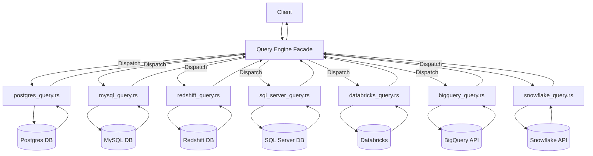

# PRD: Query Engine Performance and Limit Optimization

*Parent Project PRD:* (If applicable, link here)
*Status:* ⏳ In Progress
*Author:* AI Assistant
*Date Created:* YYYY-MM-DD
*Last Updated:* YYYY-MM-DD

## 1. Problem Statement ✅

The `query_engine` library provides a unified interface for querying various data sources (Postgres, MySQL, Redshift, SQL Server, Databricks, BigQuery, Snowflake). However, current implementations exhibit performance bottlenecks, particularly with large datasets, and inconsistent handling of row limits across different database connectors.

### Current Limitations
*   **Inefficient Limiting:** Several connectors (Postgres, MySQL, Redshift, SQL Server) fetch potentially large result sets and apply limits *after* fetching, leading to unnecessary data transfer and processing.
*   **Row-by-Row Processing:** Some implementations (Postgres, MySQL, SQL Server) process results row-by-row, often spawning an asynchronous task per row, which introduces significant overhead for large results.
*   **Inconsistent Limit Implementation:** The default 5000 row limit is sometimes hardcoded (MySQL, Redshift) or applied post-fetch instead of being consistently applied at the database query level.
*   **Type Conversion Overhead:** Each implementation performs type conversions for every column of every row, potentially using inefficient string comparisons.
*   **Postgres Parsing Overhead:** The Postgres connector parses and manipulates the SQL AST for every query to handle identifier quoting, adding potentially unnecessary overhead.

### Impact
*   **User Impact:** Users querying large tables experience slow response times. Inconsistent limit behavior can lead to unexpected results or errors.
*   **System Impact:** High CPU and memory usage on the application server during query processing for large results. Increased network traffic between the application and the database for connectors that don't limit at the source.
*   **Business Impact:** Degraded application performance affects user satisfaction and potentially impacts downstream processes relying on query results.

## 2. Requirements

### Functional Requirements ✅
*   **FR1: Standardized Limit Handling:** All query functions MUST apply the row limit directly within the SQL query or API request sent to the database.
    *   *Details:* The default limit MUST be 5000 rows. The `limit: Option<i64>` parameter MUST override the default when provided. Post-fetch filtering/limiting in the application code MUST be removed.
    *   *Acceptance Criteria:* Queries without an explicit limit return max 5000 rows. Queries with an explicit `limit: Some(N)` return max N rows. Limits are visible in database query logs/profiles where applicable.
    *   *Dependencies:* None.
*   **FR2: Consistent Implementation Pattern:** Ensure the `limit` parameter handling, default value application (5000), and overall function signature patterns are consistent across all query engine implementations.
    *   *Details:* Refactor implementations to follow a similar pattern for limit application and result processing where possible.
    *   *Acceptance Criteria:* Code review confirms consistent patterns.
    *   *Dependencies:* None.

### Non-Functional Requirements ✅
*   **NFR1: Performance:** Significantly reduce query latency and server-side resource consumption (CPU, Memory) for queries that previously returned large datasets before limiting.
    *   *Details:* Optimize row processing and type conversion logic.
    *   *Acceptance Criteria:* Benchmark tests show measurable improvement in latency (average, p95) and reduced peak memory usage for affected queries compared to the baseline.
*   **NFR2: Efficient Row Processing:** Implementations MUST avoid excessive overhead during result fetching and processing.
    *   *Details:* Eliminate patterns that spawn a new asynchronous task for each individual row. Process results using efficient streaming or batching mechanisms provided by the underlying database driver/client library.
    *   *Acceptance Criteria:* Code review confirms removal of per-row task spawning. Performance benchmarks (NFR1) validate efficiency gains.
*   **NFR3: Optimized Type Conversion:** Minimize the computational cost of converting database types to the internal `DataType` enum.
    *   *Details:* Avoid costly string comparisons for type identification where alternative methods (e.g., type IDs, driver-provided types) are available. Explore caching type information if needed.
    *   *Acceptance Criteria:* Code review confirms optimization efforts. Profiling may be used to verify reduced overhead if significant issues are suspected.
*   **NFR4: Memory Efficiency:** Reduce heap allocations and overall memory usage during result processing.
    *   *Details:* Pre-allocate collections like `Vec` and `IndexMap` with estimated capacity where possible. Reuse buffers or data structures if feasible within the processing loop.
    *   *Acceptance Criteria:* Memory usage benchmarks (NFR1) show improvement. Code review confirms best practices for memory allocation.
*   **NFR5: Postgres SQL Parsing Optimization:** The SQL parsing step in `postgres_query.rs` MUST be reviewed for necessity and performance.
    *   *Details:* Determine if identifier quoting can be handled directly by `sqlx` or connection settings. If parsing is unavoidable, optimize it.
    *   *Acceptance Criteria:* The parsing step is removed OR profiling/benchmarking shows its performance impact is negligible or significantly reduced.

## 3. Technical Design ✅

### System Architecture
The `query_engine` library acts as a facade. A client (e.g., API handler) calls the main query function, which dispatches the request to the appropriate database-specific implementation based on the data source configuration. The specific implementation interacts with the database and transforms the results into a standardized `Vec<IndexMap<String, DataType>>`. This refactor focuses on optimizing the database-specific implementation modules.

### Core Components ✅
This refactoring primarily modifies existing components (database-specific query handlers). No new core components are introduced.

### Database Changes (If applicable)
N/A - No schema changes are required.

### API Changes (If applicable)
N/A - The public function signatures of the query handlers in `query_engine` remain unchanged.

### File Changes (If applicable) ✅

#### Modified Files
*   `libs/query_engine/src/data_source_query_routes/postgres_query.rs`
    *   *Purpose:* Apply query limit at the database level using `LIMIT $1`. Remove post-fetch limiting. Refactor row processing (`process_batch`) to eliminate per-row tasks. Optimize type handling. Review/optimize/remove SQL parsing for identifier quoting.
*   `libs/query_engine/src/data_source_query_routes/mysql_query.rs`
    *   *Purpose:* Apply query limit at the database level using `LIMIT ?`. Remove post-fetch limiting and hardcoded limit check. Remove per-row task spawning; process rows sequentially. Optimize type handling.
*   `libs/query_engine/src/data_source_query_routes/redshift_query.rs`
    *   *Purpose:* Apply query limit at the database level using `LIMIT $1`. Remove post-fetch limiting and hardcoded limit check. Optimize type handling.
*   `libs/query_engine/src/data_source_query_routes/sql_server_query.rs`
    *   *Purpose:* Apply query limit at the database level using parameter binding (`FETCH FIRST` or `TOP`). Remove post-fetch limiting (`.take()`). Remove per-row task spawning; process rows sequentially. Optimize type handling.
*   `libs/query_engine/src/data_source_query_routes/databricks_query.rs`
    *   *Purpose:* Apply query limit directly in the submitted query string. Remove post-fetch limiting (`.take()`). Optimize type handling.
*   `libs/query_engine/src/data_source_query_routes/bigquery_query.rs`
    *   *Purpose:* Review existing implementation (limit already applied correctly) for potential micro-optimizations in type parsing (`parse_string_to_datatype`, `parse_number_to_datatype`).
*   `libs/query_engine/src/data_source_query_routes/snowflake_query.rs`
    *   *Purpose:* Review existing implementation (limit already applied correctly) for potential micro-optimizations in Arrow data processing and type handling (`match column.data_type()`).

#### New Files
N/A

#### Deleted Files
N/A

## 4. Implementation Plan ✅

### Phase 1: Database-Level Limit Implementation
*   **Goal:** Ensure all connectors apply the 5000 default limit (or override) at the database level.
*   **Tasks:** Modify `postgres_query.rs`, `mysql_query.rs`, `redshift_query.rs`, `sql_server_query.rs`, `databricks_query.rs` to apply limits via query modification/parameters. Remove post-fetch limit logic.
*   **Success Criteria:** Unit/integration tests pass confirming correct limit behavior for default and override cases across all modified connectors. Code review confirms removal of post-fetch logic.
*   **Dependencies:** None.

### Phase 2: Row Processing & Type Conversion Optimization
*   **Goal:** Improve performance and memory efficiency by optimizing result processing.
*   **Tasks:** Refactor `postgres_query.rs`, `mysql_query.rs`, `sql_server_query.rs` to remove per-row task spawning. Optimize type conversion logic across all relevant connectors (investigate alternatives to string matching). Review and optimize/remove Postgres SQL parsing. Review BigQuery and Snowflake implementations for micro-optimizations.
*   **Success Criteria:** Benchmark tests show significant improvement in latency and memory usage for affected connectors. Code review confirms removal of per-row tasks and optimized type handling. Postgres parsing overhead is eliminated or demonstrably negligible.
*   **Dependencies:** Phase 1 (optional, can be done concurrently but limit changes are higher priority).

## 5. Testing Strategy ✅

*   **Unit Tests:**
    *   For each modified connector, add/update unit tests verifying the correct construction of the limited SQL query or API request based on the `limit` parameter (None, Some(N)).
    *   Test helper functions used for type conversion or processing.
*   **Integration Tests:**
    *   Set up test databases/endpoints for each connector type.
    *   Create test tables with > 5000 rows.
    *   Run queries against test tables:
        *   Without explicit limit (assert exactly 5000 rows returned).
        *   With `limit: Some(100)` (assert exactly 100 rows returned).
        *   With `limit: Some(7000)` (assert exactly 7000 rows returned, if supported by test setup).
        *   With `limit: Some(0)` (assert 0 rows returned).
    *   Verify data integrity and types of returned data.
*   **Benchmarking:**
    *   Establish baseline performance (latency, peak memory) for queries returning large datasets (>5000 rows) on affected connectors (Postgres, MySQL, SQL Server, Redshift) *before* changes.
    *   Re-run benchmarks *after* Phase 1 and Phase 2 changes.
    *   Compare results to validate performance improvements (Success Criteria in NFR1).

## 6. Security Considerations ✅

*   The primary changes involve modifying query construction (adding LIMIT/FETCH) and optimizing internal processing.
*   Ensure that query modification logic does not introduce SQL injection vulnerabilities (continue using parameter binding provided by `sqlx` and other clients).
*   Changes to row processing should not expose sensitive data or alter existing security contexts.

## 7. Monitoring & Rollback ✅

*   **Monitoring:**
    *   Monitor application-level metrics for query latency (average, p95) potentially filterable by data source type if available.
    *   Monitor application server CPU and memory usage.
    *   Observe database-level monitoring for query performance changes if accessible.
*   **Rollback Plan:**
    *   Changes will be deployed via standard Git workflow.
    *   If significant issues (major performance degradation, incorrect results) are detected post-deployment, revert the relevant commit(s) and redeploy the previous version.

## 8. Dependencies & Files ✅

*   **Modified Files:** (Listed again for clarity)
    *   `libs/query_engine/src/data_source_query_routes/postgres_query.rs`
    *   `libs/query_engine/src/data_source_query_routes/mysql_query.rs`
    *   `libs/query_engine/src/data_source_query_routes/redshift_query.rs`
    *   `libs/query_engine/src/data_source_query_routes/sql_server_query.rs`
    *   `libs/query_engine/src/data_source_query_routes/databricks_query.rs`
    *   `libs/query_engine/src/data_source_query_routes/bigquery_query.rs`
    *   `libs/query_engine/src/data_source_query_routes/snowflake_query.rs`
*   **Dependencies:** Requires underlying database drivers/clients (`sqlx`, `gcp_bigquery_client`, `snowflake_api`, `tiberius`, etc.).

## 9. Open Questions

*   Is the performance overhead of the `sqlparser` dependency in the Postgres connector significant enough to warrant removal/complex optimization, or is focusing on limit application and row processing sufficient? (Requires benchmarking/profiling in Phase 2).
*   Are there more efficient type identification methods available in `sqlx` (Postgres, MySQL, Redshift), `tiberius` (SQL Server) than string matching type names?

## 10. Future Considerations

*   **Streaming API:** Explore modifying the `query_engine` interface to return a stream (`impl Stream<Item = Result<IndexMap<String, DataType>>>`) instead of `Vec` for potential further memory savings and lower latency-to-first-result, especially for consumers that can process results incrementally.
*   **Advanced Type Caching:** Implement more sophisticated caching for type information if basic optimizations in Phase 2 prove insufficient.

## 11. References

*   `libs/query_engine/`
*   `prds/template.md`
*   `prds.mdc` rule 