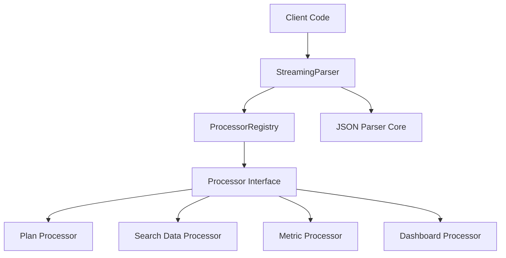

# Streaming Parser Library Refactoring

## Problem Statement 

The current streaming parser implementation in `libs/handlers/src/chats/streaming_parser.rs` contains multiple responsibilities mixed together:

1. Core JSON parsing logic for handling incomplete JSON fragments
2. Specialized processors for different types of content (plans, search data, metrics, dashboards)
3. Type definitions and conversions

This tightly coupled design makes it difficult to:
- Reuse the optimistic JSON parsing logic in other contexts
- Add new processors without modifying the core parser code
- Test individual components in isolation
- Maintain clear separation of concerns

### Current Limitations
- The streaming parser is tightly coupled to chat-specific types and logic
- Adding new processor types requires modifying the core parser class
- Testing is more complex due to the monolithic design
- Code reuse is limited by the current structure

### Impact
- **Developer Experience**: Developers need to understand the entire parser to make changes to any part
- **Maintainability**: Changes to one processor may affect others unintentionally
- **Extensibility**: Adding new processor types requires modifying existing code
- **Testing**: Difficult to test individual components in isolation

## Requirements

### Functional Requirements 

#### Core Functionality
- Create a standalone `streaming` library with the core JSON parsing logic
  - Details: Extract and refine the optimistic JSON parsing functionality
  - Acceptance Criteria: The parser can handle incomplete JSON fragments correctly
  - Dependencies: None

- Implement a modular processor architecture
  - Details: Create a processor trait/interface and move each specialized processor to its own file
  - Acceptance Criteria: Each processor is in its own file and follows a consistent interface
  - Dependencies: Core parser implementation

- Extract and organize type definitions
  - Details: Move relevant types to a dedicated `types.rs` file
  - Acceptance Criteria: All types are properly defined and organized
  - Dependencies: None

### Non-Functional Requirements 

- **Maintainability**
  - Each component should have a single responsibility
  - Code should be well-documented with inline unit tests
  
- **Extensibility**
  - Adding new processors should not require modifying existing code
  - The core parser should be agnostic to the specific processor implementations

- **Compatibility**
  - The new implementation should maintain the same behavior as the original

## Technical Design 

### System Architecture



### Core Components 

#### Component 1: StreamingParser
```rust
pub struct StreamingParser {
    buffer: String,
    processors: ProcessorRegistry,
}

impl StreamingParser {
    pub fn new() -> Self {
        StreamingParser {
            buffer: String::new(),
            processors: ProcessorRegistry::new(),
        }
    }
    
    pub fn register_processor(&mut self, processor: Box<dyn Processor>) {
        self.processors.register(processor);
    }
    
    pub fn process_chunk(&mut self, id: String, chunk: &str, processor_type: &str) -> Result<Option<ProcessedOutput>> {
        self.buffer.push_str(chunk);
        let processed_json = self.complete_json_structure(self.buffer.clone());
        
        self.processors.process(id, &processed_json, processor_type)
    }
    
    // Core JSON parsing logic remains the same
    fn complete_json_structure(&self, json: String) -> String {
        // Existing implementation
    }
}
```

#### Component 2: Processor Interface
```rust
pub trait Processor {
    fn processor_type(&self) -> &str;
    fn can_process(&self, json: &str) -> bool;
    fn process(&self, id: String, json: &str) -> Result<Option<ProcessedOutput>>;
}
```

#### Component 3: ProcessorRegistry
```rust
pub struct ProcessorRegistry {
    processors: HashMap<String, Box<dyn Processor>>,
}

impl ProcessorRegistry {
    pub fn new() -> Self {
        ProcessorRegistry {
            processors: HashMap::new(),
        }
    }
    
    pub fn register(&mut self, processor: Box<dyn Processor>) {
        self.processors.insert(processor.processor_type().to_string(), processor);
    }
    
    pub fn process(&self, id: String, json: &str, processor_type: &str) -> Result<Option<ProcessedOutput>> {
        if let Some(processor) = self.processors.get(processor_type) {
            if processor.can_process(json) {
                return processor.process(id, json);
            }
        }
        
        Ok(None)
    }
}
```

#### Component 4: Specialized Processors
```rust
// Example for one processor
pub struct PlanProcessor;

impl Processor for PlanProcessor {
    fn processor_type(&self) -> &str {
        "plan"
    }
    
    fn can_process(&self, json: &str) -> bool {
        // Check if JSON contains plan_markdown
        if let Ok(value) = serde_json::from_str::<Value>(json) {
            return value.get("plan_markdown").is_some();
        }
        false
    }
    
    fn process(&self, id: String, json: &str) -> Result<Option<ProcessedOutput>> {
        // Process plan data
        // Implementation similar to current process_plan_chunk
    }
}
```

### File Changes 

#### New Files

- `libs/streaming/Cargo.toml`
  - Purpose: Define the new streaming library and its dependencies
  - Dependencies: serde, serde_json, anyhow, regex, etc.

- `libs/streaming/src/lib.rs`
  - Purpose: Main entry point for the library
  - Key components: Re-exports, module definitions
  - Dependencies: Internal modules

- `libs/streaming/src/parser.rs`
  - Purpose: Core streaming parser implementation
  - Key components: StreamingParser struct, JSON completion logic
  - Dependencies: processor registry

- `libs/streaming/src/processor.rs`
  - Purpose: Define processor trait and registry
  - Key components: Processor trait, ProcessorRegistry struct
  - Dependencies: types

- `libs/streaming/src/types.rs`
  - Purpose: Define common types used across the library
  - Key components: ProcessedOutput enum, other shared types
  - Dependencies: None

- `libs/streaming/src/processors/mod.rs`
  - Purpose: Export processor implementations
  - Key components: Module declarations
  - Dependencies: Individual processor modules

- `libs/streaming/src/processors/plan.rs`
  - Purpose: Plan-specific processor implementation
  - Key components: PlanProcessor struct
  - Dependencies: Processor trait, types

- `libs/streaming/src/processors/search.rs`
  - Purpose: Search data catalog processor implementation
  - Key components: SearchProcessor struct
  - Dependencies: Processor trait, types

- `libs/streaming/src/processors/metric.rs`
  - Purpose: Metric file processor implementation
  - Key components: MetricProcessor struct
  - Dependencies: Processor trait, types

- `libs/streaming/src/processors/dashboard.rs`
  - Purpose: Dashboard file processor implementation
  - Key components: DashboardProcessor struct
  - Dependencies: Processor trait, types

## Implementation Plan 

### Phase 1: Core Library Setup 

1. Create library structure
   - [x] Create `libs/streaming` directory
   - [x] Set up `Cargo.toml` with appropriate dependencies
   - [x] Create basic module structure

2. Implement core parser
   - [x] Extract JSON parsing logic from existing implementation
   - [x] Create `parser.rs` with the core StreamingParser implementation
   - [x] Add unit tests for the parser

### Phase 2: Processor Architecture 

1. Define processor interface
   - [x] Create `processor.rs` with Processor trait
   - [x] Implement ProcessorRegistry for managing processors
   - [x] Add unit tests for the registry

2. Extract types
   - [x] Create `types.rs` with all necessary type definitions
   - [x] Ensure types are properly documented
   - [x] Add unit tests for complex types

### Phase 3: Specialized Processors 

1. Implement individual processors
   - [x] Create processor implementations for each type (plan, search, metric, dashboard)
   - [x] Move specialized logic from the original parser to each processor
   - [x] Add unit tests for each processor

2. Integration
   - [ ] Ensure all processors work with the core parser
   - [ ] Verify behavior matches the original implementation

## Testing Strategy 

### Unit Tests

- **Parser Tests**
  - Test JSON completion with various incomplete fragments
  - Test buffer management
  - Test edge cases (empty strings, malformed JSON)

- **Processor Tests**
  - Test each processor with valid and invalid input
  - Test processor registration and lookup
  - Test processor selection logic

- **Integration Tests**
  - Test the full pipeline from raw input to processed output
  - Compare results with the original implementation

## Dependencies 

- serde = { workspace = true }
- serde_json = { workspace = true }
- anyhow = { workspace = true }
- regex = { workspace = true }
- uuid = { workspace = true }
- sha2 = { workspace = true }

## File References 

- Original implementation: `libs/handlers/src/chats/streaming_parser.rs`
- Type references: `libs/handlers/src/chats/post_chat_handler.rs`
