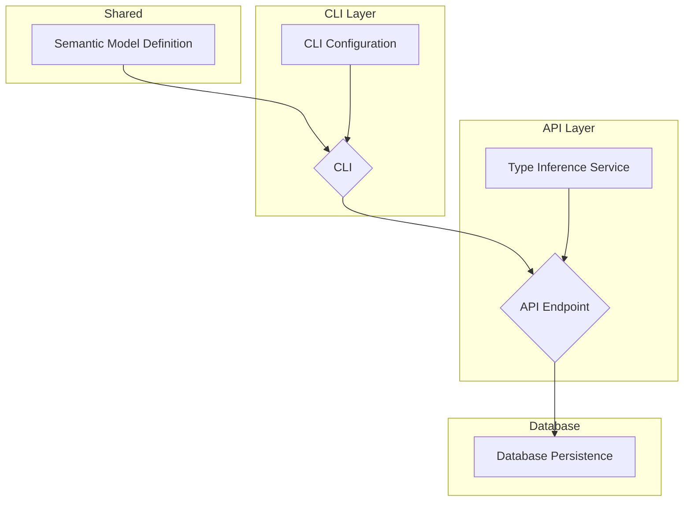

# Semantic Layer and Deployment Refactor

## Problem Statement

The current system for defining and deploying data models involves disparate structures between the CLI and the API. The CLI parses YAML model files into its own set of structs, and the API endpoint (`/deploy_datasets`) expects a different request structure. This leads to:
- Redundancy in model definitions.
- Increased complexity when making changes, as they need to be coordinated across two different representations.
- Potential for inconsistencies between what the CLI can parse/validate and what the API can accept and process.
- Limited support for project-based configurations and clear inheritance of settings like database and schema.
- The process for inferring column types in the API if not specified in the model is not clearly defined or integrated with a central semantic model.

Current behavior:
- CLI (`deploy.rs`) uses local structs (`BusterModel`, `Model`, `Entity`, etc.) to parse YAML.
- API (`deploy_datasets.rs`) uses `DeployDatasetsRequest` with its own column and relationship structures.
- Configuration via `buster.yml` is flat and doesn't robustly support multi-project setups with distinct model paths and configurations.
- Type inference on the API side is ad-hoc or missing for some scenarios.

Expected behavior:
- A unified semantic model definition (`api/libs/semantic_layer/src/models.rs`) is used by both the CLI and the API.
- The CLI parses YAML models directly into these shared semantic layer structs.
- The API's `/deploy_datasets` endpoint accepts requests based on these shared semantic layer structs.
- `buster.yml` supports a `projects` structure, allowing for defined model paths and inherited configurations (data source, schema, database) for models within those projects.
- The API has a clear process for inferring missing column types by querying the data source.
- All aspects of the semantic model (including relationships, metrics, filters) are correctly persisted by the API.

## Goals

1.  Establish `api/libs/semantic_layer/src/models.rs` as the single source of truth for model definitions.
2.  Refactor the CLI (`deploy.rs`) to use these semantic layer structs for parsing and request construction.
3.  Update `buster.yml` parsing (`cli/cli/src/utils/config.rs`) to support a `projects` array for better organization and configuration inheritance.
4.  Modify the model discovery logic in the CLI to respect the `projects` configuration in `buster.yml` and search only within the specified directory and its subdirectories.
5.  Refactor the API endpoint (`deploy_datasets.rs`) to accept the new semantic model structure.
6.  Implement robust type inference in the API for dimensions and measures where type is not explicitly provided.
7.  Ensure all components of the semantic model (models, dimensions, measures, relationships, metrics, filters) can be persisted to and retrieved from the database.
8.  Improve clarity and maintainability of the deployment process.

## Non-Goals

1.  Fundamental changes to the existing database schema beyond what's necessary to store the full semantic model. (Major schema migrations are out of scope for this initial refactor).
2.  Introducing new UI components for managing these semantic models (focus is on CLI and API).
3.  Changing the core authentication or authorization mechanisms.
4.  Overhauling the SQL generation logic based on these models (this PRD focuses on definition, deployment, and persistence).

## Implementation Plan

This project will be broken down into several sub-PRDs, implemented in phases.

### Phase 1: Core Semantic Model & CLI Configuration

#### Technical Design

#### Sub-PRDs
1.  **Semantic Model Definition** ([prd_semantic_model_definition.md](prd_semantic_model_definition.md))
    *   Purpose: Define and refine the Rust structs in `api/libs/semantic_layer/src/models.rs` to accurately represent the desired YAML model structure, including fields for optional database and schema.
    *   Dependencies: None
    *   Required for: All other PRDs
    *   Status: ✅ Completed
    *   *Concurrency: This is foundational and should be completed or largely stabilized first.*

2.  **CLI Configuration & Discovery** ([prd_cli_config_and_discovery.md](prd_cli_config_and_discovery.md))
    *   Purpose: Update `BusterConfig` to support a `projects` structure. Modify model discovery logic to use these project paths and adhere to the "search down" rule for `buster.yml`
    *   Dependencies: Semantic Model Definition (for understanding model file structure)
    *   Required for: CLI Deployment Logic
    *   Status: ✅ Completed
    *   *Concurrency: Can start once the core structs in "Semantic Model Definition" are stable.*

#### Success Criteria
-   `api/libs/semantic_layer/src/models.rs` accurately reflects the target YAML structure.
-   `BusterConfig` in `cli/cli/src/utils/config.rs` includes the `projects` field and associated structs.
-   CLI model discovery correctly identifies model files based on `buster.yml` (including `projects`) and searches only downwards.

### Phase 2: CLI and API Integration

#### Sub-PRDs
3.  **CLI Deployment Logic** ([prd_cli_deployment_logic.md](prd_cli_deployment_logic.md))
    *   Purpose: Refactor `cli/cli/src/commands/deploy.rs` to parse YAML models using the new semantic layer structs. Implement logic to resolve `database` and `schema` (model file -> project config -> global config). Construct the API request payload based on the semantic model.
    *   Dependencies: Semantic Model Definition, CLI Configuration & Discovery
    *   Required for: End-to-end testing of CLI deployment
    *   Status: ✅ Completed
    *   *Concurrency: Depends on completion of both Phase 1 PRDs.*

4.  **API Request Handling** ([prd_api_request_handling.md](prd_api_request_handling.md))
    *   Purpose: Modify `api/server/src/routes/rest/routes/datasets/deploy_datasets.rs` to accept the `DeployDatasetsRequest` structured according to the semantic layer models.
    *   Dependencies: Semantic Model Definition
    *   Required for: CLI Deployment Logic to have a target
    *   Status: 🆕 Not Started
    *   *Concurrency: Can be developed in parallel with "CLI Configuration & Discovery" once "Semantic Model Definition" is stable. It can also be developed partly in parallel with "CLI Deployment Logic", as the API interface needs to be defined for the CLI to target.*

#### Success Criteria
-   CLI can parse YAML models into the new semantic structs and correctly resolve configurations.
-   CLI can successfully send a deployment request to the (updated) API endpoint.
-   API endpoint can receive and deserialize the new request format.

### Phase 3: API Logic and Persistence

#### Sub-PRDs
5.  **API Type Inference** ([prd_api_type_inference.md](prd_api_type_inference.md))
    *   Purpose: Implement logic within the API to connect to the specified data source and infer data types for dimensions/measures if they are not explicitly provided in the deployed model.
    *   Dependencies: API Request Handling
    *   Required for: Full model processing by API
    *   Status: 🆕 Not Started
    *   *Concurrency: Can start once "API Request Handling" is complete or its interface for data processing is clear.*

6.  **API Model Persistence** ([prd_api_model_persistence.md](prd_api_model_persistence.md))
    *   Purpose: Ensure all elements of the semantic model (models, dimensions, measures, relationships, metrics, filters) are correctly mapped and persisted to the database. This may involve minor adjustments to DB schema or how existing tables are used.
    *   Dependencies: API Request Handling, API Type Inference (implicitly, for complete model data), Semantic Model Definition (for struct details)
    *   Required for: Storing and utilizing the deployed models
    *   Status: 🆕 Not Started
    *   *Concurrency: Design work can start once "Semantic Model Definition" is stable. Implementation can proceed once "API Request Handling" is complete for basic dataset/column persistence. Persistence of advanced features (metrics, filters, relationships) can be developed in parallel with "API Type Inference", as long as the core model data can be passed through.*

#### Success Criteria
-   API can infer missing types for columns.
-   All parts of a deployed semantic model are correctly stored in the database.
-   Deployed models can be retrieved and are consistent with the input.

### Phase 4: Final Integration and Cleanup

#### Sub-PRDs
7.  **CLI Migration and Cleanup** ([prd_cli_migration_and_cleanup.md](prd_cli_migration_and_cleanup.md))
    *   Purpose: Integrate the new implementation into the main CLI application, remove temporary code, and ensure backward compatibility.
    *   Dependencies: All previous PRDs must be completed
    *   Required for: Complete rollout of the refactored system
    *   Status: 🆕 Not Started
    *   *Concurrency: Must be done after all other PRDs are completed and tested.*

#### Success Criteria
-   CLI uses the new unified semantic layer model for all deployment operations
-   All temporary/development code has been removed
-   System operates correctly end-to-end with the new implementation
-   Documentation accurately reflects the new workflow and capabilities

## Security Considerations
-   Ensure that file path manipulations during model discovery in the CLI are secure and do not allow for directory traversal vulnerabilities outside the intended project scope.
-   Database connection details and credentials used for type inference in the API must be handled securely.
-   Input validation for all fields in the API request is crucial to prevent injection or other attacks.

## Dependencies
-   This project has internal dependencies between its sub-PRDs as outlined.
-   No major external system dependencies are anticipated for this refactor, beyond the existing database and data sources.

## References
-   Current CLI code: `cli/cli/src/commands/deploy.rs`, `cli/cli/src/utils/config.rs`
-   Current API code: `api/server/src/routes/rest/routes/datasets/deploy_datasets.rs`
-   Semantic Layer Definition: `api/libs/semantic_layer/src/models.rs` 